## Inhoud

## Dag 1 – St. Petersburg-Veliki Novgorod

__30/7/2004 11:30 - 17:00 | #liften=2 | afstand=269 km__

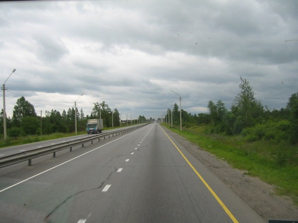

Na een paar dagen met vrienden uit Nederland in St. Petersburg doorgebracht te hebben en de nodige
acclamatisatie ondergaan was, was het zover. Vroeg in de morgen met de metro vanuit mijn hotel naar
station Zvezdnaya, vandaar uit is het zo'n 500 meter lopen naar de vleesfabriek Samson waarvan de
poort geflankeerd wordt door twee grote gebeeldhouwde, koeien. Hier neemt de Moskovski Shosse de
vorm van een snelweg aan, de M10 St.Petersburg-Moskou, en hier is al veel minder stadsverkeer. Op de
kruising voor de poort van de vleesfabriek wordt niet te snel gereden en is voldoende plek voor
auto's en vrachtwagens om te stoppen. Kortom, een puike liftplek!

Het was natuurlijk toch een beetje spannend na al die bangmakerij door mijn landgenoten en het
kostte me enige mentale moeite om mijn arm omhoog te krijgen maar uiteindelijk stond ik toch
daadwerkelijk te liften in Rusland.

Gewoon je arm omhoog steken alsof je iemand vanaf een afstandje groet.
Het gebruik van de opgestoken duim is meer iets West Europees en wordt in
Rusland niet als een
verzoek om een lift geïnterpreteerd. Liften met bordjes wordt ook afgeraden, deze zijn vaak slecht
leesbaar voor naderende automobilisten en bij het begin van een 700km lange snelweg mag het toch
duidelijk zijn welke richting je op wilt. Verder kan een bordje 'Moskou' automobilisten in dezelfde
richting maar met andere eindbestemming ontmoedigen een bijdrage aan jouw transport te leveren. Als
laatste argument mag gelden dat het gebruik van bordjes onhandig is: viltstiften gaan lekken,
bordjes moeten voortdurend bij de hand gehouden worden, worden vaak per ongeluk in auto's
achtergelaten, kunnen natregenen etc.
Probeer verder de automobilisten aan te kijken en let op of zij gebaren terug maken: dat ze vol
zitten, of een andere kant opgaan bijvoorbeeld. Wanneer je dit soort signalen helemaal niet krijgt
is er iets mis met de liftplek.
Na zo'n 45 minuten wachten en zwaaien stopte Igor met zijn vrachtwagen vol audioapparatuur onderweg
naar Moskou.

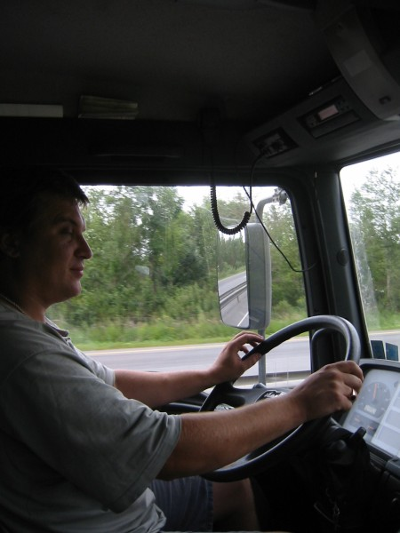

Igor was een getrouwde Sint Petersburger met twee kinderen en een toffe peer. Zijn hond, een bokser,
was helaas 3 maanden geleden overleden en zijn vrouw zeurde al een tijdje om een nieuwe. Igor kon er
niet langer onderuit, de nieuwe hond ging snel aangeschaft worden. Igor kwam direct uit Finland en
had er zo'n 12 uur wachten bij de Finse grens opzitten. Hij was erg moe maar moest nog een heel
eind. Hij trakteerde mij op een perfecte lunch bij een wegrestaurantje dat hem getipt was door een
liftster die ook ooit door hem was meegenomen. De lunch beston uit soep en varkensschnitzel. Zelf
dronk hij de nodige koffie.

Igor vertelde mij nauwgezet hoe de vork in de steel zit met de problemen die Rusland in de Kaukasus
ondervindt. Ik moest de zaken die bij ons op de televisie vertoond werden niet al te veel geloven.
Feit was, volgens hem, dat de mensen aldaar niet willen werken. Ze zijn gewoon lui en zien meer heil
in het kidnappen van rijke mensen. Maar kidnap kwam bij ons toch ook wel voor, vroeg hij mij, en dat
kon ik ook niet helemaal ontkennen.
Bij het afscheid Igor een Nederlands souveniertje cadeau gedaan. Igor
beweerde dat dit soort
keramiek alleen in Rusland gemaakt werd.
Het laatste stukje tot Novgorod met een man in een personenauto meegereden die in eerste instantie
alleen stopte voor zijn blaas maar er na lediging van deze wel heil in zag mij wat verder te
brengen.
Zwijgzaam typ die alleen de moeilijke vraag stelde: "Waarom ga je niet met de trein ?". Ik noemde
hem de doelen van mijn reis en dat vond hij wel grappig. Bij de rand van de stad afgezet en met de
bus verder tot het centrum.

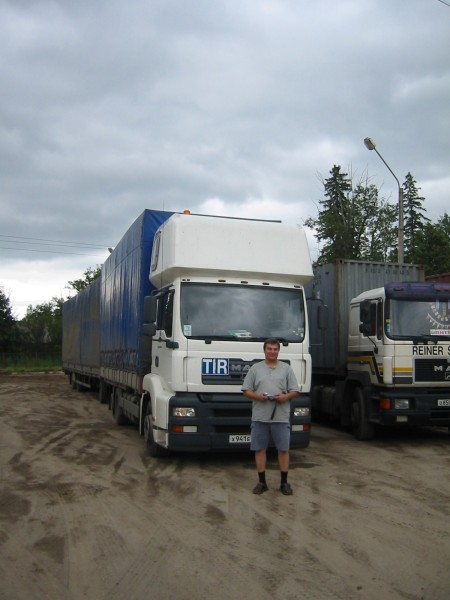

## Dag 2 – Veliki Novgorod-Tver'

__31/7/2004 10:00 - 17:00 | #liften=1 | afstand=300 km__

Na uitstekende avond in Novgorod, de volgende ochtend met stadsbus 6 de rivier de Volzhov
overgestoken en blijven zitten tot het eindpunt. Toen nog ongeveer 1 km gewandeld langs een
gloednieuw ogende Dirol kauwgum fabriek (Stimorol) tot het beginpunt van de weg richting zuiden die
een stukje later weer aansluit bij de M3 richting Moskou. (Novgorod zelf ligt niet aan de M3).
Daar is een pompstation en een politiepost (DPS) waar iedereen afremt. Mijn liftplek zag er goed uit
alleen werd ik belaagd door van die grote steekvliegen, pikdazen, horzels of hoe ze ook mogen heten
hetgeen mijn anders zo standvastige lifthouding geen goed deed.

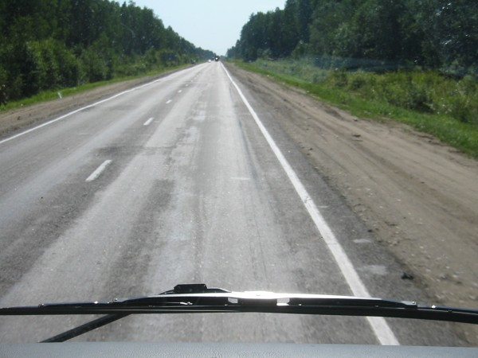

Na zo'n 10 minuten werd ik toegefloten door een agent van de politiepost die twee vrachtwagens
aangehouden had. Zij werden door hem gesommeerd mij mee te nemen ! Thanks a lot, of 'Spasiba
Bolshoi', on the road again. Mijn nieuwe driver heette Marcel, een tataar. Natuurlijk was hij een
beetje korzelig in het begin, zijn baas had het meenemen van lifters verboden maar ja, hier bleek de
agent een hogere baas. Toch bleek hij verder uiterst geschikt. Hij maakte deel uit van een konvooi
van vier koelvrachtwagens met citroenen afkomstig van een schip in de St.Petersburgse haven onderweg
naar Moskou. Hij reed het stuk St. Petersburg-Moskou zo'n veertien keer per maand, 700 km heen, en
700 km terug, niet veel vrije tijd dus als je rekent dat dit stuk zo'n 13 tot 15 uur kost.
Marcel was met een russische getrouwd en zodoende in St. Petersburg terecht gekomen. Hij was al meer
dan 17 jaar lang niet meer in zijn geboorteplaats Kazan (hoofdstad van de autonome deelrepubliek
Tatarstan) geweest. Zijn zoon werkt in de vleesfabriek maar is vastbesloten om ook
vrachtwagenschauffeur te worden. Marcel had zijn dienstijd doorgebracht bij de marine en had het
daar zo goed naar zijn zin gehad (getuige diverse tatoeages) dat hij wel een verdere carriere in het
leger ambieerde. Perestroika en het uitéénvallen van de USSR hadden echter roet in het eten gegooid
en nu zat hij alweer heel wat jaartjes op de vrachtwagen. Hij was wel blij met het feit dat hij nu
een westerse truck reed (Mercedes), dat was een stuk gezonder dan een russische Kamaz, zonder veel
vering, zonder veel verwarming in de winter en zonder veel airco in de zomer en een continu hels
kabaal van de motor.

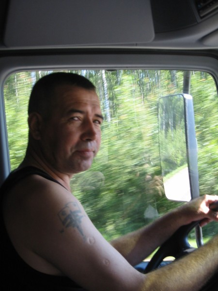

In een Kamaz had hij enkele jaren lang in konvooien het traject St. Petersburg-Murmansk gereden (
1500 km), 's Winters als een eskimo ingepakt vanwege de kou van -20, -30 of kouder.

Hij vertelde dat hij een keer onderweg in de winter een kapotte truck had aangetroffen met een
halfbevroren chauffeur en diens zoon die voor een gelegenheid meegenomen was. Ze hadden wel een
klein vuurtje gemaakt maar de aankomst van Marcel had de echte redding betekend. Met behulp van wat
wodka was de kou te lijf gegaan en volgde er een feestje (tousofka) in de cabine van de Kamaz waarna
Marcel ze verder meegenomen heeft.

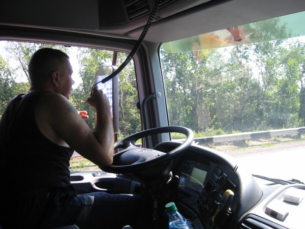

Met Marcel en zijn drie collegae ook weer in een wegrestaurant gegeten, wederom prima te doen.
Na 300 km afgelegd te hebben ben ik uitgestapt aan de westkant van Tver', vlak na de brug over de
Wolga waar de M10 een trambaan kruist. Met een hobbelige tram nummer 16 het centrum van Tver'
bereikt, een stad die ouder is dan Moskou maar met verder maar weinig bezienswaardigheden.

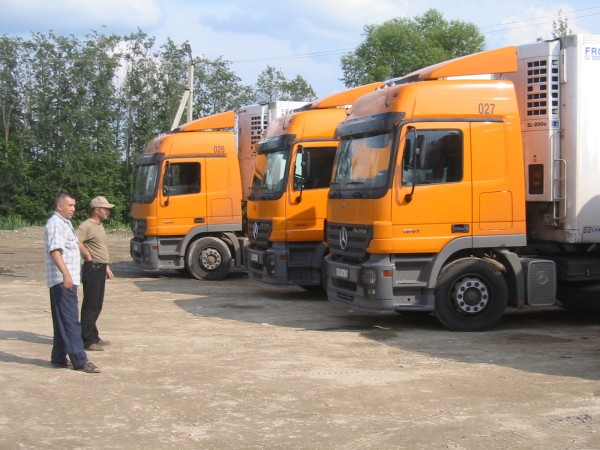

## Dag 3 – Tver'-Moskou

__1/8/2004 11:00 - 15:00 | #liften=1 | afstand=157 km__

Na een matig boeiend bezoek aan Tver' de volgende morgen met dezelfde tram weer terug naar de M10
gehobbeld voor het laatste stukkie tot Moskou. Na niet lange tijd stopte Vladimir in zijn busje
onderweg naar Moskou. Vladimir was een iets oudere man en werkte voor een boekengroothandel. Verder
was hij PA man voor één of andere band en hij had zijn autoradio aangesloten op wat apparatuur die
achterin het busje stond. Hij had meer tekst dan de vrachtwagenchauffeurs van de vorige dagen en we
hadden meer gespreksonderwerpen. Hij was duidelijk politiek geïnteresseerd; er was van alles mis nog
in Rusland maar dat alles was zeker niet de schuld van de huidige president.

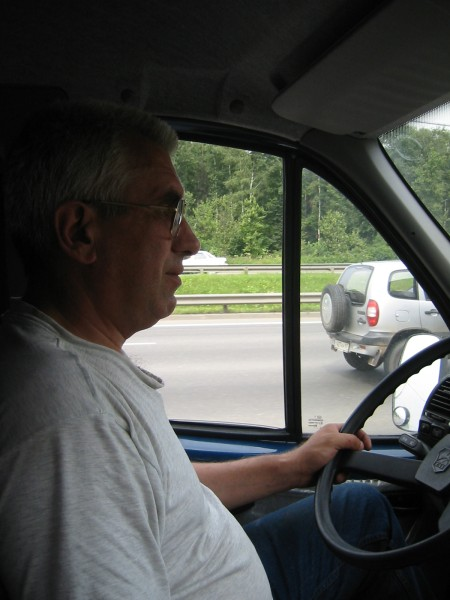

Hij was de eerste chauffeur die iets meer van Nederland wilde weten dan kwaliteit van de wegen en de
bier- en benzineprijzen. Hij vertelde veel wetenswaardigheidjes over de
stadjes waar we doorheen
reden en vaak lang in de file stonden. Zo was er Klin, de woonplaats van Tsjaikovski, Zelenograd,
een soort centrum van de radiowetenschap met veel fabrieken en instituten, en Chimki, het dichtste
punt nabij Moskou dat door de Duitsers in WWII bezet is geweest en van waaruit ze met hun
verrekijkers de koepels van het Kremlin in de zon zagen glinsteren. Onderweg werd hij ook nog heel
stevig beboet omdat er iets niet in orde was met zijn papieren.

Toen ik hem vroeg naar zijn favoriete bier (één van mijn vooraf bedachte vragen voor de dode
gespreksmomenten) vertelde hij me dat hij acht jaar geleden gestopt was met drinken nadat hij
letterlijk doodziek was geworden van een literfles bier die hij dronk in Volgograd. Nadat hij de
literfles voor zo'n driekwart geledigd had is hij ergens op straat ingestort en toen hij doodziek
weer bijkwam op dezelfde plek zag hij dat er onderin de fles een dikke laag tabaksdrab neergedaald
was dat er volgens hem doorheen gemixt was om de smaak op orde te krijgen. Vrij bizar verhaal.

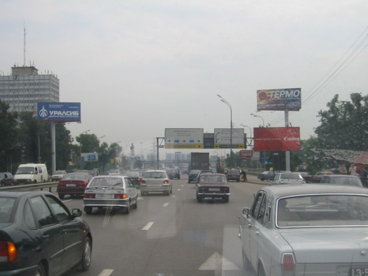

Ik werd afgezet op een afrit van de indrukwekkende ringweg van Moskou (МКАД) die enkele jaren
geleden gereed is gekomen. Daar kon ik direct een bus instappen richting het dichtstbijzijnde
metrostation. In de bus was nergens een kaartje te koop (ik heb ook niet echt gezocht) maar bij het
eindstation bleek er een tamelijk onvriendelijke controleur bij de uitgang te staan, met het postuur
van een uitsmijter. Samen met een aantal oude vrouwtjes was ik de pineut, nog wat geprobeerd te
praten, "ik spreek geen Russisch, ben een toerist", maar het mocht niet baten, de boete (штраф)
bedroeg 100 roebel (3 euro) tot grote ontzetting van de andere zwartrijders. Verder gereisd met de
onovertroffen Moskouse metro naar mij favoriete hotel in Moskou, Izmailovski
Park.

## Dag 4 – Moskou-Oekraïense grens

__3/8/2004 9:30 - 21:00 | #liften=7 | afstand=523 km__

Nadat ik de vorige dag mijn 32e verjaardag gevierd had met bier aan de Tverskaja boulevard in Moskou
met Lena en Lena, was het tijd om weer verder te liften. Vroeg opgestaan en na een uur in de metro
doorgebracht te hebben en nog een kwartier in een bus stond ik om 9:00 's ochtends aan het begin van
de M3 met 850km tot Kiev voor de boeg.
De liftplek bleek uitstekend en is als volgt te bereiken: neem de metro tot Joego-Zapadnaja, het
eindpunt van de Kaloezhsko-Rizhkaya metrolijn (de beige lijn) en neem daar bus 607 of 714 en druk op
het knopje zodra je onder de niet te missen ringweg door bent gekomen. Bij de bushalte is de goede
plek.

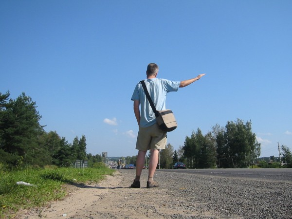

Hoewel het verkeer er voorbijraasde stopten er binnen no time twee auto's maar beide gingen mij niet
ver genoeg. De derde, een busje, ging tot vliegveld Vnukovo maar de chauffeur wilde mij wel iets
verder brengen, tot de volgende afslag. De M3 ging al snel over in de gebruikelijke twee baansweg
waarlangs in principe overal gelift kan worden (geen vangrail en brede ongeasfalteerde vluchtstroken
waar makkelijk gestopt kan worden).
De chauffeur bleek een zakenman die een vlucht moest halen en halverwege, na wat telefoontjes en bij
het zien van wat filevorming, leek het hem toch link om mij veel verder te brengen aangezien hij een
vliegtuig moest halen.

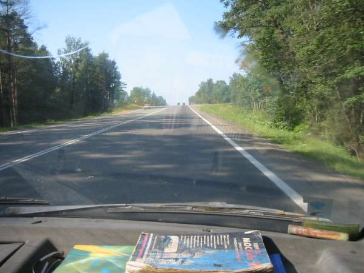

Vanaf de plek waar hij mij eruit zette, kreeg ik onmiddellijk een nieuwe lift van een jongeman
genaamd Sergej. Sergej zag er niet best uit evenmin als zijn Gazelle busje van Sovjet makelij. Bij
het voorstellen kreeg ik in plaats van een hand, alleen een arm. Het bleek dat hij de vingers van
zijn rechterhand niet kon bewegen en deze hand als een soort etalagepoppenhand met hem meedroeg.
Zijn hele rechterarm was ook met een soort groene zalf ingesmeerd.
Verder was zijn onderlip over de hele breedte één grote korst; alles suggereerde dat hij onlangs in
een stevig robbertje vechten betrokken was geweest. Mijn aanbod om hem te fotograferen vond hij niet
geslaagd en werd afgeslagen.
Hij kon met zijn vuist gelukkig nog wel een beetje sturen want hij gaste stevig door en vond het
nodig om alles en iedereen op de tweebaansweg in te halen. Zijn linkerhand had hij nodig om te roken
en te schakelen.
Sergej vroeg of ik de russische vrouwen al geprobeerd had en vertelde dat het niet meer dan 150
roebel kostte (5 eruo), maar verderop in de provincie de prijzen waarschijnlijk wel wat lager lagen.
Sergei woonde in Balabanovo waar de fabriek staat die, volgens eigen zeggen, de 'betere lucifers van
Rusland' maakt. Bij het uitstappen kwam de vraag, "zit er voor mij niet een souveniertje uit Holland
in ?". Ik weet niet precies in welke vorm hij zich dit souveniertje voorstelde, maar na een vlugge
greep in mijn handtas kon ik hem twee delfts blauwe klompjes in zijn pijnlijke knuistje drukken, hij
was erg blij verrast en we namen afscheid.

Daarna snel weer een korte lift gehad van zwijgzame chauffeur in een nogal wrakkige Kamaz. De sovjet
ontwerpers van de Kamaz hebben 50 jaar geleden voornamelijk het aantal PK's van de motor in
gedachten gehad. Comfort voor de berijders was zeker geen prioriteit. Het lijkt een beetje alsof je
in de motor van de wagen zelf plaatsneemt tussen de slangen en de stangen in. De chauffeur moet over
een behoorlijke lichaamskracht beschikken om de spartaans uitgevoerde rem, versnellingpook, stuur en
gaspedaal te kunnen bedienen. Al met al een interessante ervaring die in kwaliteit echter sterk
afneemt naarmate hij langer duurt.

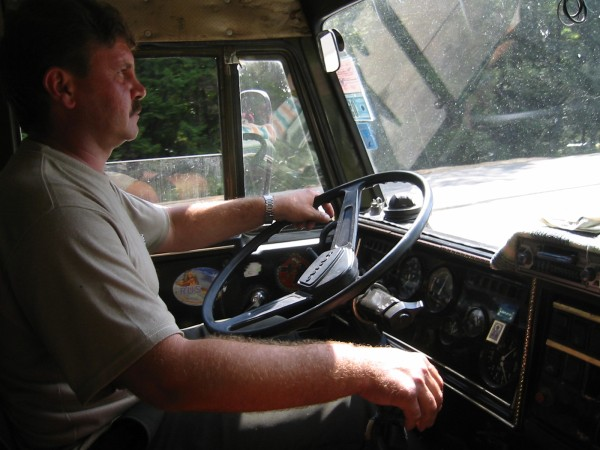

Er volgde wederom een korte lift, de vierde reeds vandaag, deze keer van een gezellige
vrachtwagenchauffeur op leeftijd, Vitka. Vitka vertelde dat hij de 16 kilometer die ik met hem
meereed al 17 jaar elke dag ettelijke malen op en neer reed. Ik kon daarop niet veel slimmers
opmerken dan dat hij de weg waarschijnlijk wel goed kende nu.

Op de plek waar Vitka een afslag nam, en ik zijn Kamaz verliet, ontmoette ik twee echte russiche
hippie lifters, Volodja (Mowgli) en zijn vriendin, van het type waarover ik zoveel gelezen had.
Ze woonden in Sint-Petersburg en waren op weg naar het Rainbow Gathering in Bulgarije. Ik was zelf
in 1994 ook een keer op het Rainbow festival terecht gekomen, dat toen in Lubljana, Slovenië,
plaatsvond. Dit is een jaarlijks terugkerend hippie event.
Ja hippies, ze bestaan nog in grote getalen in Oost Europa. Toen ik Mowgli vroeg of hij wel eens
deelgenomen had aan liftwedstrijden, geen onbekend fenomeen in de nederlands studentenscene maar ook
voorkomend in Rusland, antwoorde hij met een sterk amerikaans accent, 'No, it is competition, and
competition is bad!'
Ik kreeg wat rozijntjes van ze en zij mochten van mijn water drinken. Ze kenden mijn helden A.Krotov
en S.Bolshenko (de laatste zelfs persoonlijk) over wie ik reeds eerder schreef op mijn website.
Krotov was volgens Mowgli momenteel weer op reis in India wat zou verklaren waarom hij mijn email
niet beantwoordde.
Na een kort praatje en het uitwisselen van de adressen namen zij een positie in een stukje achter
mij, zoals het hoort volgens een ongeschreven liftersregel.

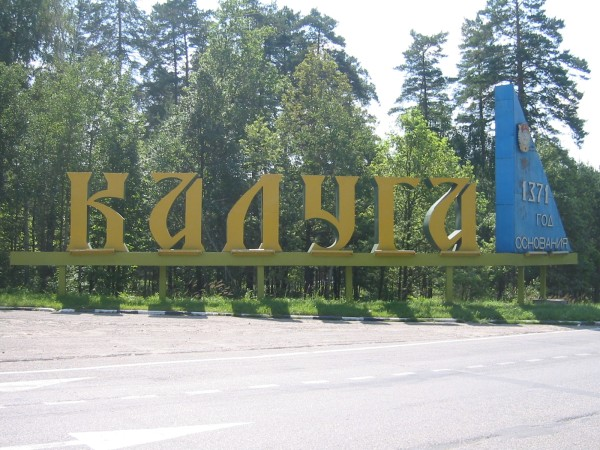

Al snel werd ik weer meegenomen, opnieuw door een busje, met daarin Yuri. Yuri was echt een erg leuk
klein ventje die razendsnel praatte en op dito wijze zijn auto bestuurde. De weg was echter
kaarsrecht en vrijwel leeg, dus erg onveilig was het niet.
Met hem reed ik in relatief korte tijd zo'n 300km mee tot de afslag naar Bryansk, zijn
eindbestemming.

Onderweg praatte hij honderduit en naarmate we vorderden ging ik hem steeds beter verstaan. Hij was
een echte natuurgenieter en hield niet van de grote stad en stedelingen en zeker niet van Moskou.
Was dol op piknikken, wandelen, camperen, en vooral kampvuurtjes maken. Tijdens het praten hierover
raakte hij zo in vervoering dat hij mij plots voorstelde om nu gelijk de natuur in de gaan en een
kampvuurtje te bouwen. Een moment later bedacht hij zich echter weer en trok zijn aanbod in. Ik had
ook geen tijd voor dit soort zaken dus vond het niet zo erg.
Hij had ook een zoontje, zo vertelde hij, en kon haast niet wachten tot junior oud genoeg was om mee
de natuur in te gaan. Yuri vertelde verder enthousiast over de vleesverwerkende fabriek in Kaluga
waar hij werkte.
Yuri poneerde de boude stelling dat Rusland het armste en tegelijkertijd het duurste land ter wereld
was. Deze stelling kon ik vrij gemakkelijk ontkrachten. Yuri ratelde vrolijk door over zijn 5.2 home
theatre, zijn DVD collectie en zijn mobieltje en de kosten daarvan. Hij verbaasde zich uitermate
over het feit dat ik thuis hometheatre noch auto had.

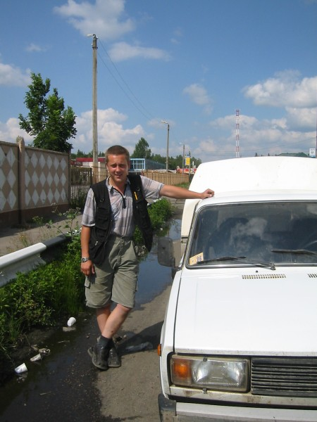

Gedropt bij de afslag naar Bryansk waren een aantal restaurantjes c.q. gaarkeukentjes en ik heb
mezelf getrakteerd op een warme maaltijd met solyanka (russische soep), aardappelen met een kotelet
en brood en appelsap. Dit kostte bij elkaar 60 roebel, minder dan 2 euro.
Net toen ik alles achter de kiezen had kwamen ook Mowgli en zijn vriendin aan op de Rastätte. Deze
keer mocht ik mijn waterfles vullen uit hun fles met vers water uit een beekje. Zij kregen van mij
een hompje vers brood dat ik ook nog gekocht had.

Er was op deze plek niet veel verkeer meer en ik besloot wat wachtende vrachtwagenchauffeurs aan te
spreken. Zo ontmoette ik Vova (Volodja), een Oekraïener uit Lwow (west oekraïense stad die voor WWII
bij Polen hoorde). Vova was pas 30 maar zag er toch een stuk ouder uit dan ik.
Hij had een dochtertje van al 9. Verder was hij gescheiden maar had gelukkig in Charkov (oost
Oekraïne) een nieuwe vriendin gevonden die hij echter zelden zag. Hij was al zo'n vier maanden niet
thuis geweest en zou het liefst op vleugeltjes (на крыльях) naar zijn meisje toevliegen.
Vova was in principe onderweg naar Kiev maar de nieuwbakken Russich-Oekraïense grens met alle
bureacratische rompslomp vandien zou hem zeker 24 uur wachttijd gaan kosten. Na een nog een aardig
lange rit, waarbij Vova Oekraïense muziek opzette en ik onderweg Mowgli en vriendin weer zag staan,
kwamen we bij de grens aan. Ik besloot deze te voet de te passeren en aan de Oekraïense kant verder
te liften.

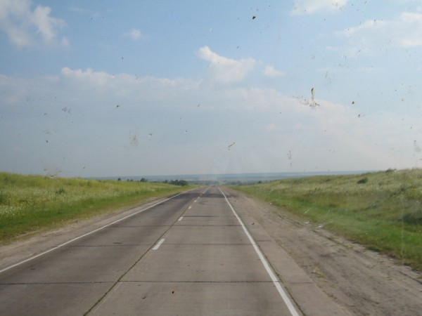

De grens ligt midden in een uitgestrekt desolaat weidenlandschap met nergens een boerderij of enig
teken van bewoning.
De grensovergang zelf is een grote ogenschijnlijke chaos, losjes gesitueerd langs de grotendeels
onverharde weg met lange rijen wachtende vrachtwagens, groepjes ouwehoerende chauffeurs,
geldwisselaars, oude vrouwtjes met grote tassen met allerhande voedsel en dranken in de aanbieding,
dames van lichte zeden die echter moeilijk als zodanig te herkennen waren, en hier en daar wat
golfplaten huisjes waarin het douanepersoneel zijn werk deed.
Later begreep ik dat de wachttijden voor vrachtwagenchauffeurs hier recht evenredig zijn met het
geld dat betaald wordt aan de douane.
Mijn wasmachinegewassen paspoort zorgde voor de nodige beroering en klaarblijkelijk een aardige
afwisseling op het eentonige stempelwerk.
Een fake-streng kijkende douaneambtenaar, Igor, verklaarde als snel, 'Peter, tvoi passport - ne
normal', en legde het met een diepe zucht terzijde. Met een krakkemikkig ultaviolet lampje werd
daarna elke bladzij van het daar waarschijnlijk zelden aangetroffen nederlands paspoort aan een
nauwkeurig onderzoek onderworpen. Er werden meer beambten met meer strepen bijgehaald en ik kon zien
dat elke bladzij van het paspoort met een handscanner opgenomen werd.
Zeker een uur lang staan wachten. Wellicht had een subtiel geplaatst flapje het proces kunnen
versnellen maar ik had de tijd, en wist dat alles in orde was.
Op een gegeven moment was mijn paspoort er weer met het bericht, 'Peter, goede reis gewenst!' (
счастливо вам!).

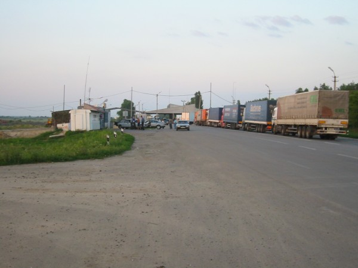

Bij een hele mooie zonsondergang heb ik nog een tijdje staan liften maar er kwamen niet meer dan 4
of 5 voertuigen per uur de grens door en die waren stuk voor stuk afgeladen met mensen.
Net toen ik besloot naar een slaapplek onder de open hemel uit te gaan kijken stopte er een auto met
geblindeerde ruiten. Toen ik de deur opende zaten daar Mowgli en vriendin achterin maar ik kon er
nog makkelijk bij met de rugzak op schoot.
De wagen reed nog zo'n 30 km over de M3 de Oekraïne binnen tot het eerste kleine plaatsje. De
bestuurder sprak trouwens goed engels. Daar werden Mowgli, zijn vriendin en ik gedropt bij een soort
hotel annex duur maar compleet leeg restaurant. Er was genoeg natuur om een goede slaapplek te
vinden.

Die avond werd het nog gezellig met het gasbrandertje van Mowgli, waarmee hij een soort rijstepapje
maakte. Mijn brood werd verder opgegeten en ik bekende de twee dat ik niet uit geldnood aan het
liften was. Ik heb biertjes voor ze gekocht en pistachenootjes en we hebben de dag afgemaakt met het
uitwisselen van liftverhalen. Best gezellige types toch, die hippies. Mowgli's vriendin ging mij in
het stikkedonker foto's laten zien van haar uitje naar de Krim.
Een mooie slaapplek uitgezocht, eindelijk kon ik Petra's matje eens gebruiken die tot dat moment
alleen nog maar de zijkant van mijn rugtas gedecoreerd had.
De hippies zetten hun lichtgewicht tentje op en gingen slapen. Ik nog even met Petra gebeld vanuit
het oekraïense veld, wat naar de sterren liggen kijken en toen snel ingeslapen.
Het einde van een mooie liftdag waarin ik goed opgeschoten was.

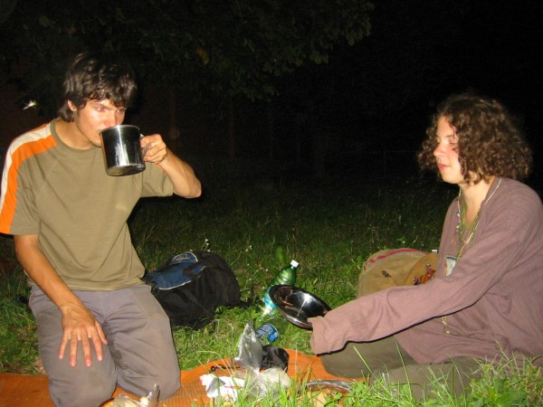

## Dag 5 – Oekraïense grens-Kiev

__4/8/2004 9:30 - 22:00 | #liften=2 | afstand=333 km__

Toen ik wakker werd lag ik midden in een weiland waar een herder met een kudde koeien gearriveerd
was.
Mowgli en ik vonden de centrale pomp van het aanliggende dorpje waar we ons wasten en water meenamen
voor het ontbijt.

Mowgli ging weer rijstepap maken alleen was hij zo onverstandig om de suiker al in het water te
doen, nog voordat dit kookte. Zo ontstond een onwelriekend caramelachtig bruin-zwart mengsel waar ik
helaas voor moest bedanken. De twee hadden absoluut geen haast, ze werden pas begin oktober weer in
St. Petersburg op de universiteit terug verwacht.
Ik nam weer afscheid van hen, en van het tandeloze herdertje dat er rustig bij was komen zitten en
gulzig shaggies rookte, die hij uit voorgescheurd krantenpapiertjes gedraaid had.
Het liften bleek hier vrij bar, de doorgaande weg was nog steeds de M3, de grens lag 30 km terug en
ik wist dat daar niet veel verkeer doorheen kwam.

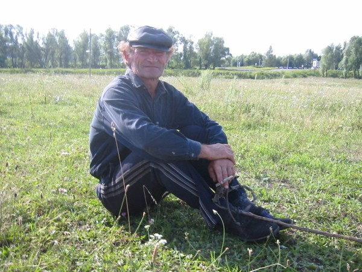

Na een half uurtje wachten, waarbij ik nog lang naar het herdertje heb gekeken die zo lekker op zijn
rug tussen zijn koeien in het veld lag, stopte er een local die mij zo'n 50 km meenam naar de eerste
stad van betekenis, volgens eigen zeggen. Het was een zwijgzaam typ, geen bijzonderheden.
Ik werd afgezet in het stadje waarvan ik de naam nog steeds niet weet en dat ik totnutoe niet op de
kaart terug heb kunnen vinden. Wel weet ik dat ik er meer dan drie uur heb staan wachten op een
hete, hele stoffige plek. Fanatiek gezwaaid naar alles wat maar voorbij kwam maar het waren
voornamelijk locals en ik bleef staan in de hete zon. Beetje ge-SMS-ed. Ook goed gekeken of Mowgli
en vriendin misschien voorbij kwamen maar ik heb ze niet meer gezien.
Korte gesprekjes gehad met voorbijgangers op brommers, fietsen en zijspannen die meestal eerst
netjes vroegen of ze met mij mochten praten.
Praatje gemaakt met een pooier in een Lada die met een zwaar opgedirkt, erg jong meisje rondreed en
enthousiast deed over Amsterdam en een bepaalde voetbalclub die daarvandaan schijnt te komen. Later
reed hij nog een keer voorbij en elke keer ging de vuist omhoog vanuit zijn raampje, een symbool dat
in Rusland veek wordt gebruikt om waardering uit te drukken. Hetzelfde gebaar zag ik ook vaak
terugkomen als het gesprek met mensen over Poetin ging.
Een local vertelde me dat dit een hele hele moeilijke tijd was voor het land en er vooral op het
platteland helemaal niks te halen is. Het platteland gaat langzaam dood, volgens zijn woorden, oude
mensen sterven en jongelui trekken allemaal naar de steden waar meer kansen zijn op iets beters dan
een semi-autonoom bestaan waarbij alleen van de producten van het eigen volkstuintje geleefd wordt.
Deze situatie is op het russische platteland precies hetzelfde. Overal langs de weg zitten mensen
met emmertjes paddestoeltjes, potten besjes, aardappelen, flessen water etc om het broodnodige bij
te verdienen. Enige welvaartsgroei vindt alleen in de steden plaats.

Na drie uur wachten ben ik wat rond gaan lopen en een praatje gaan maken met chauffeurs van
vrachtwagens die al er stonden toen ik aankwam. Ze stonden elkaar met veel handgebaar moppen te
vertellen. Eéntje vertelde mij direkt dat hij geen plek had maar misschien zijn collega wel. In elk
geval gingen ze pas over een uur weg. Naar aanleiding van mijn verschijning ging het gesprek over op
lifters en het bleek dat één van hen eens een hele nacht was wakker gehouden door een lid van de
Petersburgse Autostop Liga (sportieve lifters), die in lichtreflecterende overalls liften. Toen
bleek dat ik ook voor de lol onderweg was en uit Nederland kwam mocht ik niet meer verder liften
maar stonden ze erop dat ik met hun mee zou rijden. Ze zouden over een halfuurtje al gaan met
eindbestemming Kiev!
In de tussentijd kreeg ik koffie, thee en koek in het aftanse stacaravan truckerscafé en na een
korte maar hevige wolkbreuk gingen we daadwerkelijk op weg.
Het betrof een konvooi van vier vrachtwagens die reeds drie dagen onderweg waren vanuit Samara (
Zuid-Centraal Rusland) naar Kiev met Lada-Chevrolets jeeps. Lada bouwt daar trucks in een joint
venture met General Motors. De deal is als volgt: de auto's zijn gewoon Lada's maar het merkje voor-
en achterop is Chevrolet.

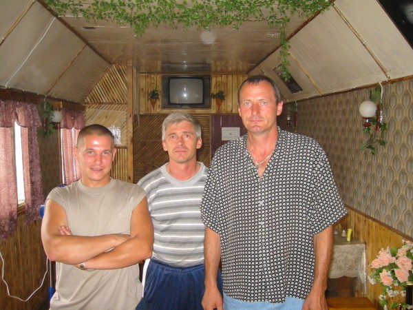

De chauffeurs waren Igor, Igor en Ljolja, diens langbenige dochter en nog een vierde chauffeur met
zijn vrouw waarvan ik de namen niet meer weet. Ik kreeg een plekje in de truck bij één van de Igors
en mijn rugzak ging in één van de Chevrolets achterop.
Igor bleek goed gezelschap en een intelligente vent met een brede interesse. Hij sprak rustig en
goed verstaanbaar. Moppen uitgewisseld en ik merkte weer wat vooruitgang in mijn russisch. We
luisterden naar een radiokanaal dat af en toe een frans of engels nummer speelden en Igor vroeg mij
in die gevallen de strekking van de tekst te vertalen. Het deed hem goed te horen dat ook engelse en
franse liedjes vaak over (onmogelijke) liefde en verre meisjes gingen.
Het leven van de vrachtwagenchauffeurs is erg zwaar daar, ze zijn vaak maanden lang onderweg, rijden
in wrakkige wagens en staan soms dagen stil voor reparaties of formaliteiten, worden om de haverklap
aangehouden door de wegpolitie voor betalingen en leven gescheiden van vrouw en kinderen die ze
slechts sporadisch zien. Velen zijn echtgescheden of aan hun tweede of derde huwelijk bezig. Hun
huis is de vrachtwagencabine. Met een beetje geluk rijden ze in een konvooi, zoals Igor, en kunnen
ze goed opschieten met de collega's.
Ze leven over het algemeen als ééndagsvliegen; alle mensen die mij een lift hebben gegeven waren
zware rokers. Er wordt wodka gedronken zodra het maar enigszins mogelijk is. Het is dan ook geen
verassing dat de gemiddelde levensverwachting van de russische man 58.9 jaar is (die van de
russische vrouw overigens 72.3 jaar).

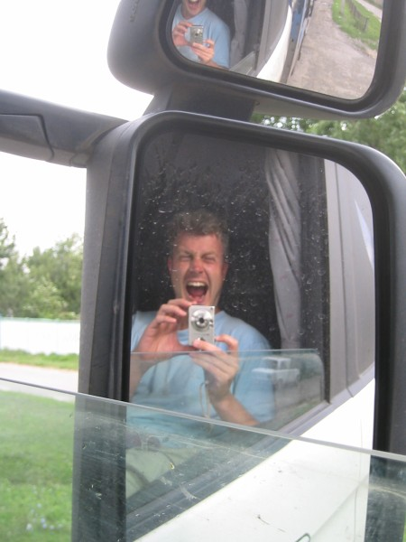

Zo'n 90 km ten noorden van Kiev gaat de M3 over in een vierbaans snelweg zoals wij ze kennen en kon
er goed doorgereden worden op nog enkele lange gedwongen stopovers bij politieposten na.
Mijn vriend Oleg wachtte op mij op het centrale plein in Kiev en was reeds aan de wodka begonnen.
Hij begon mij met een hoge frequentie te bellen omdat hij zich zorgen maakte, die nog enigszins
versterkt werden door zijn dronkenschap. Ik vertelde hem duidelijk dat ik eraan kwam en gaf mijn
geschatte aankomsttijd door en heb toen mijn telefoon uitgezet. Later vond ik 29 berichten terug op
mijn voicemail.
In de buurt van Kiev waren er wegopbrekingen die de heren slim dachten te omzijlen door B-weggetjes
te gaan nemen. Hierdoor naderden we Kiev echter slechts langzaam. Het was al donker toen ik vlak na
de brug over de Dnjepr werd afgezet bij een groot klaverbad aan de rand van de stad.
Van daaruit was het dichtstbijzijnde metrostation snel gevonden en een half uurtje later was mijn
rendez-vous met Oleg en Max op Independence Square in Kiev een feit. Veni, vidi, vici!

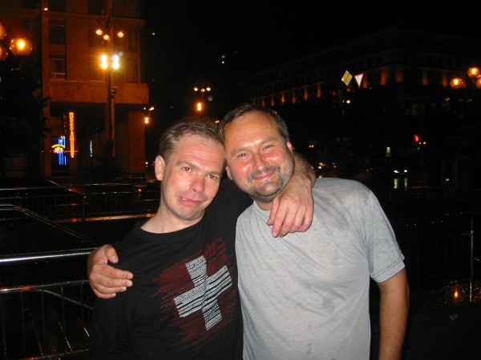

