## Inhoud

## Dag 1: Rotterdam - Poolse grens

Ochtends om 6:30 opgestaan en afscheid genomen van Petra.

Om 8:00 kreeg ik mijn eerste officieuze lift van de ongeëvenaarde Jan de Bas vanaf het Weena tot pompstation de Vink. Daar was ik van plan een tijdje te gaan liften met een bordje 'Vladivostok', je weet tenslotte maar nooit, maar het bleek dat ik mijn schetsboek a la liftbordjes vergeten was. De eerste fout.

Toen ben ik maar wat tankende mensen om een lift gaan vragen en na 10 minuutjes was de eerste lift geregeld tot pompstation Bijleveld bij de Meern vlak voor Utrecht. De bestuurder was een vrolijk babbelende IT-er die in Tholen woonde. Hij werkte 5 dagen per week thuis omdat zijn baas geen reiskosten wilde vergoeden.

Bij Bijleveld verder gevraagd en direkt een lift gekregen tot een pompstation voor Apeldoorn. De bestuurder bleek een Oud-Beijerlander die voor Getronics werkte, weer een IT-er dus. Hij was accountmanager voor de sector Zorg.  
Het pompstation waar ik afgezet werd lag aan de E30 (A1). Deze weg loopt van Amsterdam tot Moskou en moet ik dus voorlopig niet meer verlaten.

Bij dat pompstation via vragen weer direkt een lift gekregen van een italiaanse man die in een busje richting Duitsland speerde. Hij sprak een beetje engels en ik begreep dat hij in de weekenden in Nederland woonde, bij vrouw en kinderen en gedurende de week in Duitsland aan de weg werkte.  
Op een Rastätte voor Hannover afgezet.

Bij gebrek aan liftbordje maar weer gaan vragen, wat overigens een stuk beter gaat dan met bordje. Bovendien kies je op deze manier zelf je bestuurder i.p.v. dat jij gekozen wordt, nog veiliger ook dus. De volgende lift was van Daniël, een arnhemmer die voor zijn werk in zijn eentje huizen en hotels in Duitsland opknapt. Hij had veel respect voor mijn onderneming.  
Bij Braunschweig zou hij de weg verlaten. Juist voordat ik me liet afzetten bij pompstation Zweidorfer Holz, werden we door een voorbijrijdende douanebusje gemaand te stoppen. Er volgde een routineonderzoek waarbij we beiden uit moesten stappen en de heren douanebeambten als eerste mijn rugzak aan een zeer grondig onderzoek onderwierpen. Ze vonden veel interessante zaken maar niks verbodens. Bij Daniël was het wel gelijk raak. Hij had een dikke joint bij zich, verstopt in zijn pakje shag. Verder vonden ze daar een zakje met 4 pillen. Daniël vertelde de agenten dat dit medicijnen tegen oogpijn waren. Hij had ze in een plastic zakje gedaan omdat hij dan niet het hele doosje met pillen mee hoefde te nemen.

  
Het Zollbusje bleek een rijdend laboratorium en de pillen werden aan een reeks chemische proeven onderworpen. Er kleurde iets rood wat duidde op amphetamine, Daniël snapte er niks van maar stemde snel in met de 50 euro boete en de inbeslagname van de gevonden spullen. De agenten adviseerden hem in het vervolg zijn medicijnen in de gebruikelijke verpakking te laten zitten en niet verpakt in een drugszakje in zijn shag te bewaren.  
Ik heb Daniël een beetje bijgestaan. Hij baalde natuurlijk behoorlijk over zoveel onrecht. Samen nog een kop koffie gedronken en toen afscheid genomen.

Na korte tijd weer via vragen een lift tot Berlijn gekregen van twee Ossi's die terugreden van het Hurricane festival (Rammstein, Queens of the Stone Age) naar huis. Het waren echte rockers met een vieze auto vol lege bierflessen en snoeiharde rock uit de speaker. Mijn kaartje met internetadres afgegeven zodat ze mijn reis kunnen volgen.  
Ik liet me afzetten op Rastätte Michendorf waar ik vroeger, in DDR-tijden, met mijn ouders wel eens was geweest om de laatste Ostmarken de besteden aan glazige aardappelen en harige soep. Ik heb er deze keer niks gegeten.

De volgende lift betrof twee russen in een busje. Ze reageerden vol ongeloof toen ik mijn reisplannen uit de doeken deed. Zelf woonden ze al 13 jaar in Duitsland en waren volgens mij de voeling met het vaderland een beetje kwijt.  
Ze brachten me naar een pompstation c.q. vrachtwagen terminal zo'n 3 km achter de grens in Polen alleen niet in mijn richting maar richt Zeleny Gorod.

Daar heb ik zo'n twee uur lang alle vrachtwagens op de reusachtige terminal afgelopen maar niemand ging mijn kant op. Ze gingen of naar zuidelijk Polen, of naar Duitsland of bleven daar om te overnachten. Dit schoot niet zo op dus. Na twee uur wachten een strategische lift geregeld terug naar de grens geregeld met een vrolijke poolse vrachtwagenchauffeur zonder oplegger. Zijn vrachtwagen rammelde aan alle kanten en had grote problemen met het vinden van de juiste versnelling. De chauffeur vloekte er vrolijk op los (Kurwa) maar wist wel zijn truck met veel horten en stoten richting grens te bewegen.

  
Vlak voor de grens stonden twee poolse agentjes van een jaar of 18 die mij verboden om direkt aan de grens te liften. Dat was vrij klote omdat ik nu aan de weg moest liften, een paar honderd meter van de grens af, op een plek waar iedereen net lekker aan het optrekken was. Het schemerde reeds en ik had nog steeds geen bordje. Ik besloot de tent op te gaan zetten met het beetje daglicht dat mij nog restte. Dat lukte.

Het einde van de eerste dag, alles volgens planning verlopen en zo'n 900km afgelegd.

## Dag 2: Poolse grens tot 50km voor Wit-Rusland

De volgende ochtend vroeg wakker en de tent weer ingepakt. Toen ik weer bij de weg was stonden daar nog steeds diezelfde agentjes en ik mocht nog steeds niet dichter richting grens mijn liftwerk verrichten. De plek was beroerd dus na 10 minuten besloot ik maar weer richting de terminal te lopen waar ik vorige avond al had staan vegeteren.

Toen stope plots een Litouwse vrachtwagen die de goede kant opging en ik was weer onderweg !  

Het rijden schoot niet op vanwege gebrek aan 4-baansweg, veel verkeer, en veel getreuzel van Alexandr. Hij moest vaak koffie drinken en was op zoek naar een speciaal kantoortje dat zich volgens hem ergens langs de weg moest bevinden alwaar speciale bonnetjes gemaakt worden ergens voor die hij weer kan declareren. Na zelfs een paar keer een stuk te zijn teruggereden werd het kantoortje eindelijk gevonden, ergens achter een sloperij aan de kant van de weg.  

Het was al halverwege de middag toen ik Alexandr had voorgerekend dat het hem 50km zou schelen als hij door Warschauw zou rijden i.p.v. een noordelijker route te nemen. Hij ging akkoord en we reden nog een stuk door. Op zo'n 50km afstand van Warschauw bleek echter dat deze weg voor vrachtwagens verboden was. Wist ik ook niet natuurlijk. Ik werd afgezet bij een pompstation aan de verkeerde kant van de weg en liet de lustig in het pools, russisch en waarschijnlijk ook litouws vloekende Alexandr achter.

Er waren op deze plek drie opties:

1. liften aan de (snel)weg op een ongunstig plekje
2. liften bij het pompstation aan de verkeerde kant van de weg
3. liften bij het truckersrestaurant.

Er volgde een heftige onweersbui dus ik koos voor optie 3. De chauffeurs in het restaurantje gingen mijn kant niet op en eentje ried mij aan terug naar Nederland te gaan.

Het buitje uitgezeten en een hapje en een drankje op. Toen het weer droog was, maar al wel een beetje schemerig, nog even gaan liften op het ongunstige plekje. Na 30 minuten stopte er een streepjescodescannerverkoper in een gewone auto die goed engels bleek te spreken. Hij vertelde dat hij die dag al twee lifters had laten staan en toen van achteren aangereden is, zijn bumper was met ducktape weer vastgeplakt. Het leek hem beter voor zijn geluk mij wel mee te nemen. Hij bracht me tot aan de rand van Warschauw en onderweg bedachten we dat het het handigst voor mij zou zijn om bus 125 te nemen die de hele stad doorkruist van west naar oost. Zo gezegd, zo gedaan. Het was niet mogelijk om in de bus een kaartje te kopen dus was het gratis.

Aan de oostkant van Warschauw nog een bus (502) genomen die nog een paar km oostelijker tot een pompstation ging. Dat ging vrij soepel. De plek was gunstig alleen was het inmiddels 22:30.  
Na een half uurtje vragen bleek een pools jongen in een busje zeer verheugd mij mee te kunnen nemen. Hij was samen met een vriend onderweg van Frankfurt Main naar oostelijk Polen. De chauffeur was erg moe en had veel koffie nodig onderweg.

Hij vertelde dat hij 6000km in 7 dagen had gereden in zijn busje. Tsja. Anyway, we hadden veel lol onderweg en ze maakten via de korte golf grappen met andere nachtelijke chauffeurs. Om 1:30 werd ik zo'n 50 km van Terespol (grens) afgezet. Daar met toestemming van de pomphouder mijn tentje opgezet op een mooi plekje. Tevreden in slaap gevallen.

## Dag 3: 50km voor Wit-Russische grens tot Minsk

's Ochtends weer vroeg op (7:30) en snel een korte lift gescooord nog iets verder richting Terespol. Daar heb ik een tijdje bij een verkeerde weg staand liften omdat ik een verkeersbord misinterpreteerde. Zie foto. Toen ik erachter kwam dat ik gewoon rechtdoor moest had ik snel een lift van een pools stelletje dat naar Brest, Wit-Rusland, ging.

Met hen de hele grensprocedure afgelegd, die in totaal 3 uur duurde. Daar stond ook nog een convooi van 30 belgische en nederlandse kampers en caravans die op vakantie richting St. Petersburg en Moskou waren.

Aan de andere kant van de grens kreeg ik een korte lift van twee dikke kortharige russische jongens naar een goede liftersplek aan de andere kant van Brest. Onderweg nog even Brest bekeken vanuit de auto.  
De liftersplek was goed bevolkt met sjaggerijnig kijkende russen, die waarschijnlijk niet voor de lol aan het liften waren. Ik nam mijn plaats in achteraan, zoals het hoort. Na zo'n 30 minuten in de hete zon werd ik meegenomen door een oude man in een stokoude Ford, terwijl de lifters voor mij nog lang niet allemaal weg waren. Zo gaat dat soms. De oude man reed richting Minsk en had een afspraak met iemand halverwege die uit Minsk kwam. Die zou mij volgens hem verder mee kunnen nemen en zo geschiedde. De twee hadden een korte schimmige bespreking waarna ik over kon stappen in de splinternieuwe Toyotabus van de ander, een jong dikbuikig figuur die veel interesse had voor Nederland. Hij bracht mij tot het hotel in Minsk alwaar ik om 18:00 aankwam.

## Minsk

Zoals mij al door meerdere mensen van de tevoren verteld was is Minsk inderdaad een hele schone stad ! Weinig rommel en stof.  
In de oorlog is de stad grondig vernietigd hetgeen de soviets de kans gaf om hier een na de oorlog een model communistische stad uit de grond te stampen: brede straten en nog bredere trottoirs, stadion in het centrum van de stad, grote pleinen, parken en plantsoentjes met alle bankjes bezet, geen kerken en verder gewoon heel weinig te beleven vanuit toeristisch oogpunt. De museums zijn vrij oninteressant op het oorlogsmuseum na.  
Opvallend is ook dat er relatief weinig reclame op straat te zien is, veel minder dan in Moskou bijvoorbeeld. De meeste abri's zijn gevuld met posters die gaan over de herdenking van de overwinning van 60 jaar geleden op nazi-duitsland. Dat blijft een thema.

Verder is er een tweelijnige metro en rijden er trammetjes en trolleybussen rond. Er is relatief weinig verkeer op straat. Maar, zoals gezegd, alles is schoon en goed onderhouden. Helemaal geen tekenen van verval of vieze grouwigheid zoals in andere post-soviet steden wel het geval is.

Ik heb snel een werkende pinautomaat gevonden en een SIM-kartochky gekocht. Eerste nachtje in het hotel doorgebracht. Mijn boeking kon een nacht naar voren worden geschoven (ik lig 1 dag voor op mijn conservatieve schatting). 's Avonds moest wel de telefoon weer van de haak.

Tijdens de eerste douche in drie dagen vond ik een teek op mijn borst, waarschijnlijk uit het Poolse bos. De Xenos tekentang kreeg zo zijn vuurdoop en bleek goed te werken. Nu maar afwachten of ik Encephalitis krijg. Zo'n 15% van alle teken draagt deze ziekte met zich mee. Het risico op besmetting is echter veel lager. Encephalitis schijnt zich aan te kondigen met een grote verkleuring rond de beet en die heb ik nog niet kunnen waarnemen, sterker nog, ik kan de plek nauwelijks meer terugvinden.

Na 17 juni de hele dag de stad verkend te hebben was het 's avonds tijd mijn via [Hospitality Club](http://www.hospitalityclub.org) geregelde adresje op te zoeken. Ik had hem al gebeld maar merkte weinig enthusiasme aan de lijn. Toen ik hem, Alexey, echter gevonden had, was hij uiterst hartelijk. Het bleek dat mijn nederlandse accent aan de telefoon nogal als arabisch-russisch klinkt en hij was bang met een arabier van doen te hebben...

Alexey is een informatica student, volgende week studeert hij af. Hij woont met twee andere informatica studenten in het centrum van de stad. Hij werkt bij IBA, een bedrijf dat zich met name bezig houdt met offshore programmeren voor westerse klanten. Hun grootste klant is IBM. IBA was vroeger onderdeel van IBM.  
Ze hebben ook een content management systeem gemaakt voor een Engelse klant. Hij heeft het 
gedemonstreerd en het zag er heel aardig uit: je kon zelf objecttypes definieren en de relaties daartussen !  
Verder houdt hij zich bezig met een oude Russische rituele zelfverdedigingssport en hij drumt. 
Hij heeft een jaar in Miami gewerkt om geld voor de studie te verdienen. Zijn huisgenoten werken ook om de studie te kunnen bekostigen. Eentje had er zelfs enige maanden in Napels in de bouw gewerkt.  
Wat wel opvallend is is dat ze geen van allen een bed hebben. Ze slapen op een dekentje op de grond, zo hebben ze overdag meer ruimte op de kamers, hoewel die helemaal niet klein zijn. Ook is er in het hele huis geen TV te bekennen. Wel hebben ze alledrie een moderne PC met alles erop en eraan.

## Dag 4: Minsk - Moskou

's ochtends om 7:30 opgestaan en na een snelle koude douche afscheid genomen van Alexey. Toen met de metro naar station Bostok en daar bus 99 genomen tot het eindpunt. Toen we naar de laatste halte reden zag ik aan de weg reeds een lifter staan, vlak achter een politiepost. Ik besloot daar ook heen te lopen en even een praatje te maken met de medelifter.  
Net toen ik hem wilde aanspreken stopte er een auto voor hem, de lifter vroeg de chauffeur gelijk of ik ook meekon en dat kon. De bestuurder, Dima, bleek een jaar in Antwerpen gewoond te hebben en was een paar keer in Rotterdam geweest waar hij hele heldere en goede herinneringen aan had.

Het bleek dat hij direkt richting Moskou reed ! Dat was geregeld dus. De andere lifter bleek Vjaza te heten en was 19 jaar oud. Hij herinnerde zich mijn [post](http://www.bpclub.ru/index.php?showtopic=2363) op het Russian Backpacker forum en was erg blij mij te ontmoeten ! Hij nodigde mij onmiddelijk uit om naar Jaroslavl te komen. De uitnodiging werd gedurende de reis nog een paar keer herhaald en kracht bijgezet met allerlei beschrijvingen van deze 1000 jaar oude stad en haar bezienswaardigheden. Het klonk best aanlokkelijk hoewel het wel 250 km de verkeerde kant op ligt.

In wit-rusland reed Dima redelijk rustig omdat hij geen wit-russisch geld meer had voor benzine en niet veel spritze meer had. Met mijn laatste geld nog even getankt en toen reden we al wat harder.

Ik maakte me al weer op voor een zware grensovergang maar hiervan bleek helemaal geen sprake. Al stond er wel een kilometerslange vrachtwagenfile, personenauto's konden doorrijden zonder paspoortcontrole. Wit-Rusland en Rusland vormen een soort van unie of zoiets. Er zijn helaas wel twee visa nodig maar het declaratieformuliertje dat ik bij de Pools - Witrussische grens had ingevuld is weer geldig voor beide landen.

Eenmaal Rusland bereikt ging de snelheid goed omhoog en af en toe bereikten we de 180 op de uitstekende snelweg. De andere lifter had verteld dat zijn max totnutoe 160 was, dus dat was weer een extra aanleiding voor Dima om dit highwatermark te verhogen. Verder niet onveilig.

Na een heel gezellige rit van zo'n 8 uur bereikten we zo Moskou. Iedereen was blij. De andere lifter werd afgezet bij een metro station en Dima begon mij te vragen wat mijn direkte plannen waren. Deze waren vrij vaag, dat moet ik toegeven, ik had een lijst met telefoonnummers en een hotelboeking maar nog niks concreets bedacht. Daarop nodigde hij mij uit naar zijn huis.

Dat bleek een heel mooi ruim appartement in Moskou-Zuid. Snel even gedouched en nadat ik op aandringen van Dima mijn broek had gestreken, gingen we naar een Oekraiens restaurant. Beetje wodka op en Borsch en Salo (wit dierlijk vet dat in de Oekraine als een lekkernij wordt beschouwd). Onderweg naar huis nog even wat DVD's gekocht en ontbijt voor de volgende dag. 's Avonds dus nog whiskey gedronken en de portfolio van Anja bekeken, die modellenwerk deed. (Rijdend door Moskou kon ze haar collega's op de billboards aanwijzen). Verder de film Madagaskar gekeken, een aanrader. Ik kreeg een DVD van de film Fandorin, naar de roman van Boris Akunin (Fandorin, een verbastering van de nederlandse naam Van Dooren, is de Sherlock Holmes van Rusland) en een grote fles sterk belgisch bier, die later duits bleek te zijn en door Oleg bij het ontbijt weggewerkt is.

In een superbed tevreden in slaap gevallen.

## Moskou in vogelvlucht 

De vierde dag in Moskou alweer. Vanwege de hoge dichtheid aan gebeurtenissen heb ik geen tijd om alles uitvoerig te beschrijven.

De eerste avond overnacht bij mijn laatste lift, de rijke rus met zijn 19-jarige vriendin die als model werkt. In een oekraiens restaurant gegeten, dure single malt whiskeys gedronken en Madagaskar op DVD gekeken. Goed geslapen en bij het ontbijt, de volgende dag, nog wat geinternet op de reusachtige laptop op de keukentafel.

Op maandag naar het hotel gegaan alwaar Arnold, de medecursist russisch, ook net aangekomen was na zijn twee maanden verblijf in de Oeral, in Perm.  
Veel ervaringen uitgewisseld en toen de stad in gegaan. 's Avonds daar met Oleg, mijn vriend uit Kiev afgesproken op het rode plein. Er volgde een gebruikelijk avondje en dagje met Oleg, wel erg gezellig zolang het niet te lang duurt. Oleg was al zo'n 20 jaar niet in het centrum van Moskou geweest.

's Avonds (dinsdag) vertrok Oleg weer richting Kiev.

Op woensdag met Arnold en zijn tataarse vrienden Veronica en Marat naar de dierentuin geweest, het weer was een stuk beter en de dierentuin best aangenaam.  's Avonds met een nederlandse bekende van Arnold, Arjen, afgesproken. Arjen is een toffe gozer uit Spike-City die specialistische kabels verkoopt voor een bedrijf uit Capelle. Hij was in Moermansk geweest en ook Moskou beviel hem uitstekend. Hij bleek een echte gangmaker en al snel waren in allerlei gezellige pubs aan het dansen waarbij we ons onderweg aansloten bij een groep CMG-ers. De CMG-ers waren naar een telecommunicatie beurs geweest en zaten nu in de relaxmodus. Het was al vrij laat toen ik afscheid nam van Arnold en Arjen, die nog een tent verder gingen. Ik met de taxi naar huis en goed gepraat met de chauffeur.  

Op donderdagochtend even een bummer toen bleek dat ik het hotel niet kon verlengen voor nog een nachtje. Nu ga ik dus maar een ander slaapplekje zoeken, waarschijnlijk bij Lena, de vriendin van Lena uit Rotterdam. Alleen betekent dat dat ik weer met de rugtas heel Moskou door moet. Het feit dat ik hier tegenop zie doet al vermoeden dat ik tijdelijk de liftmodus verlaten heb en me het comfortlevel van een toerist heb aangemeten. Hoog tijd om dit weer eens te verlaten, mijn hotelkamer voor een plaatsje ergens op een vloer in te ruilen, mijn frisse deolucht ondervandaan mijn oksles te vervangen door een pittige zweetdamp en snel wat andere lifters te vinden voor nuttige info voor de rest van de route.

## Ontmoeting met Russische lifters

Gisteren heb ik een nieuw logeeradres gevonden bij Lena die in een ruim appartement helemaal aan de rand van Moskou woont. Na een gezellige maaltijd bij haar thuis zijn we gisteravond samen wat russische lifters gaan opzoeken wat haar ook wel interessant leek.

Als eerste ontmoetten we Sergei Karitich, webmaster van [hike.ru](http://www.hike.ru), de russische hitchhikers site. Hij praatte uitstekend engels want werkt als tolk-vertaler. Hij was nog nooit naar het verre oosten van Rusland gelift maar wel veel naar West-Europa, waarbij hij altijd over Finland reist vanuit St. Petersburg.  
Met Sergei afgesproken dat ik hem af en toe wat voortgang rapporteer hetgeen hij dan weer op Hike.ru zal zetten.

Met hem zochten we vervolgens ene Oleg op. Oleg is de langste rus die ik totnutoe ken (>2m) maar zag er verder uit als een kabouter. Hij was nog aan werk bij een archief vlak bij het rode plein. Oleg is vorig jaar van Moskou naar Kaapstad gelift, petje af dus.  
Hij is een 'bekend' lid van de [AVP](http://www.avp.travel.ru/), de akademie van het vrije reizen, in Moskou. Lidmaatschap daarvan is alleen op basis van uitnodiging en komt pas ter sprake bij >100.000 km liftervaring.  
Van hem heb ik een aantal erg nuttige boekjes gehad. De informatie daarvan is ook op de AVP site te vinden alleen zijn deze boekjes handiger, voor als je onderweg bent. Alle boekjes zijn van de hand van [Anton Krotov](https://www.boekreporter.nl/index.php?itemid=63) (1976) die inmiddels liftend veel uithoeken van Rusland heeft bezocht, maar ook Arfika, Afghanistan, Iran, Syrie en China doorlift heeft.

1) **De praktijk van het vrije reizen**. Het eerste boek van Krotov en een hele goede introductie voor elke rus die zin heeft om te gaan reizen zonder daar kapitalen voor uit te geven. Het behandelt onderwerpen als de keuze van beste route, de techniek van het stoppen van auto's in allerlei omstandigheden, formules om je dagsnelheid te bepalen, hoe je slaapplaatsen kunt vinden in onbekende steden, hoe je goedkoop aan eten kunt komen, hoe je een gratis douche kunt regelen, wat de beste uitrusting is, hoe je te gedragen als je bij vreemden logeert etc.  
   De slogan van de AVP is 'наука победит', hetgeen zoiets betekent als 'de wetenschap overwint'. Het allerbelangrijkste en enig absoluut noodzakelijke onderdeel van je uitrusting zijn je eigen 1500 gram hersenen, zo luidt het betoog.  
   Dit boek kende ik al maar erg leuk om het nu in vaste vorm en handzaam formaat te hebben. Krotov is een goed auteur die boeiend weet te schrijven. Door zijn boekjes ben ik vandaag al twee keer tever doorgereden in de metro.

2) **134 vragen en antwoorden**. Zijn eerste boek heeft Krotov zelf uitgegeven en massaal verkocht op festivals, concerten en in treinen. Het sloeg erg aan bij een bepaalde groep jongeren en de armere (gewone) rus in het algemeen (een relatief grote groep). Het succes was overstelpend en Krotov werd een voorbeeld voor velen. Zijn 'volgelingen' noemt men ook wel de 'Krotovniki' en eigenlijk ben ik er ook een.  
   Krotov publiceert zijn woonadres en email en telefoonnummers in al zijn boekjes en hij moest al snel allerlei maatregelen nemen om zelf nog een beetje rust te hebben. Een daarvan was het schrijven van het tweede boekje, waarin hij 134 vragen beantwoordt, die hem vaak gesteld worden. Een greep uit de vragen:

- Ben je vaak in vervelende situaties beland ?
- Gebeuren er vaak ongelukken met lifters ?
- Lieg je wel eens ?
- Overlijden lifters wel eens ?
- Wat doe je als bestuurders om geld vragen ?
- Ik wil met jou op reis !
- Is het warm in Afrika ?
- Zijn er nog armere landen dan Rusland ?
- Drink je wel eens wodka ?
- Hoe lift ik in de winter ?

etc. etc. Erg leuk om te lezen en om te hebben ook.

3) **De encyclopedie van het 'vrije' reizen**.  
   Dit boek is het nuttigst voor mij. Het bestaat uit 277 pagina's in A5 formaat compeet volgedrukt in een klein nauwelijks leesbaar lettertype. Het beschrijft alle grote wegen, steden, liftplekken bij elke stad en hoe deze te bereiken. Het bevat tips voor goedkope eetplekken, bezienswaardigheden en het vertelt van elke stad waar de permanente hangplekken zijn waar geestverwanten ontmoet kunnen worden. Het bevat minstens zoveel informatie als de LP van Rusland, die ik deze keer thuis heb gelaten. Echt een superboek.

4) **Alle elektrichkas van Rusland**  
   Vanuit elke stad van betekenis in Rusland rijden er elektrische treinen die de stad met het direkte achterland stad verbinden. Vaak gaan ze tot 100km of verder van de steden vandaan. Deze zogenaamde elektrichkas vormen een groot netwerk en het is in het europese deel van Rusland vaak mogelijk om via het elektrichka netwerk van stad naar stad te reizen, als je geduld hebt. Elektrichkas worden matig beconducteurd dus het kan ook gratis.  
   Dit boek is ook in A5 formaat maar gebruikt een nog kleiner typeface. Nog net leesbaar somt het alle vertrektijden van alle elektrichkas op en geloof me, dat zijn er veel.

Ik heb een klein bedrag betaald, later, toen ik zag wat ik allemaal gekregen had bedacht ik me dat iets meer wel op zijn plaats zou zijn maar de gelegenheid om meer te betalen komt nog wel op het festival. Gewapend met deze boeken voel ik me een stuk zekerder.

De AVP heeft zicht tot doel gesteld iedereen die geinteresseerd is informatie te verschaffen over het vrije reizen. Ik heb dus met Oleg rest van mijn reis doorgesproken en de moeilijkheden en eventuele gevaren die mij te wachten staan geinventariseerd:

1) **Alcoholisten**. Komen voor in heel Rusland maar lopen in Siberie nog al eens langs de wegg. Dronken bestuurders komen heel weinig voor volgens Oleg (Alcoholisten hebben hun auto meestal al verkocht en de politie is erg streng op drink&drive). Advies: rustig blijven, niet tegen ze gaan schreeuwen, niet met ze praten en rustig weglopen.

2) **Teken**. Advies: je huid bedekken als je in een bos loopt en goed controleren als je er weer uit komt. Als je je na een tijdje slap gaat voelen kun je die ziekte hebben. Dan moet er een arts bezocht worden.

3) **Het stuk Chita-Chabarovsk**. Daar is geen asfalt en ueberhaupt heel weinig verkeer, enkele auto's per uur of nog minder. Advies: geduld hebben.

4) **Politie**. Officieel bestaat nog steeds de wet dat je je in elke stad waar je niet woont moet registreren. Dit geldt ook voor Russen zelf. In de praktijk is dat voor een reiziger/lifter natuurlijk niet haalbaar.  
   In europees Rusland wordt het allemaal wel een beetje gedoogd maar in de afgelegen gebieden kan deze wet nogals eens irritant stipt door de politie nagevolgd worden. Advies: geduld hebben, of pech, naar huis gestuurd worden met het vliegtuig op eigen kosten.

## Dag 5: Moskou - Penza

De tocht van Moskou naar Penza (600km) is goed verlopen. 's Ochtends vroeg opgestaan en gedouched, nadat ik de kattekeutels uit het bad had verwijderd. Na een uurtje metro en een stukje minibus stond ik aan het begin van de M5, die trouwens in mijn atlas ook nog met E30 wordt aangeduid. Deze weg loopt van Moskou via Penza en Samara naar de Oeral naar Cheljabinsk en is zoon 1800 km lang.

Na zoon 10 minuten stopte Anatoli die mij meenam tot het dorpje Lychovitsi, een kleine 120 km verder. Anatoli bleek fanatiek orthodox christen. Zijn auto was volbehangen met kleine icoontjes en toen ik mijn reis vertelde sloeg hij zijn eerste kruisje, er zouden er nog ettelijke tientallen volgen gedurende de rit. Zo sloeg hij kruisjes in de auto bij elke kerk die we passeerden, maar soms ook zomaar (of ik zag de kerk niet). Hij was onderweg naar een starets in wording. Diegene die Dostojevski gelezen hebben weten wat een starets is. Dit is een mystieke ziener/heilige met bijzonder gaven en een breedband verbinding met de spirituele wereld. Je zou het een orthodoxe versie van een medicijnman kunnen noemen. Blijkbaar komen ze nog steeds voor.

Onderweg wilde Anatoli nog even het graf bezoeken van een andere starets, Nila, die onlangs overleden was en nu hard op weg richting heiligverklaring. Naarmate we de kerk naderde sloeg Anatoli steeds meer kruisjes. Bij de kerk zelf aangekomen ging hij goed door. Een aldaar lopende priester werd door hem op de hand gezoend, waar de beste man niet echt van gediend leek te zijn trouwens. In de kerk werden de iconen gezoend.

Achter het kerkje was een speciaal gebouwtje gemetseld met daarin het graf van Nila, die nog maar kort geleden overleden was. Het was bedekt met een laagje zand en omringd door vazen met bloemen.  
Anatoli stelde voor dat ik haar zou vragen mijn reis te zegenen maar hier had ik geen zin in. Hij ging het gebouwtje wel in, ging langdurig op zijn knieen en drukte zijn voorhoofd in het zand dat het graf bedekte. Hij plaatste een mooie roos in een van de vazen en ging nog eens op de knieen. Daarna ging hij naar het kerkwinkeltje en kocht een foto van Nila, een oude vrouw met dikke hangwangen. Deze foto drukte hij een paar keer tegen zijn gezicht en werd toen ook in de auto gehangen. I.p.v. de bedelaars bij het kerkje geld te geven kregen ze allemaal een banaan van hem.  
Ik moet eerlijk zeggen dat ik een beetje onwel werd van zoveel devotie en vromigheid.

Toen we verder reden begon hij te vertellen over het christendom in Rusland, dat sinds 2000 jaar niks veranderd was en daarom het enige ware christendom was. Verder had hij het over de dyxovoi mir, de geestelijke wereld om ons heen, die gevuld is met kleine groene duiveltjes. Duiveltjes van de prostitutie en van het alcoholisme etc.

Hij vertelde over de russische vrouwen die een man in het westen zoeken via contactbureaus. Hij maakte een vergelijking met een pan met versgemolken melk. Na een tijdje drijft daar bovenin het beste mooie lichte schuim, dan komt de melk, en de vieze klontjes vet zakken uiteindelijk naar de bodem. De vrouwen die een man in het westen zoeken, dat zijn die vieze klontjes vet.

We kwamen onderweg nog langs de afslag bij het dorpje Gzelj. Tijdens mij vorige lifttripje werd mij verteld dat de delfts blauw klompjes die ik als kadootjes weggeef helemaal niet typisch nederlands zijn maar eigenlijk typisch russische soeveniertjes, met de naam Gzelj.  
Anatoli vertelde dat Peter de Grote, na zijn reis naar Nederland, hier een fabriek had laten bouwen om aardewerk naar nederlands voorbeeld te produceren. Dit feit is blijkbaar in de vergetelheid geraakt en de meeste russen menen nu dat delfts blauw van russische origine is :)

Ik stapte uit in het gehucht Lychovitsi en werd gezegend door Anatoli. Wat wel tof was is dat hij mij nog het telefoonnummer gaf van bekenden van hem uit Chita. Dat kan later nog wel eens van pas komen.

In Lychovitsi hing een grappig spandoek: "Rusland heeft drie hoofdsteden: St. Petersburg, Moskou en Lychovitsi."  
Ik had er al snel weer een lift te pakken in een klein vrachtwagentje met een nuchtere chauffeur en een niet nuchtere passagier die zin had in wat gezelschap. Deze Alexander bleek een toffe peer en had een heel genuanceerde mening over buitenlanders, moslims en integratieproblematiek etc. I.p.v. de rondweg te nemen reden we speciaal voor mij door de stad Rjazan heen, zodat ik foto's kon nemen. Hij bood me een aantal keren wodka (medicijn zoals hij het noemde) aan maar dat heb ik afgeslagen, hetgeen hij wel snapte en verstandig vond. Een stuk achter Rjazan afgezet.

De volgende lift volgde al snel. Het was een vrij zwijgzame soldaat (met verlof) in een Zjiguli personenauto. Met hem door de schitterende natuur gereden tot Zubova Poljana, gelegen in de autonome republiek Mordovie, hoofdstad Saransk. Daar heb ik wel een uurtje gestaan bij een rotonde. Er liepen daar wat zwerfhonden waar ik niet echt fan van ben. Bedacht me dat het misschien wel handig is om een stuk worst of zo mee te nemen voor het vervolg om ze af te kunnen leiden. Hard schreeuwen is misschien beter trouwens. Analoog hieraan zou ik voor lastige dronkaards een fles wodka in de rugzak kunnen meenemen.

Het wilde niet echt vlotten en ik liep een paar honderd meter verder waar er wegwerkzaamheden waren bij een brug over de rivier de Vod. Daar moesten alle auto's stoppen bij een stoplicht en ik kon al snel instappen bij een lege vrachtwagen die normaal auto's vervoerde. Toen ik instapte bleek dat zich in de slaapruimte van de kabine een dronken manspersoon bevond. Het was de broer van de chauffeur die een paar dagen meereed en in Moskou een fles wodka had gedronken.  
Weer viel me op dat russen die zelf niet kunnen drinken, omdat ze moeten rijden bijvoorbeeld, wel lol hebben in gezelschap van lieden die wel dronken zijn. De kabine was een redelijk zooitje maar de beide heren waren erg goed gezelschap en vroegen honderuit over mijn reis en over nederland. Heb weer een beetje gelogen over mijn salaris en mijn leeftijd.  
De chauffeur leek trouwens sprekend op Kevin Kostner. Zijn dronken broer was slager en vertelde me herhaaldelijk wat een superbroer hij toch had en hoeveel hij van hem hield. "Wat heb ik op deze wereld nog meer nodig met zoon broer !". Dit veroorzaakte telkens minzame glimlachjes bij Kevin Kostner.  
De vrachtwagen was onbeladen en reed op sommige stukken 120 km/uur. Ik vroeg of er geen begrenzer was en Kostner vertelde me dat hij een speciaal knopje in de vrachtwagen had later inbouwen waarmee de begrenzer uitgezet kon worden. Gewoon via het dashboard.  
De natuur was nog steeds geweldig en we passeerden allerlei boerendorpjes met kerkjes waarvan de condities varieerden van compleet inelkaar gezakt tot funkelnagelneu opgeknapt met glimmende koepels die vanaf grote afstand zichtbaar in de zon aan het glinsteren waren.

Bij Penza de vrachtwagen en de M5 verlaten. Met een taxi naar het centrum en een redelijk hotel gevonden.

Het einde van een superdag.

## Dag 6: Penza - Tjoletti

De vorige avond, na een dagje Penza, vertrokken met de elektrichka richting de M5. De elektrichka reed behoorlijk langzaam en het was reeds 21:00 toen ik in het dorp Chaadaevka aankwam. Vanaf het station is het 500 meter lopen richting de weg. Het bleek een redelijke liftplek maar het leek me toch beter de tent maar op te gaan zetten want daar had ik zin in.

Een aardig plekje gevonden maar bij het opzetten van de tent werd ik gehinderd door een legioen muggen. Het interieur van tent heb ik gelukkig mugvrij kunnen houden. Nog een tijd nagedacht over mijn reis en me afgevraagd waarom ik een nachtje in een klein tentje langs een drukke weg, belaagd door muggen, leuker vindt dan een riante hotelkamer...  
In de tent kreeg ik SMS'sjes van Lena&Jan en Jan de Bas. Er kropen nog wat piepende beestjes langs de tent maar gelukkig geen homo sapiens. Met oordopjes in in slaap gevallen.

Vandaag om 8:00 uur wakker en de tent ingepakt. Het bleek vrij bewolkt en er dreeg regen. Vlak bij mijn slaapplaats aan de weg, op mijn goede liftplek bovenop een heuveltje waar ik goed zichtbaar zou zijn, stond een politieauto. Dat nodigt automobilisten bepaald niet uit tot stoppen dus ik ben een stuk verder gaan lopen. De inmiddels begonnen motregen veranderde in een plensbui en ik ben gaan schuilen onder een afdakje. Toen het stopte met regenen zag ik de politieauto wegrijden, waarop ik teruggesneld ben naar de goede plek.

Daar kreeg ik al snel een lift van Evgeni, een soldaat die onderweg was naar Kyznets, een plaatsje 30km verderop. Hij vond mij een superheld en zou eigenlijk ook wel eens zo willen reizen. Hij was zelf wel heel Rusland doorgeweest tijdens zijn militaire carriere, het verre oosten, Chabarovsk, Afganistan en Tsjetsjenie. Tsjetsjenie was geen pretje geweest.  
Zijn salaris was aardig volgens eigen zeggen alleen was het hem verboden naar het buitenland te reizen, dit tot groot verdriet van zijn vrouw die lerares Duits was en dolgraag eens daarheen zou gaan. Na 5 jaar pensioen wordt het hem toegestaan de grens over te gaan.

Vanaf Kyznets duurde het weer eventjes voordat ik een lift had. Tijdens een bui zwarte koffie zonder suiker en een gebakje gegeten bij een eethuisje aan de weg.  

Toen stopte er een witrussische Volkswagen Golf met twee relaxte alternatievelingen uit Gomel, Wit-Rusland. Zij waren op weg naar het Grushinski festival en met hen ben ik tot Tjoletti meegereden. Tijdens de rit babbelden de twee honderduit, vooral met elkaar. Ze waren ook fysiek aan het dollen wat mij niet altijd even veilig leek. Ook waren ze op zoek naar nog een lifter. Interessant om eens te zien hoe ze hun keuze maakten. Iedereen die er oud en als een local uitzag, zonder bagage etc, lieten ze staan. Toen er weer een jong iemand langs de weg opdook, met rugtas en gitaar, werd er prompt gestopt. Geen verassing eigenlijk. Om deze reden heb ik ook een grote rugtas meegenomen.

De tweede lifter heette Dennis en kwam uit Saratov. Hij had twee gouden voortanden en was ook onderweg naar het festival. Hij had een gitaar bij zich en twee mondharmonica's en een groot mes. Hij klaagde een beetje over dat het liften zo slecht ging. Hij babbelde verder heel rap en was moeilijk te volgen. Wel gaf hij een aardig mondharmonicaconcertje weg in de auto.  
Ook kreeg ik japanse eetstokjes van hem. Ik heb hem Krotov's boekje 'de praktijk van het vrije reizen kado gedaan'.

Onderweg kregen we twee keer een boete oftewel, moesten we twee keer de politiebetalen. Ik heb wat meegelapt.

Bij Tjoletti ben ik uitgestapt evenals Denis. Ik begreep het niet helemaal maar volgens mij vonden de witrussen hem irritant worden en vroegen ze hem om 50 roebel. Hij besloot toen maar vanaf hier de elektrichka naar het festival te nemen. Ik twijfelde nog of ik niet direkt naar het festival zou gaan. Dat begint vrijdag officieel en eindigt op zondag. Ik ben al niet zoon festivalmens, het weer is niet super en een hele week kamperen tussen 150.000 mensen zie ik niet zitten. Ik besloot dus weer een hotelletje te gaan zoeken aangezien mijn hospitalityclub adresjes in Tjoletti niet thuis gaven.

Samen met Denis richting station gelopen omdat ik vermoedde dat vandaaruit ook wel bussen zouden gaan naar het centrale gedeelte van de stad, dat een paar kilometer verderop ligt. Dat bleek niet het geval, ik nam afscheid van Denis alsof we oude vrienden waren en ben teruggelopen naar de weg, alwaar ik een minibusje vond die naar het centrale rayon ging. Uitgestapt bij hotel Wolga. Prima kamer voor 15 euro per nacht, warm water, aardige personeel en internetcafe om de hoek.  

Overigens totnutoe geen spoor van [die irritante clown en die dekselse acrobaat](http://www.adriaan-homepage.nl/foto_nieuw/121_ba_bloembollen2_gr.jpg)...ik blijf zoeken !

## Grushinski Festival

Dit jaar voor de 32ste maal, het Grushinski Festival. Er is hier in 1965 een jongen in de Wolga verdronken (Valeri Grushinski) toen hij kinderen wilde redden die in de Wolga waren gevallen. De kinderen zijn gered maar Valeri zelf is verdronken. Grushinski was een student lucht en ruimtevaart die goed kon zingen en gitaar spelen.  
Ter ere van hem hebben zijn vrienden hier toen elk jaar een bijeenkomst georganiseerd met gitaarmuziek en zang. Dit is uitgegroeid tot het festival waar nu op de drukste dag, de zaterdag, 300.000 mensen schijnen te komen. Moeilijk in te schatten of het klopt maar druk is het wel.  
In de 80-er jaren is het festival 8 jaar niet gehouden want verboden door de commies.  
  
Iedereen overnacht in tenten en het hele terrein van zo'n 2 bij 5 km is een grote camping. Het is onderverdeel in 'lagers' met groepjes. Het nederlandse kampje (1 tent) bevindt zich tussen het lager uit Oktjabrsk en Ekaterinaburg in. Verder zijn er kampjes met punkers, scouts, tolkienisten, hippies, lifters, soldaten, families, zwervers etc. Overal zijn kleine podia waar muziek gemaakt wordt, voornamelijk van het type singer-songwriter, man of vrouw met gitaar.  
's Avonds worden overal vuurtjes gemaakt,eten gekookt en vooral gedronken, veel gedronken. De hygienische omstandigheden zijn vrij spartaans. Wassen gebeurt in de Wolga en voor de toiletgang zijn een soort van latrines ingericht.

Inmiddels twee dagen verder mag ik wel zeggen dat dit festival voor mij een echt socioavontuur aan het worden is. Het is ondoenlijk om alle groepjes te beschrijven waarin ik ben beland en die mij uitgenodig hebben in hun lager. Er is wel een algemeen patroon te ontwaren:  
Ik kom iemand tegen of wordt via via geintroduceerd, het blijkt dat ik een nederlander ben en er volgt een spervuur aan vragen. Soms door 3, 4 mensen tegelijk. "Peter, nog een vraag, nee nu ik !, Peter nog een vraag". De vragen zijn meestal niet zo origineel en eerder gesteld zodat ik in vlot russisch het antwoord kan geven, waarop weer veel lof volgt over mijn russisch. Dan stel ik mijn vragen, wie zijn jullie, waar komen jullie vandaan etc.  
Dan krijg ik thee, pap, gedroogde vis, bier, een hele maaltijd of wodka, dat laatste niet zo heel vaak trouwens en volgt de adressenuitwisseling en het nemen der foto's

Als ik even rustig bij mijn tent ga zitten zijn daar de omringende kampen (Oktjabrsk en Ekaterinaburg) die zich haasten om mij gezelschap te houden. Gisteren met hen een hele grote gedroogde en gezouten snoek op !

Als ik wat langer bij een groepje blijf hangen wordt het soms wat lastiger. De conversatie onderling tussen de russen gaat heel rap en is doorspekt met uitdrukkingen en zegwijzes die mij onbekend zijn. Sommige mensen praten ook gewoon heel onduidelijk, het russisch leent zich vrij goed voor binnensmonds gemompel. Verder ben ik niet zo'n held in smalltalk en de paar moppen die ik inmiddels in het russisch kan zijn snel verteld. Het lukte me gister ook niet om maar 1 nederlands liedje compleet uit te zingen.

Met de lifterscommunity had ik het snel gehad. Hele discussies over de juiste lifthouding en hoe je je hand moet houden. Schrijven gedichten en zingen liedjes over liften. Ze gaan echt helemaal op in hun lifterszijn en hebben weinig aandacht voor andere zaken. Een groot aantal van hen is hier ook eigenlijk alleen maar om te werken, het verkopen van boekjes met liftverhalen.

Gisteren kreeg ik een krant met daarin een artikel over nederland dat mij ter verificatie werd aangeboden. Het ging over de beweging 'Maxifal' die in Nederland en West-Europa erg veel aanhangers zou hebben. De auteur was zogenaamd in Amsterdam toen hij op straat een hele groep mensen tegenkwam die allen 'Maxifal' scandeerden. Hij was op hen afgestapt en vroeg wat dit te betekenen had. Hem werd verteld dat er in Nederland allerlei problemen waren: omdat de regering homoseksualiteit en transseksualiteit door de vingers ziet, evenals het roken van weed, is het normale gezinsleven en gezonde liefde tussen man en vrouw eigenlijk verdwenen. Hierdoor daalt de bevolking in rap tempo terwijl de immigranten in  grote getalen het land binnenstromen. De Maxifal beweging wil hier een einde aan maken en promoot daarom het penisvergrotende device Maxifal met begeleidende zalf, gebaseerd op natuurlijke ingredienten. Daarna volgde het adres waar de Maxifal te bestellen is...

Inmiddels ook kennis gemaakt met Gulsum, waarbij ik in Ufa zal logeren. In haar kamp aangekomen was er ene overenthusiaste Karina die gelijk vroeg of ze met mij mee mocht naar Vladivostok. Ik hoefde hier nog geen nanoseconde over na te denken. Mijn weigering werd met veel onbegrip bejegend. Blijkbaar ging ze door voor een knappe meid en sla je dit soort aanboden niet af...  
In dat kamp was ook een arts uit Ufa, van mijn leeftijd die zich erover verbaasde waarom ik geen grote buik had. Hij bleek een heel populair figuur omdat hij toegang had tot medicinale alcohol waarmee hij allerlei drankjes brouwde, niet vies trouwens.

Gisteravond was het hoofdconcert waarbij iedereen zich verzameld op een behoorlijk stijle 
helling. Onderaan de helling ligt een podium in de vorm van een gitaar in het water. Er volgde een groot variete aan artiesten en ensembles. Echt erg gezellig en gelukkig bleef het droog. Vorige jaren had het geregend en dan schijnt er na een tijdje een modderstroom op gang te komen, minder natuurlijk.

Het weer is verder super hoewel er wel regen voorspeld wordt. Blijft tot morgen.  

Oh ja, het internet is gratis voor mji op voorwaarde dat ik elke keer in het engels een stoere customer quote over het bedrijf SAMTelekom schrijf, die dit alles mogelijk maakt.

"I would like to thank [SAMTelecom](http://www.samtelecom.ru/) once more for the excellent service they provided me on the Grushinski Festival for free ! Thanks to them I was able to continue the day to day report of my trip. The speed of the connection is very impressive and the [SAMTelecom](http://www.samtelecom.ru/) employees were very helpful !"

## Dag 7: Grushinski - Samara - Ufa

Maandagmorgen vanaf het festival met een afgeladen taksibusje voor weinig geld naar Samara gereden waar ik vroeg in de morgen aankwam. Daar de rugzak in het bagagedepot gedumpt van het ultramoderne station van spiegelglas en staal met van binnen in een spiraal oplopende gang a la guggenheim New York.  
Het centrum van Samara is doet heel europees aan, kleine huisjes, relatief nauwe straatjes en zelfs een voetgangerzone. Gevolg is wel dat het centrum erg druk is met veel file-achtig autoverkeer. Ook staan er hier en daar nog pre-revolutionair houten huisjes.

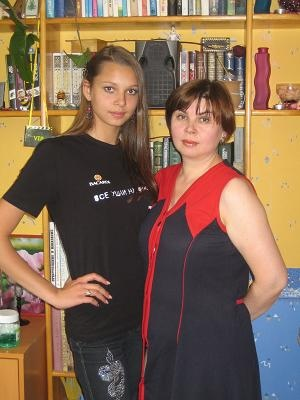
Er is een aangenaam park met zandstrand aan de Wolga waar ik een tijdje rondgehangen heb. Eind van de middag mijn [hospitalityclub](http://www.hospitalityclub.org) logeeradresje opgezocht die al een tijdje bezorgd aan het SMS'sen waren waar ik bleef. Het betrof een huishouden bestaande uit moeder en dochter van 16, Dasha. Moeder had twee tassenwinkels en was relatief welvarend.

Lekkere kippepootjes gegeten, foto's laten zien en toen uitgebreid gebadderd en het festivalvuil weggewassen inclusief rouwrandjes ondervandaan teen- en vingernagels. Allerlei aanboden tot excursies en vriendenbezoek afgeslagen. Vroeg naar bed gegaan, wat misschien wel een beetje onbeleefd was, maar ik was gewoon behoorlijk moe.

De volgende ochtend om 8:00 uur op en afscheid genomen, nadat ik eerst uitgebreid gefotografeerd ben. Via tram bus en nog een bus stond ik om 10:00 uur aan de weg op een goede liftplek achter een politiepost, waar iedereen langzaam rijdt.  
Al snel kwamen er nog twee sportiefe lifters in reflecterende kleding bij waarvan er eentje behoorlijk bruut en assertief liftte en voorbijkomende auto's met heftig en dwingend gezwaai poogde te stoppen. Dat lukte al snel: we konden alledrie met een agent mee tot de doorgaande weg, de M5 zoon 30 km verderop vanwaar het nog 480 km tot Ufa is.

Daar aangekomen was het een komen en gaan van katerige lifters afkomstig van het festival plus een nog grotere groep locals zonder rugzakken. Ook superlifer [Skazochnik](http://www.bpclub.ru/index.php?showuser=123) kwam en ging (richting Kamchatka). De sportlifters waren allemaal sneller weg dan ik evenals de vrouwelijke locals. Na 2 uur wachten stonden alleen ik en wat zwerverige locals er nog. Ging niet helemaal soepel zo natuurlijk en een beetje mismoedig besloot ik mijn gele regenjas aan te trekken om me wat te onderscheiden. Ik werd nog aangeklampt door een dronken figuur die beweerde mij te herkennen van het festival. Hij kwam mij niet bekend voor. Vroeg om een beetje geld en heb hem 30 roebels gegevens (0.90 euro). Hij was gelijk weg richting wegrestaurantje voor meer wodka, vermoed ik.

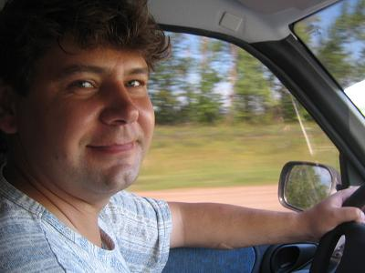
Uiteindelijk stopte er een Chevrolet 4-wheel drive met daarin een vertegenwoordiger van de russische afdeling van Van Nelle snoep. (Fruitella, Mella etc). Hij reed vlotjes richting Oktjabrsk, zoon 250 km verder. Na een paar kilometer zag ik [Skazochnik](http://www.bpclub.ru/index.php?showuser=123) staan en na een kwartiertje rijden waren we alle lifters die ik die morgen gezien had voorbij gereden. Blijkbaar hadden ze allemaal korte liftjes geaccepteerd en nu stonden ze op nog ongunstiger plekjes te vegeteren.

Goed gekletst met de vertegenwoordiger die een keer op werkbezoek in Amsterdam was geweest. Hij bevond zich eigenlijk voortdurend op de wegen tussen Kazan, Moskou, Samara, Ufa en Orenburg, zijn sales area.

Hij vertelde dat hij een keer een documentaire had gezien over een lifter die naar Afrika en Afghanistan was geweest. Ik liet hem de foto van [Krotov](_img/grushinski/ikenkrotov.jpg) en mij zien en het bleek inderdaad hem te betreffen.

De M5 werd steeds smaller en kronkelde door de heuveltjes van Tatarstan en later Bashkirië. 
Getuige de vele ja-knikkers die we onderweg passeerden reden we over een olieveld heen. De kale heuvels, verre uitzichten, plukjes bos en schattige meertjes deden me een beetje aan ierland denken.

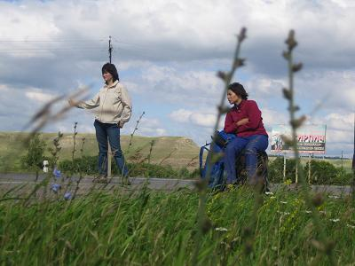
Bij de afslag richting Oktjabrsk stopten we en toen ik uitstapte kwamen Gulsum en nichtje Dina aangesneld. Zij waren ook terug aan het liften en dachten dat de auto voor hen stopte. Erg grappig natuurlijk toen ik uitstapte. Omdat het weinig zin had om eerder dan hen in Ufa aan te komen ben ik in de berm gaan liggen en heb de liftende dames gefotografeerd inclusief het stoppen van een auto, het instappen en afdruipen van de concurrerende lifters.  
Toen zelf weer aan de slag en kon al snel instappen achterin een oud vies voormalig arbeidersbusje. Ik kond de chauffeur en bijrijder niet zien en spreken en ueberhaupt niet naar voren kijken. Aanvankelijk voelde ik me een tikje ongemakkelijk met de situatie (waarom hadden ze niet 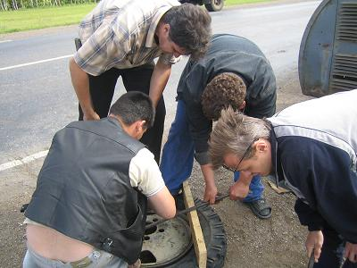 meer lifters meegenomen bv, er was ruimte zat en genoeg aanbod?) maar na een korte stop, waarbij iemand met pech onderweg geholpen werd, bleken het superaardige figuren.  
De bestuurder leek nogal op Pa Hofland. Ze gingen naar Ufa en hielpen onderweg mensen met pech, geheel belangeloos, wat de snelheid natuurlijk geen goed deed. Ook werd er een aantal keer gestopt om mij foto's te laten nemen op pittoreske plekjes.  
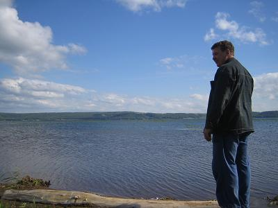
De weg werd erg smal en ik kon drie uur later compleet doorgeschud uitstappen in Ufa. Gulsum bleek niet ver weg te wonen en haar huis was snel gevonden.

Lekker gegeten met haar familie en kennis gemaakt met haar zus en vriend die zojuist van een huwelijksreis uit Europa teruggekeerd waren en een paar duizend foto's hadden gemaakt.

## Dag 8: Ufa - Chelyabinsk

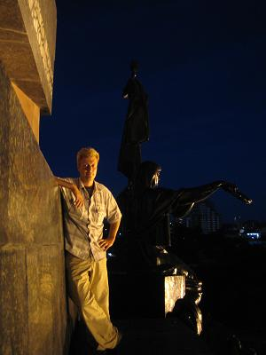
Na een aangename dag in Ufa 's avonds met Gulsum door de stad gewandeld. Op een bruggetje in een park sprak een nogal dronken jonge vrouw ons aan. Zij was 4 weken geleden moeder geworden en morgen moest ze haar dochter registreren (moet in rusland 4 weken na de geboorte). Het werd dus tijd om een naam te verzinnen, ze liep te peinzen en vroeg of wij niks leuks wisten. We hebben een hele serie namen opgenoemd maar ze had overal wel wat op aan te merken. Op een gegeven moment opperde ik de naam 'Petra' en die beviel haar heel goed ! Ook spaarde ze muntjes, ik heb haar wat eurostukjes gegeven waarop de naam 'Petra' nog beter beviel. Hoe het af gaat lopen zal ik wel nooit te weten komen maar ik schat de kans groot dat er een Petra bij is gekomen.

Met Gulsum tot diep in de nacht thee gedronken en over van alles gepraat. Veel te weten gekomen over haar leven en haar liftreisjes in Nederland en West-Europa. Erg interessant om te horen hoe ons land en onze maatschappij er in hun ogen uitziet. Onze bourgeois leventjes komen op hen over het algemeen als saai en te voorspelbaar over en het valt me hier moeilijk dat tegen te spreken. Ondanks alle moeilijkheden klagen mensen hier niet, het is not done om in alledaagse gesprekken over je problemen te praten.  
Verder hebben we het over de filosofie van het liften en reizen i.h.a. gehad, over emigratie van russen naar het westen, de toekomst van Rusland en de relatie tussen welvaart en geluk. Gulsum vond het tijdens Soviet tijden beter in Rusland, mensen waren beter voor elkaar en er was meer gelijkheid. Ze is niet de eerste jonge rus die ik tijdens mijn reis deze mening hoor verkondigen.

De volgende dag toch nog redelijk vroeg op, afscheid genomen van Gulsum en met de bus richting de M5. Daar aangekomen stond er weer een kluitje locals te liften waaronder een agent met twee meisjes. De locals vinden het leuk om praatjes met toeristen te maken en dicht bij je te komen staan. Onderdeel uitmakend van zo'n groepje verkleint de kansen op een lift aanzienlijk en ik moest meerdere malen een stuk verderop lopen en heb wederom mijn gele regenjas aangetrokken en rugzak prominent langs de weg gezet.  
Dat werkte en ik kreeg als eerste een lift van een Gazelle busje, dat mij 30 km verderop bracht, met nog steeds de stad Ufa aan de linkerkant. Ufa is een nogal uitgestrekte stad, waar 1.2 miljoen mensen wonen.  
Toen een lift gekregen van een stelletje, wat vrij ongebruikelijk is, deze blijven meestal liever gezelligjes met zijn tweetjes in de auto. Zij brachten mij zo'n 100 km verder in hun snelle Lada.

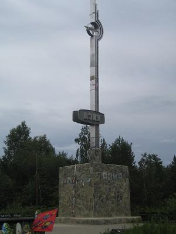
Na een half uurtje wachten en wat vragen kreeg ik een lift van een Gazelle met een zwijgzame tartaarse chauffeur. Na een rit van een paar uur in zijn busje over de weg die zich tussen Oeral'toppen' doorslingerde stond ik die avond om 18:00 uur op 100km afstand van Chelyabinsk. Onderweg nog het grenspunt Europa-Azie gepasseerd. Ook kreeg ik bericht over de 'Terakt' in Londen wat hier overigens nergens ook maar een wenkbrouw doet optrekken.

Onderweg zagen we de liftende agent met het meisje van die ochtend uit een vrachtwagen stappen. Mijn bestuurder barstte in een hard gelach uit, "Haha, hij heeft een hoer gevangen !!!". Hij dacht blijkbaar dat de agent een prostituee uit een vrachtwagenkabine had gehaald en arresteerde.

Laatste lift ook weer met een Gazelle busje dat mij tot centrum Chelyabinsk bracht. Daar belde ik het adres dat ik van Alex in Minsk gehad heb en al eerder had gecontacteerd, ene Olya met een vriendin Julia waar ik zou overnachten. Ik had reeds uitgebreid ge-email met deze Julia over wanneer ik zou komen, zo dacht ik.  
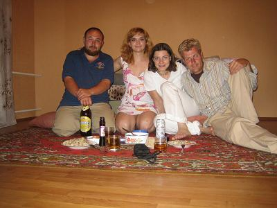
Die avond samen met Julia, Olya en nog een andere witrussische lifter onderweg naar Irkutsk, Misha, Chelyabinsk doorgereden in de Oka (russische twingo) van Olya voor een sightseeing tour. Chelyabinsk is in de 60er jaren gebouwd en was het centrum van nucleaire wapentechnologie en industrie van de USSR. Een verboden stad voor buitenlanders vroeger. Inmiddels wonen er 1.2 miljoen mensen en doet men hier en daar pogingen wat bezienswaardigheden op te richten, zoals een kerkje of een bioscoop, en wordt er een winkelpromenade ingericht. Verder lijkt er tussen de russische steden een wedloop aan de gang wie het mooiste, grootste en modernste station heeft. 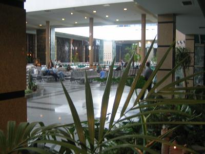 Samara centraal was al indrukwekkend maar het station hier slaat alles. Alles in marmer en malagiet, veel beelden binnen, overal tropische tuintjes, luxe wachtzalen, schilderijen en kabbelend water. Vrij bizar in de verder zo kale stad.

Hier in de buurt schijnt zich een der meest vervuilde stadjes op aarde te bevinden, gelegen aan een oranje riviertje.

Vandaag bleek plots dat ik bij een andere Julia overnacht had dan die ik reeds lang geleden via Hospitalityclub gecontacteerd had. Deze stuurde mij een ongeruste mail over waar ik bleef...  
Tsja, de namen zijn niet zo selectief hier en ik ben misschien wat ongeorganiseerd in mijn adressenhuishouding die zich over hoofd, telefoon, opschrijfboekje, adressenboekje en internet uitspreidt. Uitgebreid excuses aangeboden en die werden geaccepteerd met een glimlach.

Erg moe geworden van Misha, de witrussische lifter. Hij heeft een fenomenaal geheugen voor gedichtjes, anekdotes, gezegdes en moppen, veel moppen, en is eigenlijk continu aan het praten. Daarmee valt hij bij veel mensen in de smaak maar ik snap helaas maar een klein gedeelte van zijn kunsten met de russische taal. Dat bedroefde hem nogal en hij deed nog meer zijn best om alles uit te leggen, ik deed nog meer mijn best om alles te begrijpen en zodoende snapte ik op een gegeven moment helemaal niks meer :)  
Verder literflessen bier gedronken en Olga jongleren geleerd, wat ze heel snel onder de knie had (met drie ballen).

## Dag 9-10: Chelyabinsk - Novosibirsk

The saga continues... In 33 uur de 1500 km tussen Chelyabinsk en Novosibirsk overbrugd, de weg M51 van begin tot eind.

Zaterdag de 10e rustigjes opgestaan en met Julia naar het huis van Olga, waar Misha de witrussische lifter logeerde. Samen werden we door de dames naar de liftplek richting Toergan gereden, afscheid genomen en aan het liften geslagen.  
Ik kreeg al snel een lift van een mannetje in een Lada die mij zo'n 80 km verderop bracht tot een politiepost. Er was erg weinig verkeer op de weg, 1 auto per 3-4 minuten. Na een tijdje stopte er een rechtssturige Honda met daarin reeds medelifter Misha. Ik kon ook instappen en we werden een heel eind verder gebracht door een serieuze meneer die veel over de omgeving wist de vertellen en de economische situatie van de Oeral. Het schijnt dat in dit gebied het grondwaterpeil al een paar jaar aan het stijgen is en er al verscheidene dorpjes ondergelopen zijn. Een ander gevolg hiervan is dat er grote stukken berkenbos sterven omdat de wortels onder water komen te staan. Dat was duidelijk zichtbaar. De uitgestrekte stukken bos met witte bomen zonder bladeren boden een vrij spookachtig aanblik.  
De meneer ging vissen in Kazachstan, zoon 50 km zuidelijker gelegen, en moest rechtsaf op een gegeven moment. Wij bleven staan op een tamelijk ongunstige plek want relatief hoge snelheid waarmee de auto's voorbij raasden. Misha stond achter en ik 50 meter daarvoor. Het is niet echt duidelijk wie in zo'n situatie het voordeel heeft. Soms dient de aanblik van de eerste lifter als warmmakertje en stoppen chauffeurs pas bij de tweede. Chauffeurs die altijd lifters meenemen stoppen uiteraard reeds bij de eerste lifter.

Het was misschien verstandiger geweest om Misha voor te laten staan, hij is natuurlijk beter in staat de chauffeur om te praten om ook de tweede lifter mee te nemen. Anyway, ik kreeg de eerste lift, vertelde de bestuurder direkt dat de andere lifter verderop met het baardje erg grappig was, uit Minsk kwam en veel moppen kende. Maar het mocht niet baten, deze chauffeur had duidelijk geen trek in twee lifters in zijn riante Honda. Hij heette Denis, vertelde mij dat de meeste russen geen zin hebben om hard te werken en daar bleef het ongeveer bij. Hij zette mij af bij de afrit richting Kyrgan, waar hij zelf wezen moest.

Vrijwel direkt daarop een lift gekregen van een zachtaardig typ dat werkzaam was in het onderwijs. Hij ging zijn ouders opzoeken die zoon 200km verderop woonden, vlak bij de grens met Kazachstan. Onderweg klaagde hij nogal over de verslechterde mentaliteit van de russische jeugd. We hebben nog eventjes 'glibniki' geplukt, dat zijn een soort kleine wilde aardbeitjes die heel dicht bij de grond groeien. Momenteel is het seizoen voor deze besjes en op veel plekken langs de weg konden plukactiviteiten worden waargenomen.

Wie op de kaart kijkt zal zien dat de korste route van Kyrgan naar Omsk een stuk door Kazachstan loopt. In Soviettijden, toen Kazachstan gewoon een onderdeel was van de Soviet Unie, volgde al het verkeer deze weg. Nu niet meer omdat de wachttijden bij de grensposten oplopen tot 7 uur. Voor mij was deze route sowieso geen optie omdat ik geen visum voor Kazachstan heb. Het doorgaande verkeer volgt nu dus een omweg, die om Kazachstan heen, richting Omsk voert. Dit is een bestaande weg waarvan gedeeltes verbeterd worden om de grotere stroom verkeer op te kunnen vangen.

Ik werd afgezet bij het begin van deze omweg. Daar kreeg ik vrijwel direkt een lift van een jager in een UAZ busje. De natuur was trouwens ontzettend mooi. We reden door een groen heel licht glooiend steppelandschap met hier en daar een meertje, je had overal 360 graden uitzicht en kon kilometers ver kijken zonder een spoortje menselijke activiteit te zien, op de weg na dan.

Op de plek waar ik werd afgezet, bij een pompstation vlak achter een afslag, zoon 80 km verder was er erg weinig verkeer. Ik schat 1 auto per 5-7 minuten, die je al minuten van te voren aan kon zien komen.  
Toch kreeg ik snel weer een lift van een man in een Lada. Het betrof de uiterst vriendelijke en goedlachse 61-jarige Kolja. Hij vertelde me dat hij die ochtend gebeld was door zijn zoon die met drie lekke banden bij een pompstation aan de M-51 stond. Zoonlief had er niet bijverteld waar het pompstation zich bevond dus pa had banden gekocht en was gaan rijden richting Kyrgan en had alle pompstations langs de weg bezocht. Toen zoon gevonden was waren er al 250km afgelegd. Toen de drie banden gewisseld waren, was er ook nog een vierde lek gegaan en pa had weer ergens een band moeten kopen.  
Nu waren ze op weg naar huis en na een tijdje rijden kregen we zoon in zicht die met een zwaar beladen minitruck langzaam voortstiefelde richting Ishim, hun woonplaats.  
Kolja had zijn werkzame leven als treinmachinist doorgebracht achtereenvolgens op stoom-, diesel- en elektrische treinen. Treinmachinisten mogen hier op hun 55e met pensioen omdat het werk zo zwaar is. De dieselloks waren hem het best bevallen. Werken in de elektrische lokomotief was volgens hem erg ongezond vanwege de grote magneten die zich in de elektromotor bevinden. De stoomlokomotief was het gezondst (minst ongezond). Van zijn oudere ex-collega's, die een groot gedeelte van hun leven op de stoomboemel hadden gewerkt, leefden er nog een aantal en eentje was er zelfs 80 ! Van de jongere collega's waren er al veel heengegaan of hadden zelfs de pensioenleeftijd niet gehaald. Ik vroeg Kolja wat de mogelijkheden tot liften in treinen waren. Dit was volstrekt verboden, zo beweerde hij streng. Daarna vertelde hij vrolijk over allerlei voorvallen waarbij hij passagiers in de lokomotief had meegenomen.

Een heel stuk met hem meegereden. Af en toe even gewacht tot zoon weer in zicht was. Het laatste stuk voor Ishim, werd de weg erbarmelijk slecht. Er moest voortdurend rondom allerlei kuilen en slechte stukken heengereden worden. Toen de zon ondergegaan was, bereikten we de afslag naar Ishim en stapte ik uit. Het was inmiddels 22:00 en volgens Kolja kon ik beter met hem mee naar Ishim alwaar een goedkoop hotel zou zijn. Ik besloot nog even door te gaan liften en desnoods in de tent te overnachten. Afscheid genomen van Kolja die me nog serieus waarschuwde voor teken.

Het was inmiddels bijna donker en ik had mijn LED-hoofdlantarentjes opgezet die ik gekregen heb op Grushinski en in Moskou van een lifter. De voorbijkomende locals keken me af en toe met verbijstering aan. Doorgaand verkeer was erg zeldzaam. Ik kreeg telefoontjes van Petra, die veilig thuis aangekomen was, van mijn ouders, die op vakantie gaan, en ontving een SMS van Misha, die vertelde dat hij door locals was uitgenodig om te overnachten. Hij bevond zich zo'n 100km achter mij.

Ik begon reeds uit te kijken naar een plek om te overnachten en overwoog richting Ishim te lopen, omdat de tent me toch niet zo geschikt leek na de serieuze tekenwaarschuwing van Kolja. Toen stopt er een kleine auto met een stelletje die mij 15 km verderop brachten. Dit bleek een hele strategische lift te zijn: op de plek waar ik afgezet werd door het hartelijke stel, kwam de weg van Tyumen erbij met aanzienlijk meer verkeer en vooral veel trucks.  
Heel snel had ik een lift naar Omsk in een truck zonder oplegger bij een zwijgzame chauffeur die een goede muzieksmaak had en niet rookte !!! Hij navigeerde zijn truck stug tussen de kuilen door. De snelheid werd nergens hoger dan 50km. Erg genoten onderweg: ondanks duisternis heel goed uitzicht, goede muziek (70er jaren rock), comfortabele truck (Scania), gewoon top.  
De chauffeur bood me al snel aan te gaan slapen in de cabine maar dit druist in tegen het liftgebod 'Gij zult niet slapen in de auto !'. Naarmate de nacht vorderde en hij bleef aandringen begon ik te twijfelen aan dit gebod en ben gaan liggen. Hij even later ook want zijn ogen gingen dichtvallen. Goed geslapen en toen ik wakker werd waren we al praktisch bij Omsk waar veel zondagsverkeer was met dagjesmensen die gingen vissen, bessenplukken of paddestoelen zoeken.

Omsk is de grootste westsiberische stad met ongeveer 1.5 miljoen inwoners. Ik ben er niet ingeweest en heb slechts wat inkopen gedaan aan de rand van de stad bij een pompstation. Na 3 korte liften bevond ik mij om 9:00 's ochtends aan het begin de weg naar Novosibirsk, 680 km oostelijker. Deze weg is in 1999 geheel gerenoveerd en derhalve in relatief goede staat. Verkeer, ongeveer 1 auto per drie minuten.

Hier beging ik een fout die ik duur zou bekopen. Na mijn [ervaring in een Kamaz](http://010-vladok.reitsma.ru/index.php?m=2&item=3&sec=5) vorig jaar had ik besloten Kamazzen gewoon te door te laten rijden tenzij de situatie erg wanhopig zou zijn. Totnutoe dus niet geprobeerd Kamaz trucks te stoppen. Misschien was ik nog slaperig of lette ik gewoon niet goed op maar ik strekte mij arm uit bij een langzaam voorbijkomende Kamaz en deze stopte (Kamaz chauffeurs zijn de alleraardigste). Ik stapte in en hij bleek tot Novosibirsk te gaan....

...13 uur later stapte ik uit in Novosibirsk, onderweg 7 keer aangehouden door de politie waarbij 2 keer mijn paspoort uitgebreid bekeken is. Twee keer hadden we motorstoring waarbij de cabine omhoog moest, er een lekkende olieleiding met tape gerepareerd werd, en ik na afloop de halfzwarte chauffeur moest afsponzen. Door het schudden van de Kamaz kun je onderweg lezen noch schrijven. Het ding had geen radio, erg stugge vering en het bankje voor de bijrijder heeft geen ruggensteun en is niet geveerd. De snelheidsmeter was kapot maar ik schat de gemiddelde snelheid in op 50/60 km uur.

Kortom, karaktervormend !

## Dag 11: Novosibirsk - Krasnoyarsk

In Novosibirsk allerlei mensen ontmoet:

- Amerikanen
- Daniel, die reeds enkele jaren in Groningen studeert en goed nederlands praat. Zijn moeder heeft een chinees restaurant in Novosibirsk
- Lars, nederlander die werkt voor Royal Haskoning en hier hard aan het onderhandelen is met locals.
- Een groep belgische jongeren die mij de weg naar het station vroegen. Zij zijn op weg naar Krasnoyarsk, per trein, om daar op charitatieve basis de russen wat kennis en enthusiasme voor ecologie bij te brengen.
- Vriend Serge, de naychni bomz (wetenschappelijke zwerver) die 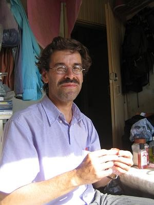 mij in mei heeft opgezocht tijdens zijn trip door Nederland en hier woont in Akademgorodok, het wetenschapsstadje in de buurt van Novosibirsk.
- Andrej en zijn vriendin Tanja. Bij hen heb ik overnacht. Andrej is een heldhaftig maar zeer bescheiden lifter die vanuit Novosibirsk elk jaar een maand lang ergens heenlift. Zo heeft hij reeds een aardig gedeelte van West-Europa gezien en is in China, Laos en Thailand 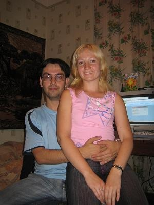 geweest. Dit alles zonder ook maar 1 keer in een hotel te slapen of anderszins betaald te overnachten. Ook maakt hij wandeltochten. Zo is hij van Cannes naar Nice gelopen en heeft een heel stuk langs de kust van de Krim gewandeld. Hij is ook een goed fotograaf en ik heb veel mooie foto's bewonderd. Op eentje is zijn geimproviseerde slaapplaats te zien midden in een klaverblad A4-A2 ten zuiden van Amsterdam.

Dinsdagmorgen de 12e vanuit Andrej's huis met de elektrichka terug naar Novosibirsk centrum, toen met bus 1189 naar de eerste politiepost op de M-53, de weg van Novosibirsk naar Irkutsk, via Kemerovo en Krasnoyarsk.  
Daar had ik snel een lift te pakken van een jongeman in een sportieve Lada, die hij zelf had opgepimpt. Gele wieldoppen, stoere ruitenwissers en spoilertjes. Alleen ontbrak het achterraam van de auto. Met hem snel zoon 50km verderop geracet naar de volgende politiepost.

Daar maakte ik voor het eerst kennis met de Siberische [midge](http://www.scotweb.co.uk/environment/midges/whatisamidge.html). Diegene die schotland wel eens bezocht hebben weten wat [midges](http://www.scotweb.co.uk/environment/midges/whatisamidge.html) zijn. Kleine vliegachtige insektjes die in grote zwermen rondvliegen, vooral tijdens schemering of tijdens regenbuien, wanneer het zonlicht wat gedimt is. In tegenstelling tot muggen, die geheel pijnvrij een gaatje door de huid boren alvorens wat bloed te zuigen, trekt de midge de huid op pijnlijke wijze open om daarna te gaan lebberen.

Tijd om mijn muggenspul op te zoeken had ik niet want ik kreeg een lift van een piloot die op weg was naar Tomsk. Met hem kon ik meerijden tot de afslag naar Tomsk. Onderweg pikten we nog een liftende soldaat op.  
De piloot vloog in kleine vliegtuigjes tot 20 passagiers richting Moskou of Vladivostok. Sensatiebelust vroeg ik hem naar bijna ongeluk ervaringen. Hij vertelde dat hij een keer met een 3-motorig vliegtuig onderweg naar Moskou in een storm was beland. 1 motor viel uit en toen ze voor de noodlanding gingen bij Novosibirsk viel nog een motor uit. Het toestel is toch nog aan de grond gezet waarna bleek dat veel passagiers de stoelen bevuild hadden...

Afgezet op een parkeerplaats met veel vrachtwagens en enkele cafe's. Ik vroeg een lift aan een witrussische vrachtwagen die richting Krasnoyarsk gingen. Geen afwijzing alleen zouden ze voorlopig nog niet rijden.  
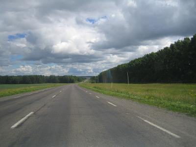
Toen kreeg ik een lift tot Kemerovo in een snelle Lada. De man woonde in Kemerovo en wist veel over deze mijnwerkersstad te vertellen. Kemerovo is het centrum van de Kuzbass, de regio is verantwoordelijk voor 85% van de steenkool productie van Rusland en exporteert daarnaast nog veel richting rest van de wereld, met name China. Het is een tijdlang heel slecht gegaan, toen Moskou de salarissen niet meer betaalde. Inmiddels was het tij gekeerd, Moskou betaalde weer en een groot gedeelte van de mijnen is geprivatiseerd. Het verval is nog duidelijk zichtbaar overal in de stad maar er zijn ook veel tekenen van welvaartsgroei. Zo worden overal gebouwen opgeknapt, de wegen rond de stad zijn prima, bijna nederlandse conditie met uitstekende bewegwijzering. En er stonden door het hele centrum files, wat duidt op veel auto's.  
Ik werd in het centrum afgezet en nam bus 10 die me naar de andere kant van de uitgestrekte stad bracht. Daar vertelde de chauffeur me dat ik een stuk door een bos moest lopen en dan weer bij de weg uit zou komen. Dat klopte.

Bij de politiepost aldaar was er een Dorozhnik wegrestaurantje. Totnutoe was ik overal langs de weg veel cafe en restaurantjes tegengekomen in allerlei varianten, van heel luxe (zeldzaam) tot erg basic behuisd in een oude stacaravan of bouwkeet (vaak).  
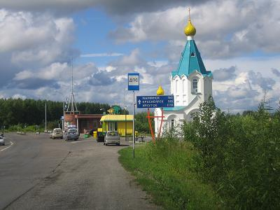
Een groep studenten uit Kemerovo zag hier een gat in de markt en is een keten begonnen, de zogenaamde Dorozhniks. Goed herkenbaar met logo's, geel-groene kleuren en een vast menu, met constante kwaliteit en vaste prijzen. Binnen staan een paar grote koelkasten en een batterij aan magnetrons. Een broodje is in 1 minuut warm en kost ongeveer 1.50 (euro). Verder is er thee, koffie en limonade te krijgen.

Vanaf de liftplek zag ik dat veel bezoekers helemaal geen doorgaande reizigers waren maar gewoon vanuit de stad naar de Dorozhnik reden voor een hapje. Het MacDrive effect !

Het was inmiddels 18:00 en er restte nog 420 km tot Krasnoyarsk. De liftplek was uitstekend. Helaas werd ik weggestuurd door de politie die mij vertelde dat dit geen parkeerplaats voor auto's was, maar hun werkterrein. 100 meter verderop reed men aanzienlijk harder. Tot mijn geluk stopten de witrussische vrachtwagens, die ik eerder deze dag had aangesproken voor Kemerovo. Met veel gepiep brachten zij hun wagens tot staan om mij mee te nemen.  
Met hen het hele stuk tot Krasnoyarsk afgelegd door schitterend heuvelachtig zeer dun bevolkt gebied. Langzaam ging het loofbos over in naaldwoud, de taiga. De chauffeurs vervoerden een metalen constructie vanuit Duitsland naar de ondergrondse stad Zelensogorsk, iets voorbij Krasnoyarsk, waar [twee kernreactoren plutonium](http://russianforces.org/eng/blog/archive/000517.shtml) produceren voor bommen. Ze moesten vaak stoppen om te telefoneren, ze hadden namelijk nog geen vergunning om de stad in te mogen.  
Verder ging de lading schuiven onderweg en deze moest twee keer opnieuw vastgesjord worden.  
's Nachts om 2:30 kwamen we aan op een vrachtwagenovernachtingsplek met motel, 2km voor Krasnoyarsk. Daar heb ik een klein kamertje gehuurd en ben gaan slapen.

In Krasnoyarsk deze dames gevonden die mij de stad hebben laten zien.

## Krasnoyarsk

Vroeg in de morgen in Krasnoyarsk aangekomen heb ik eerst mijn rugtas in het depot van het station gedeponeerd. Daarna een goed deel van de dag bezig geweest om een nieuwe USB kabel te regelen. In de negende computer salon was het eindelijk raak, en waren de mini-USB kabels niet uitverkocht, tot mijn groot geluk.

's Avonds ontmoette ik Elena, de kennis van Gulsum uit Ufa. Net als Gulsum had ook zij een trainee gehad in Belgie, bij de Caterpillar fabriek. Nu werkt ze voor Caterpillar in Krasnoyarsk.  
Zij had een sightseeing tour door de city geregeld in de bedrijfsauto van een vriendin, Tanya. We zijn naar twee uitzichtspunten gereden gelegen op de bergen die Krasnoyarsk omringen. 's Avonds gelogeerd bij Sveta, weer een andere vriending van Elena. Sveta was vervuld van haar carriere en wilde zo snel mogelijk manager of director worden bij een interessant bedrijf. Het is volgens haar heel belangrijk dat mensen een doel in hun leven hebben, anders kan het snel fout gaan.

De volgende ochtend bleek Misha, de witrussische lifter Krasnoyarsk ook bereikt te hebben. Hij nodigde mij uit om samen met hem en andere lifters de zogenaamde 'Stolbi' in de buurt van Krasnoyarsk te bezoeken. Dit zijn een aantal grote basaltrotsformaties gelegen in de bossen varierend in hoogte van 40 tot 80 meter.  
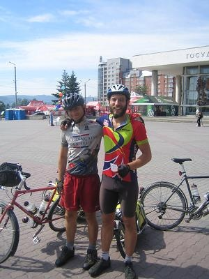
Toen ik op hem zat te wachten kwamen er twee westerse bikers op hun fietsen met aanhangwagentjes voorbij die ik aansprak. Het bleken [Lewis & Graham](http://bikemongolia.95mb.com/) uit Bath, UK, die onderweg zijn naar Mongolie op de fiets. Vrij heldhaftig uiteraard. Tijdje met ze gepraat, ze kwamen net aan uit Novosibirsk, zoon 5 dagen fietsen, en waren zo moe dat ze even moesten denken over hun eigen naam. De tocht was erg zwaar en vooral de Siberisch insecten waren geen pretje. Het zal alleen nog maar moeilijker worden naarmate ze oostelijker komen en de wegen nog slechter worden. Later kwam ik nog een Canadees tegen die van Jakoetsk naar Europa aan het fietsen is. Hij fietst de betere infrastructuur tegemoet.  
Graham en Lewis vroegen mij wat het woord 'Malatsi' betekende, dat ze onderweg vaak te horen kregen van locals. Ik legde uit dat dit een compliment is en zoiets betekent als 'reuze kerels'. Verder heb ik hun de helft van mijn encefalytus antidote pillen cadeau gedaan die ik in Novosibirsk gekocht heb. Zij hebben meer van teken te duchtten dan ik, schat ik zo.

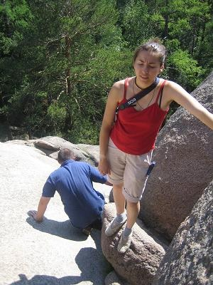
Met Misha, Marina en Andrej (de andere lifters) de hele dag bezig geweest de Stolbi te bereiken, te beklimmen, en weer terug te lopen. Mooie wandeling door het bos en de rotsformaties zelf waren indrukwekkend. Wel moeilijk te beklimmen en ik heb erg voorzichtig gedaan. Het spookte voortdurend door mijn hoofd dat het toch wel erg lullig zou zijn als ik na 6500 km liften hier van een rotsblok af zou vallen.  
Misha is weer de hele dag geen minuut stil geweest en bracht iedereeen met zijn moppen, liedjes en gedichtjes in vervoering, op mij na. Dus werden er weer veel pogingen gedaan om mij de hogere schoonheden van de russische taal bij te brengen en ik werd weer erg moe van hem.

Voor die avond had ik nog geen slaapplaats geregeld en heb eens ervaren hoe de gemiddelde russische lifter een dergelijke situatie aanpakt. In elke russische stad zijn bepaalde hangplekken voor jongeren, de zogenaamde tusofka's. In Krasnoyarsk bevindt de hangplek zich bij de speelgoedwinkel.  
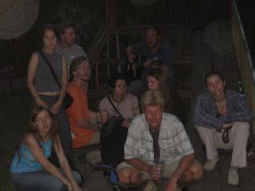
Daar aangekomen hebben we wat jongeren aangesproken, werden de gitaren tevoorschijn gehaald, werden er liedjes gezongen en bier gedronken. Al heel snel werd mij een slaapplaats aangeboden door ene Dima.  
Dima wist mij te vertellen hoe ik gratis met de BAM (Baikal Amoers spoorlijn) richting oosten kan reizen.

Ook kwamen er nog drie agenten kijken en mijn paspoort en visum bleken nog ok.

Verder kennisgemaakt met meisjes uit Irkutsk onderweg naar Moskou en ik kwam Nikita uit Magnitogorsk tegen ! Met hem had ik in Nederland reeds uitgebreid gecommuniceerd op internet en een tijdje waren we van plan om samen vanaf de Ural richting Baikal te liften. Dat ging niet door omdat hij een meisje vond die heel graag met hem mee wilde.  
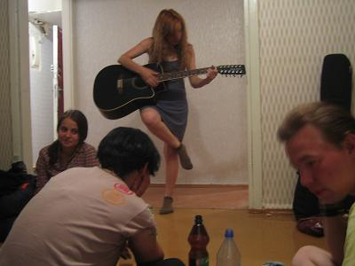
Erg gezellig in ieder geval en na veel gedoe bereikten we eindelijk de slaapplaats, de vpiska. Daar bleek dat er die nacht in het eenkamer appartementje zonder meubels 9 mensen zouden slapen, matje tegen matje. Eerst moest er nog het nodige gedronken en gezongen worden.  
Er was ook een gozert uit Norilsk, het uiterste noorden van Rusland. Hij was op reis met alleen zijn gitaarkoffer. Sliep gewoon op de grond zonder slaapzak of matje en dronk gewoon elke avond zoveel dat hij dit niet miste. Hij pretendeerde een sjamaan te zijn en ik mocht hem niet fotograferen. Hij gaf een imposent concertje keelzingen.

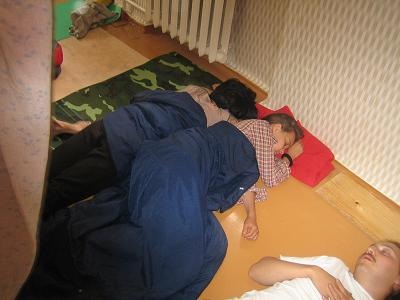
Het was erg laat toen ik in slaap viel, de gastheer was erg dronken en hield iedereen tot laat wakker. Hij kroop voortdurend over iedereen heen op zoek naar meer wodka.

Door alle activiteiten van de afgelopen dagen had ik mijn kleren niet kunnen wassen en was ik ook niet goed uitgerust voor de verdere toer. Daarom besloot ik nog een dagje te blijven, weer een beetje tot mijzelf te komen, en goed uit te rusten en in een hotel.  
Veel respect voor de russische lifters die zonder bankpas en creditcard op pad zijn.

## Dag 12: Krasnoyarsk - Taishet

Vroeg opgestaan (6:00) en de bus genomen naar de Krasnets fabriek. Vandaaruit met een marshrutka naar het plaatsje Berezovka, enkele kilometers verderop. Daar zou een DPS wegpolitiepost zijn waar het altijd goed liften is maar die kon ik niet vinden. Al zoekende was ik het plaatsje inmiddels doorgemarcheerd en ik besloot maar direkt aan de weg te liften. Redelijk snel stope er een russische jeep en na wat uitleg bleek dat ze mij naar een andere plek konden brengen, verderop waar een cafeetje aan de weg gesitueerd was.  
Na een bakje koffie kon ik gelijk mee met de eerste vrachtwagenchauffeur die ik aansprak. Hij heette Kolja (Klaas) en was met een lege truuk onderweg om hout op te halen in Kansk, zoon 100 km verder. Hij was een gezellige gesprekspartner en had er duidelijk lol in mij een stukje verder te brengen. Hij ondervroeg mij honderduit over Nederland en was erg geinteresseerd in ons drugsbeleid. Zelf was hij 28, getrouwd en gescheiden en vader van de 8-jarige Olya. Vlak voor Kansk sloeg hij af en stapte ik uit.

Ik kon vrijwel direkt verder met een stadsbus richting centrum Kansk. In het centrumpje bij de bushalte voor de bus richting weg naar Irkutsk liep ik de uiterst luchtige en bevallige Katya uit Moskou tegen het lijf. Zij verbleef de zomermaanden alhier bij oma en ze verveelde zich naar eigen zeggen stierlijk in dit provinciestadje. Ze moest mijn kant op en even later bereikten we de afrit waar volgens de encyclopedie een politiepost moest zijn. Deze was echter ook verdwenen.  
Ik vroeg Katya voor de grap of ze niet meewilde richting Baikal. Na even nadenken wees ze mijn voorstel op serieuze toon af. Wel ging ze in op mijn verzoek om even te helpen met liften. Als beloning nam ze een paar happen van mijn ijsje.

Al snel stopte ze een auto die 30 km verder ging. Zelf stapte ze na 500 meter uit om direkt in een andere auto te stappen met bekenden die haar opwachtte. Ik wenste haar een fijn leven toe.

Zelf reed ik nog een stuk verder met de Al Pacino look-alike Andrej. Hij onderwierp mij in korte tijd aan een spervuur van vragen en concludeerde daarna snel dat ik een goed mannetje was (òû õîðîøèé ìóæèê). Hij snapte niet wat voor een lol ik had in een dergelijke reis maar had er ook niks op tegen. Hij was vertegenwoordiger van een handel in alcohol, reed voor zijn werk in een Lada maar had thuis een BMW 500 om in de avonduurtjes vrouwen mee op te pikken.  
Hij waarschuwde mij voorzichtig te zijn en berekende snel dat mijn salaris zoon twintig keer hoger is dan het lokale gemiddelde.

Op de plek waar hij mij afzette was nauwelijks verkeer maar stonden wel twee onbemande vrachtwagens met neus in de goede richting. Toen de chauffeurs terugkeerden uit het cafeetje gelijk gevraagd of ik mee mocht. Ze hadden nog wat te prutsen aan hun wagens maar daarna was het "ðîåõàëè !, we gaan !  
Ik nam plaats in de ruimste en mooiste truck die ik ooit bereden had. Een amerikaanse Eagle (General Motors), wel redelijk oud maar formaatje met een zeer ruime cabine op stahoogte. Chauffeur Igor bleek uiteraard weer een toffe peer. Voor zover ik kon waarnemen had hij een volledig gouden gebit. Woonachtig in Barnaul reed hij twee keer per maand naar Irkutsk volbeladen met zonnebloempitten.  
De weg was even heel goed maar daarna volgde de slechtste stukken die ik totnutoe tegen ben gekomen. Het asfalt hield gewoon op en er volgden stukken echte gruntovka, bestaande uit een hobbelige grond en grindweg. De truck reed stapvoets over alle kuilen en hobbels. Rammstein werd opgezet !

Hier eindigde de beschaafde wereld volgens Igor (hier alweer, dacht ik). We passeerden allerlei armoedige dorpjes. Igor vertelde dat hij hier niet rustig langs de weg kon overnachten zonder 's nachts lastig gevallen te worden door alcoholisten werklozen. Echte bandieten waren er volgens hem echter al een tijdje niet meer in deze regio. Hier wonen volgens hem slechts ex-gevangen en bannelingen en hun nageslacht, maar dat geldt eigenlijk voor heel Siberie (en Australie).

De M-53 kruiste regelmatig met de transsiberische spoorlijn en in werd in de buurt van Taishet weer iets beter. In Taishet zelf was het asfalt weer verdwenen. Nog even getwijfeld of ik wel echt uit zou stappen. Ik kon rustig blijven zitten en de volgende dag in Irkutst aankomen, maar het BAM idee had zich inmiddels te stevig tussen mijn oren geplaatst.

Uitgestapt en samen met een papirossie rokend oud mannetje middels een busritje en een taxirit van 8 roebel het station bereikt. Daar begon opnieuw een twijfelperiode c.q. besluitvormingsproces. Ik kon hier letterlijk twee kanten op.

*1) Terug naar de weg en doorliften naar Irkutsk, Ulan Ude en Chita, treinen met de transsib naar Xabarovsk en verder liften naar Vladivostok.*

- ✅ Misschien iets sneller
- ✅ Had reeds slaapadresjes in Irkutsk
- ✅ Lifterskamp met bekenden bij Irkutsk aan de Baikal
- ❌ Beaten track
- ❌ Lifterskamp met bekenden bij Irkutsk
- ❌ Geen BAM
- ❌ Lange lifttocht met nog veel gruntovka voor de boeg

*2) Verder met de BAM, de alternatieve transsiberische spoorlijk, 3000 km door de Taiga noordelijk van Baikal tot Komsomolsk, daar verder naar Xabarovsk en liften naar Vladivostok.*

- ✅ Ik reis met de BAM en zie het BAM gebied
- ✅ Off the beaten track
- ✅ Mogelijkheid tot liften met treinen
- ❌ Onzekerder: rijden er wel treinen ? hoeveel ? hoe snel ?
- ❌ Niet echt liften meer

Het is optie 2 geworden.

Liften bij lokomotieven schijnt hier heel goed mogelijk te zijn maar ik besluit het eerste stuk tot Severobaikalsk netjes betaald te gaan reizen (15 euro voor 24 uur trein, 1000 km). Liften met treinen is compleet nieuw voor mij en het station van Taishet, ofschoon druk gefrequenteerd door goederentreinen, wordt erg goed bewaakt door allerlei figuren in uiteenlopende uniformen en bewapening. Mijn trein gaat morgenochtend pas maar het station bleek voorzien van goede faciliteiten.  
De goede faciliteiten in de vorm van een luze wachtkamer met bed & douche bleek helemaal vol te 
zitten waarop ik mijn matje in de gratis wachtzaal heb uitgerold en daar prima heb getukt.

## Dag 13: Taishet - Severobaikalsk

Toen ik gewekt werd door mijn telefoonalarm stond de trein al te wachten. Ik had een platsknartny biljet, dat zijn de rijtuigen zonder coupes maar wel met slaapplaatsen. Een soort rijdende barakken, wel comfortabel hoor, tenzij je erg op privacy gesteld bent.

In de trein hoorde ik mensen een andere taal spreken. Het bleken 5 azerbeidjanen (azeri's ?) te zijn op weg naar Bratsk waar langenoten van hen woonden en werkten. Zelf gingen ze ook werken. Azerbeidjan was een prima land volgens hen, waar je riant kon leven, als je werk had, en dat laatste was er helaas weinig. Azerbeidjaans lijkt veel op het Tursks en de woorden die ik wist op te dissen uit mijn beperkte turkse woordenschat waren hun allemaal bekend. Zelf bedienden ze zich van een plattelandsdialect, niet zo mooi als het algemeen beschaaf turks.  
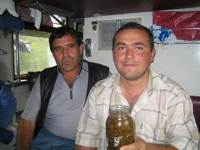
Twee van hen praatten ook russisch en een aardig gesprek met ze gehad. Ze zouden graag nederland eens bezoeken, vooral toen ze van mij hoorden dat dit in de buurt van Duitsland gelegen is. Hun was bekend dat je daar gewoon heen kon gaan en jezelf bij de politie aan kon geven. Vervolgens zou je onderdak krijgen plus 500dm per maand en daar hoefde je niet eens voor te werken !  
Ik heb vergeefs getracht dit Walhalla verhaal iets te nuanceren. Ze wilden graag Nederland en Duitsland eens bezoeken en ik heb hen mijn telefoonnummer gegeven. Ik werd getrakteerd op koffie, thee en jam en bij het uitstappen namen ze afscheid met de woorden, "We zien elkaar nog wel !". Wie weet...

De tijdelijke overstap naar het spoor bevalt me uitstekend, na het vele gelift. Afgezien van het feit dat Severobaikals over de weg menselijkerwijs niet te bereiken is, heeft het treinreizen zo zijn voordelen (duh :).  
Zo kun je prima slapen, thee en koffie zijn onder handbereik dankzij de aanwezige samowar en om 16:00 stipt kon ik eindelijk mijn meegesleepte cup-a-soupjes eens aanbreken (asperge).

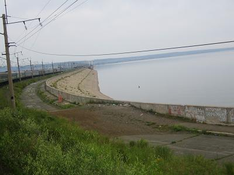
De eerste paar honderd kilometer van Taishet tot Yskt-Kyt horen officieel nog niet bij de BAM, dit stuk is reeds in de vijftiger jaren aangelegd. Onderweg paseerden we Bratsk, waar de spoorlijn over de stuwdam in de rivier de Angara loopt. Ik schatte de lengte van de dam op 7 tot 12 kilometer. Het gebied rond Bratsk maakte een geindustrialiseerde indruk.  
Na Bratsk nam het aantal stops geleidelijk af, de wagon was inmiddels nagenoeg leeg. Het landschap werd ruiger en bergachtiger en de eerste tunneltjes volgden. Het weer was grauw en regenachtig en er hingen een laaghangende nevel tussen de bergen.  
Op station Lena nog een shoarmarol gegeten en toen gaan slapen.

De volgende morgen aankomst in Severobaikals, waar het bewolkt was en miezerde. Snel een 
hotelletje gevonden en het Baikal opgezocht.

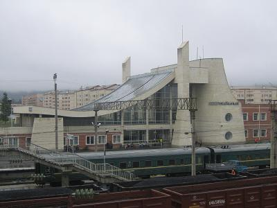

## Dag 14: Severobaikalsk - Tunda

De 19e juli. 's Ochtends kwam ik erachter dat het dinsdag was waar ik eigenlijk een maandag verwachtte. Gelukkig gevolg was dat ik het BAM geschiedenis museum nog kon bezoeken voordat ik de trein naar Tunda zou nemen.  
Samen met Michael erheen gewandeld. Michael was mijn 49-jarige kamergenoot uit het hotelletje 'Huis aan de Baikal'. Hij was afkomstig uit Irkutsk en werkte als IT-docent. In die hoedanigheid bezocht hij hier een conferentie samen met collega's afkomstig uit heel de voormalige USSR. De vorige avond een kleine drinksessie met ze gehouden die gedicteerd werd door een zeer dronken ukraiense professor.  
In het museum konden we aansluiten bij een rondleiding gegeven door een vriendelijke burjatische dame. Zij vertelde veel interessante weetjes over de 4000 km lange spoorlijn, de zware omstandigheden tijden de bouw, de vele tunnels en bruggen en de 6 alternatieve route die op de tekentafel bestaan hebben.

Vanaf Taishet, gelegen aan de transsiberische spoorlijn, begint de Baikal Amoer zeleshno dorozhni Magistral (BAM) die eindigt in Sovietski Gavan aan de Grote Oceaan, 4000 km, 3000 bruggen en veel tunnels verder, een zeer onherbergzaam gebied doorkruisend. De bouw is een van de grootste civieltechnische projecten van de 20e eeuw, is in 1974 begonnen en in 1984 voltooid. Voor die tijd was er echter al veel werk verricht qua egalisering van het tracee.  
Het aanvankelijke doel was strategisch, namelijk te voorzien in een alternatieve transportlijn in geval van een oorlog met China. Later werd de economische ontwikkeling van het gebied een belangrijk oogmerk.

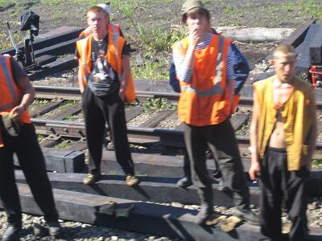
De langste tunnel is 15 km lang en het uithakken ervan kostte 5 jaar. Toen de tunnel bijna klaar was liep hij onder water en alleen met hulp van een amerikaanse firma kon de klus geklaard worden, zo vertelde de burjatische ons op zachte toon. In 1984 reed de eerste trein vanaf Taishet helemaal door tot aan de Grote Oceaan.  
Er is nog altijd veel discussie over de werkelijke redenen van de aanleg: vanuit economisch oogpunt is het een volstrekt onverantwoorde investering. Een Betuwelijn avant-la-lettre.  
Vanuit strategisch oogpunt, als alternatief voor de transsiberische spoorlijn in geval van oorlog, lijkt de spoorlijn mij van weinig waarde. Met inzet van modern wapentuig is de lijn in no-time onbruikbaar te maken. 3000 bruggen om uit de kiezen.  
De werkelijke reden van de bouw was volgens Michael de wens van de partijbonzen om middels een groot project nieuw leven in de uitgebluste Sovietstaat van de 70-er jaren te blazen. Een socialistische overwinning op de domme taiga zou het waakvlammetje van het communisme opnieuw tot een groot vuur moeten aanwakkeren.  
Het heeft niet mogen baten, het communisme is niet meer, maar de spoorlijn ligt er toch maar mooi, hoewel op de meeste stukken hooguit 1 passagierstrein per dag rijdt plus nog enkele goederentreinen.  
Voor meer informatie over soviet civieltechnische megolomanie raad ik het boeiende boek ['Ingenieurs van de ziel'](http://www2.rnw.nl/rnw/nl/themes/cultuur/taal/stalin031009.html) aan van Frank Westerman, bij mij te leen.

Door een vergissing met de tijd had ik nog bijna de trein gemist. Tijden worden op alle stationsklokken, treinschema's en biljetten in heel Rusland voor het gemak (van de automatisering, niet van de burger) in moskoutijd aangegeven. Mijn trein vertrok om 8:00 moskoutijd. Het was hier Moskou +6 maar in het internet cafe waar ik mijn mobiel gesynchroniseerd had was het om een of andere reden Moskou +5.

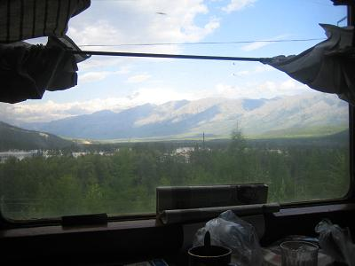
Heftig zwetend nam ik plaats in de platskartny wagon (de rijdende barak) en maakte daar kennis met Jan en Artem Liu. Een twee-eiige tweeling met een Koreaanse opa van vaderskant. Ze studeerden beide in Novosibirsk en waren op weg naar huis in Niugri, een stad gelegen in de Sacha, de grootste en dunstbevolkte deelrepubliek van Rusland, met hoofdstad Jakoetsk.  
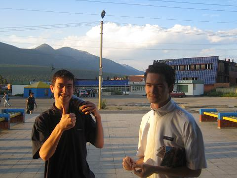
Het waren leuke gozers maar moeilijk te verstaan, hun monden gingen nauwelijks open tijdens het praten. 's Avonds bier gekocht in de trein en later op station Taskimo nog meer bier gekocht en rode bulgaarse wijn. De jongens hebben nederlandse muntdrop geproefd, muziek uit mijn MP3 speler geluisterd en we hebben wat gejongleerd voor zover dat mogelijk was in een rijdende trein.

Die nacht liet ik een luide bierscheet. De volgende ochtend geen klachten gehad van medereizigers en Jan en Artem beweerden zelfs niets gehoord te hebben.  
Veel uit het raam gehangen en de natuur bewonderd die met hoge besneeuwde bergtoppen aans ons voorbijtrok. Honderden kilometers met nergens een mens de bekennen. Het BAM gebied is zo dunbevolkt dat er op de toiletten in de trein geen gordijntjes hangen.

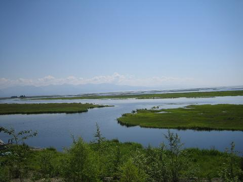

## Dag 15: Tunda - Belogorsk

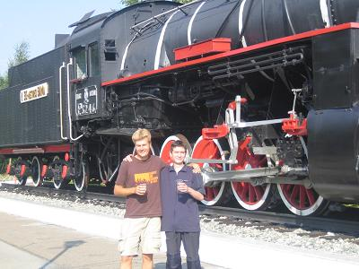
De 20e 's middags in Tunda aangekomen en uitgestapt. Jan en Artem moesten nog 6 uur verder met de trein naar hun hometown maar de trein bleef hier 2 uur staan. Dit bood de mogelijkheid tot een uitgebreid afscheid waarbij we nog 2 literflessen bier dronken op het stationsplein.  
Artem ving nog een groot vliegend insekt en demonstreerde een geintje uit zijn kinderjaren: de tor werd in een plooi van zijn T-shirt gehangen 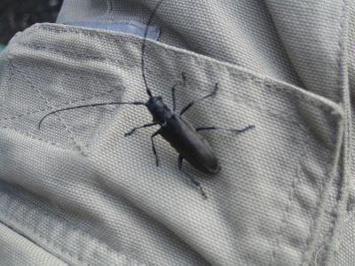 waar het beestje zich met zijn heftig happende kaken stevig in vastbeet. Artem gaf een snelle ruk aan het achterlijfje en er bleef een decoratieve broche in de vorm van een torrekop met lange voelsprieten op zijn T-shirt achter.  
De jongens nodigden mij nogmaals uit om met hun mee te gaan, had best zin maar mijn tijd begon te dringen, en bij tijd en wijlen begonnen zich gevoelens van heimwee te ontwikkelen.

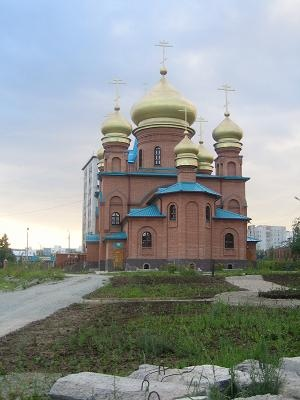
In Tunda had ik weer een aantal opties: 23 uur wachten op de trein naar Komsomolsk a/d Amoer verder over de BAM oostwaarts of 5 uur later met een trein richting Chabarovsk. Het treinlift idee speelde ook nog en er stonden enkele goederentreinen te wachten. Echter, toen ik rustig die kant op bewoog werd ik gelijk teruggefloten door agenten die overigens wel allervriendelijkst waren en na een kort praatje handenschuddend afscheid namen. Later nog een praatje gemaakt met andere agenten op het station en ook deze vertelden mij dat het treinliften echt strikt verboden was (maar blijkbaar wel bestond).

Ik had geen zin om 23 uur door te brengen in dit stadje dat, ofschoon bekend staat als hoofdstad van de BAM, aan bezienswaardigheden niet veel te bieden had. Toen een kaartje gekocht tot Belogorsk, een stad gelegen aan de transsiberie express, waar volgens mijn informatie de autoweg oostwaarts weer in normale conditie zou zijn. Het bleek dat de coupe en platskartny klassen uitverkocht waren. Er was nog wel plaats in de zogenaamde obshe wagon, de allerlaagste klasse die alleen in afgelegen arme gebieden nog voorkomt. Ik had weinig keus, was in voor een nieuwe ervaring, en dus kocht voor 10 euro een kaartje tot Belogorsk.

Die middag en avond wat rondgelopen door Tunda. Tunda is door arbeiders uit Moskou gebouwd en dat is weer terug te zien aan de architectuur van de stad en de straatnamen. De prijzen van produkten waren trouwens ook vergelijkbaar met Moskou.  
Een beetje gezocht of er hier internet aansluitingen waren. Hiervoor kun je in Rusland, zo is mijn ervaring, het beste jonge verzorgde enigszins intelligente uitziende dames aanspreken. Deze vertelden mij stuk voor stuk direkt dat internet de volgende morgen om 8:00 in de bibliotheek beschikbaar zou zijn. Daar kon ik niet op wachten en bovendien vermoedde ik dat een grote menigte dames mij daar op dat tijdstip voor zouden zijn.

Wachtend op het station kennisgemaakt met een grote groep moskouse jongeren die aan een zwaar gesponsorde trip rond de wereld bezig waren. Ze zouden naar Kamtsjatka gaan en vandaaruit per vliegtuig naar Canada. Hun blikken werden vrij bezorgd toen ik ze de prijzen van sigaretten en bier in Canada voorschatte.  
Toen ik mijn digicam tevoorschijn toverde bevond ik mij plotseling in een iglo van hoofden en onder een spervuur van vragen heb ik de slideshow afgespeeld.

Die avond begon mijn obshe wagon ervaring. Ik was al gewaarschuwd er bij het instappen vroeg bij te zijn maar toch bleek een grote menigte mij voor te zijn, met vooraan een groep schreeuwende zigeunervrouwen die met de standaard zigeuneruitrusting, een klein kind in de armen, zich een weg naar voren baanden. Ik stond achteraan in de rij voor de kaartjescontrole en het instappen en zag drie wagons verderop de lokomotief staan en besloot eerst daar mijn geluk eens te proberen. De lokomotief reed weg, er werden nog wat wagons af- en aangekoppeld maar daarna kwam de definitieve nieuwe lokomotief aangereden. Een local schatten mijn kansen hoog in en deed een goed woordje voor mij bij de machinist. Deze was echter niet te vermurwen en ik blies de aftocht richting wagon. De provodnik vroeg bij het instappen of ik wist waar ik aan begon, nee, zei ik. Hij ried mij aan 'accuraat' te zijn, op mijn hoede.

De obshe (gemeenschappelijke) wagon is een gewoon platskartny rijtuig (rijdende barak) met dit verschil dat er geen vaste plaatsen zijn en er geen beddegoed wordt uitgedeeld. Er is geen maximum aantal passagiers. Het feit dat niemand een vaste plaats heeft zorgt voor een beetje onaangename sfeer. Even opstaan kan je plaatsje doen vergaan.  
Voor mij als laatste binnengekomen was er alleen nog maar een zitplaats. Tegenover mij zat Konstantin (Kolja), een man met zijn arm in het verband en voortdurend van de slaap dichtvallende ogen. Met hem een paar potjes Nardi gespeeld, de russische variant op Backgammon, die hij met gemak van mij won. Toen hij ging roken dook er een dikke man op zijn plaats die prompt in slaap viel en al lag te snurken toen Kolja terugkwam. Kolja keek eventjes treurig en nam toen gelaten plaats op het overgebleven puntje van de bank.

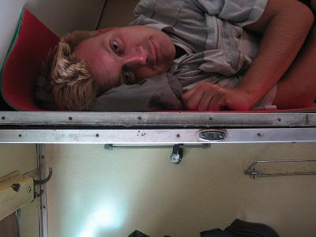
I.t.t. veel russen slaap ik slecht in de zittende positie en ik besloot op de derde plank te gaan liggen. Dit is de bagageplank boven het bovenste bed. Het was even klimmen, schuiven met bagage en matje en slaapzak maar uiteindelijk lag ik en viel snel in slaap.

De volgende ochtend was mijn eerste ingeving direkt uit te stappen op het eerste het beste stationnetje maar alles went, ook de obshe wagon. Doordat veel mensen uitstapten kon ik mijn plaatsje verbeteren. 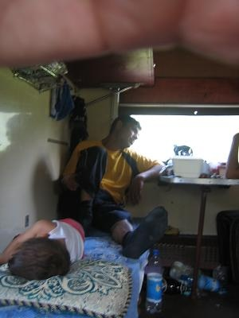 Al met al waren het toch prima mensen in de obshe wagon. Zelfs de zigeuners waren vriendelijk en het was vertederend om te zien hoe ze met hun kleintjes speelden. Er was ook een grote groep doven, die ik trouwens in deze regio veel zie. Ze lopen in halve cirkelformatie over straat zodat ze elkaar goed kunnen 'verstaan'.  
Aardig gesprek gehad met een vrouw die tegenover me kwam zitten. Zij vertelde me dat de autoweg van Chita tot Blagoveshensk momenteel verbeterd wordt of compleet nieuw aangelegd op plekken waar nog niks was. In de volksmond werd hij de 'federalka' genoemd.

's Middags, aan het eind van de warme dag, bereikten we Belogorsk. Ik stapte uit, dronk een beker vieze kvas en vond het enige hotel in deze rommelige, arme en stoffige stad. Voor 600 roebel (18 euro) kreeg ik een suite van 3 kamers en balkon, maar zonder warm water. De receptioniste vroeg nog of ik de prijs acceptabel vond en kon betalen.  
Nog maar net op de kamer, werd er aangeklopt en kwam er een klein mannetje in burgerkleding informeren naar mijn paspoort. Hij had een pasje bij zich dat aan moest tonen dat hij van de politie was. Ik nodigde hem uit in mijn suite en hij bekeek alles nauwkeurig. Het was in orde maar ik moest wel absoluut registreren bij het hotel zodat ik bij het vervolg van mijn reis geen problemen zou krijgen. De receptionist kon niet registreren, miste de nodige stempels, maar legde mij haarfijn uit hoe ik het politiebureau kon vinden, waar de registratie mogelijk was.

Tijdens het inslapen besloten om de volgende dag nog een laatste poging tot treinliften te doen en anders de 'snelweg' op te zoeken en gewoon te liften.

## Dag 16: Belogorsk - Chabarovsk

22e juli. 's Ochtends ontbeten en toen richting politiebureau dat zich aan de rand van de stad bevond. Daar bleek zich voor de kamer van de paspoortregistratie een grote wanordelijke menigte te bevinden in een benauwd en snikheet gangetje. Nog even getwijfeld of ik niet van mijn buitenlanderschap gebruik moest maken om eerder aan de beurt te komen maar na een korte aarzelsessie besloten de registratie te laten zitten en het risico te nemen.  
Terug naar hotel en met rugzak door de hete stad richting station waar het uitgestorven was. Er stonden twee lange goederentreinen te wachten met de lokomotief in de juiste richting, het oosten.

Terwijl ik, een verbodsbordje negerend, over de rails richting de lokomotieven liep, reed de eerste trein weg. De andere trein met enkele tientallen tankwagons, stond nog en ik kon mijn vraag stellen. De machinist die blij verrast leek, moest even overleggen maar al snel ging het deurtje open en werd ik naar mijn plekje aan de andere kant van de lange symmetrische lokomotief begeleid. Enkele aan het spoor zittende mannen raadden de machinist aan mij om mijn paspoort te vragen maar zij werden weggewuifd. Via een smal trappetje en een nauw gangetje kwam ik in de niet gebruikte cabine terecht en kon plaats nemen. De machinist vertrok weer naar de voorkant en raadde mij aan de knopjes en hendeltjes met rust te laten.

De trein begon als snel te rijden en ik vierde een klein feestje ter ere van deze grote overwinning ! Snel verzond ik nog een aantal vreugde SMS-sen voordat het bereik wegviel.  
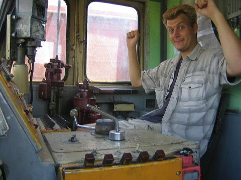
Er volgde een lange zit van 25 uur waarin de 500km tot Chabarovsk werden afgelegd. De natuur was weer heel mooi en het werd weer wat bergachtiger. Halverwege de rit werd het machinistenteam afgelost door een nieuw kommando. De eerste twee machinisten kregen van mij de delfts blauwe klompjes en na een korte introductie bij het nieuwe team kon ik rustig blijven zitten.  
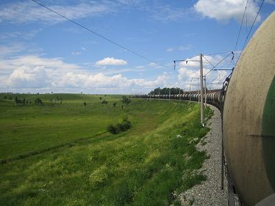
De trein reed hele stukken stapvoets, niet sneller dan 10km per uur, en stond soms zomaar een uurtje stil, wanneer het licht op een baanvak op rood stond. Tegen de avond kwam de machinist een lampje in mijn cabine aanbrengen en wees mij het lichtknopje aan, het 6e knopje van links op het meest linkse paneel.  
Om 2:00 's nachts werd de trein afgekoppeld en kregen we een nieuwe trein aangekoppeld, eveneens bestaande uit tankwagons, en na veel ingewikkelde rangeermanouvres reden we verder richting oosten door de joodse autonome deelrepubliek. Tijdens het rangeren werd mijn cabine ook gebruikt, toen er achteruit gereden moest worden, en kon ik zien, maar niet begrijpen, hoe het besturen van de trein in zijn werk ging. Wel werd duidelijk dat ook het vak van treinmachinist gepaard gaat met veel administratief werk. Alle acties van de loc werden geregistreerd op een tachograaf en elke manouvre werd met de hand nog eens opgeschreven in een dik logboek.  
Ik had nog een tijdje het plan om Birobidzhan te bezoeken, de hoofdstad van de joodse autonome republiek, maar die trein denderde hier in volle vaart doorheen en uitstappen was geen optie.

Op een laaghangende nevel boven de velden na, was de nacht helder en de opkomst van een grote gele volle maan was schitterend. De duisternis werd af en toe onderbroken door een vonkenregentje afkomstig van de bovenleiding.  
Ik deed een paar hazeslaapjes in mijn stoeltje waarbij ik mijn hoofd half uit het raam liet hangen, op mijn armen rustend.

's Ochtends om 7:00 uur waren we op 30km afstand van Chabarovsk en werd de tweede trein afgekoppeld. Als losse lokomotief zouden we naar Chabarovsk rijden. Losse lokomotieven hebben blijkbaar weinig voorrang op het spoor en we stonden nog 3 uur lang te wachten op een zijspoor bij een stationnetje net buiten Chabarovsk, en werden aan alle kanten voorbijgereden door elektrichkas, goederentreinen en passagierstreinen.

Om 11:00 reden we het station binnen, nadat we de lange brug over de Amoer bereden hadden, en was de bestemming bereikt. Nogmaals twee Delfst blauw klompensetjes cadeau gedaan en afscheid genomen. Laatste kiekje genomen van mijn lokomotief en met een zeer voldaan gevoel een van de lekkerste biertjes uit mijn leven gedronken tegenover het station, onder het beeld van Chabarovsk, de stichter en naamgever van deze stad, 8400 km oostelijk van Moskou.

## Chabarovsk

24 juli. Chabarovsk was een aangename verassing na alle dorre dorpjes en kale stadjes die ik de laatste 3000 km sinds Krasnoyarsk was gepasseerd. De stad doet duidelijk mee in de economische opkomst van de Pacific Rim en het centrum maakt een opmerkelijk welvarende indruk. Mooie grote opgeknapte gebouwen, aardige eettentjes, banken, merkkledingwinkels, veel beelden en veel (rechtssturige) auto's.  
De stad beslaat een aantal heuvels gelegen aan de brede rivier de Amoer. De centrale boulevard is zo'n 3 km lang en eindigt bij de rivier waar je via een aantal mooie trappen afdaalt tot een aardig strandje met links en rechts wandelpromenades langs de rivier.  
Het was er tijdens mijn bezoek erg warm 30+ en vochtig met af en toe een heftige bui. Dit leverde mij wat problemen op omdat ik dergelijke temperaturen nog niet beleefd had totnutoe. Wel gezommen in de Amoer, waarvan het water duidelijk zwaar vervuild was.

In het airconditioned internetcafe kennisgemaakt met twee jongens van in de twintig, Kolja en Valentin. Het duurde even voordat ik doorhad wat een een vlees ik met hen in de kuip had. Bij de eerste kennismaking kwamen ze als normaal op mij over ('normaal' vanuit het nederlandse referentiekader) maar later zou blijken dat ze van het type gozert waren waarvan er naar mijn smaak meer rondlopen in Rusland dan goed is.  
Ze zijn in de eerste plaats erg vriendelijk en vertonen een haast aggressieve gastvrijheid niettegenstaande het feit dat ze een gast weinig te bieden hebben. Verder wordt hun gedrag gekenmerkt door een hoge mate van opportunisme, leeghoofdigheid en gebrek aan zelfkennis en realiteitszin.

De jongens waren zeer enthusiast over het feit dat ze een russischsprekende buitenlander en tot conversatie bereidwillige buitenlander ontmoetten en nodigden mij uit om 's avonds naar een volgens eigen zeggen zeer hippe en modieuze disotheek te gaan en mij een onvergetelijke herinnering aan Chabarovsk te bezorgen. Ik had de hele dag alleen rondgelopen, wel wat behoefte aan gezelschap en ging tot hun grote vreugde op het voorstel in waarmee ik natuurlijk het recht tot klagen over de gebeurtenissen die volgden verspeelde.  
's Avonds om 11:00 uur afgesproken, ze zouden zich eerst thuis verkleden, wassen en scheren. Ze wilden graag mijn hotelkamer zien maar mochten van de portier de lift niet in.  
Op de afgesproken tijd en plek bleek dat er niks aan hun uiterlijk was veranderd, behalve dat de overhempjes open waren geknoopt waaronder de blote basten zichtbaar waren. De haren waren nog steeds vet maar Valentin had zijn sportschoenen voor slippers ingeruild.  
Er werd gelijk een taxi gestop die ons voor het belachelijke bedrag van 150 roebel een kilometer verderop bracht. "Duur he Peter", merkten de jongens met enige trots op. Bij de disco aangekomen bleek dat ze nog net de entree konden betalen en dat Valentin er op zijn slippers niet in kwam. Na veel gezeur bij de portier en mijn buitenlanderschap als argument aandragend lukte het uiteindelijk toch om met slippers binnen te komen. Daar bleek het bijna uitgestorven te zijn en meer dan 30 mensen zouden er die avond ook niet komen. De muziek was wel aardig en na wat wodka amuseerde ik me een tijdje lang op de dansvloer.  
De jongens gingen op onbehulpzame wijze aan de slag om een meid voor mij te versieren danwel iets voorzichzelf te regelen, mij als attribuut van stoerigheid gebruikend. Het liep uiteraard op niets uit. Ik ook had niks geen intenties in die richting en het bleek dat de overhitsige boys met hun gretige voorkomens een welkome en effectieve barriere vormden tussen mij het gewillige lonkende vrouwvolk.  
Ze bleven mij echter tot mijn vermaak verzekeren dat alles goed zou komen. Om 3:00 besloot ik op te stappen met het oog op de laatste lifttocht die mij wachtte, enkele uren later.  
Mijn 'helpers' sputterden hevig tegen maar toen ik daadwerkelijk opstapte sloten ze zich schielijk bij mij aan in de taxi. I.p.v. naar het hotel te gaan vertelden vertelden de chauffeur echter naar een sauna te rijden. Hier had ik helemaal geen zin in maar tegensputteren was zinloos, ik moest en zou deze geweldige russische ervaring meemaken. Daar aangekomen bleek dat er nog wat geld in hun zakken zat voor de entree en we hebben nog even wat zitten zweten, wat niet onaangenaam was. Voor verdergaande plannen was hun geld op en mijn zin compleet afwezig. Toen ik er echt genoeg van had wendde ik een plots opkomene slaap en dronkenschap aanval voor. Dit leidde tot voldoening bij de heren, ze sprongen weer in hun helperrol en er werd een taxi voor mij naar het hotel besteld. Daar aangekomen was de portier opnieuw consequent in het tegenhouden van mijn begeleiders en ik kon gaan slapen.

De volgende morgen, ik lag nog zwaar ronken, stormde om 8:30 Valentin met luide stemgeluid mijn hotelkamer binnen. Ik was zeer onaangenaam verrast door dit bezoek in mijn katerige ochtendhumeur en liet hem dit merken met diverse opmerkingen. Ik geloof werkelijk dat het geen moment tot hem doordrong dat zijn aanwezigheid ongewenst was. Hij was zich van geen kwaad bewust en waande zich de ultieme helper. Zonder hem zou ik reddeloos verloren zijn in de stad.  
De vorige dag had ik hen reeds herhaaldelijk duidelijk gemaakt dat ik vandaag zo vroeg mogelijk de snelweg op wilde zoeken richting Vladok. Helaas moest ik eerst nog pinnen want het meeste geld was de vorige avond verbrast. Valentin wilde weer een taxi nemen op mijn kosten en verbaasde zich erover dat mijn geld op was. "Weet je niet meer wie gisteren alles betaald heeft Valentin ?", vroeg ik hem "En waarom denk je dat ik nu een pinautomaat nodig heb ?". "Oh ja, oh ja".  
Hij ging onverstoord verder met het etaleren van zijn denkvermogen: "Peter, hoe weet de pinautomaat dat hij jouw russisch geld moet geven terwijl er toch euros in jouw kaart zitten ?" "Peter, als jij een foto maakt met je digicam, staat deze dan gelijk op internet ?".  
Nadat ik hem verteld had waar de weg naar Vladok in zijn stad begint (kennis uit de Encyclopedie) toonde hij zijn ware gidskwaliteiten door via veel vragen, een lange wandeling, overbodig veel busritjes en omwegen mij op de juiste plek af te leveren, onderweg mij voortdurend met brede glimlach verzekerend dat alles goed zou komen.  
Bij de weg aangekomen was het reeds 12:00 en hij stelde voor om lekker te gaan lunchen, een wandeling te gaan maken en of ik hem niet nog eens de werking van mijn digicam wilde laten zien of dan toch op zijn minst de batterijoplader ? Op dat moment kon ik mijn mengeling van lach en frustratie niet langen inhouden, "Valentin, waarom denk ik je dat ik hierheen wilde ? Om te vertrekken ! We nemen hier afscheid !". Hij zei niks meer, draaide zich om en beende weg zonder nog een woord te zeggen of ook maar een keer om te kijken. Zijn helperschap was afgelopen, ik ging liften en hij ging op zoek naar een nieuw avontuur.

In 3e wereld landen schijnen dit soort helpertypes cq. opportunisten zich vaak op te dringen aan westerse toeristen maar in Rusland komen ze blijkbaar ook voor. Het is moeilijk voor te stellen, maar deze jongens beweerden school en hogere opleiding doorlopen te hebben en nu normale banen te hebben waarmee ze beiden 300$ per maand binnenhaalden.  
Ik voel geen wrok richting hen. Ze hadden geen kwaad in de zin en ik was tenslotte zelf op hun voorstellen ingegaan. Alleen heb ik het te doen met moedertje Rusland, die de oorlog voorlopig niet gaat winnen met dergelijke manvolk.

## Dag 17 - Chabarovsk - Vladivostok

25 juli. Door het gedoe met Valentin stond ik pas om 12:00 op de plek, het begin van de M-60 Chabarovsk-Vladivostok. De laatste etappe.

Direkt stopte er een auto met een geuniformeerde bestuurder die mij 5 kilometer verderop bracht tot de eerste politiepost. Onderweg zag ik op een bord dat Vladivostok 750 km verderop lag waar de afstand in mijn hoofd slechts 600km was. Dat zou ik dus niet meer in een dag gaan halen.  
Vanaf de DPS post was de 2e lift ook heel snel binnen, een zwijgzame oudere man die mij in zijn rechtssturige Toyota 100 km verder bracht tot Vsaemiski, waar zich de volgende politiepost bevond. Onderweg hebben we nog ergens koffie gedronken en chebureks gegeten.

Daar bijna een uur gewacht op de volgende lift. Er was wel redelijk wat verkeer, veel chinese vrachtwagentjes maar alle auto's zaten vol en ik was nog niet zo wanhopig om naar Kamazzen te gaan zwaaien. De andere kant op was het aanzienlijk drukker met veel vers aangekochte japanse auto's zonder nummerplaat op weg naar Siberie.

Ik kreeg een lift tot Bikin, weer 100km verder. De chauffeur heette Viktor en werkte als bewaker op stations. Hij had reed een comfortabel Mazda minibusje, uiteraard rechtssturig. Gezellig gepraat en hij wist aardig wat te vertellen over de omgeving. Veel taiga met kleine parmante heuveltjes die ze hier 'sopki' noemen, een plaatselijke term, in west-rusland heten heuvels gewoon 'cholmi'. Onderweg passeerden we een kernrakettenlanceerinstallatie die helaas niet zichtbaar was vanaf de weg.

3 km voor Bikin bevond zich de politiepost en die heb ik goed kunnen bekijken want op deze plek wel zo'n 3 uur gewacht. Veel muggen, heftige regenbuien, en het weinige verkeer dat voorbij kwam (70 auto's per uur) zat helemaal vol. Het laatste spreekwoordelijke laatste loodje. Toen ik voor de regen schuilde onder een afdakje bij de politiepost kon ik eens van dichtbij bekijken hoe de wegagenten hun 'werkzaamheden' verrichten. Ze waren zoon 90% van de tijd aan het kaarten en aan het eind van elk potje, afgesloten met hard gejuich en gevloek, gingen de petten op de hoofden, liepen ze naar buiten en werden er een paar auto's gestopt en de papieren gecontroleerd.  
De mannen hadden vieze uniformen en achter de politiepost was een goed onderhouden volkstuintje met aardappelplanten waar te nemen. Al met al heb ik deze reis niet de indruk gekregen dat politieagent een benijdenswaardige baan is in Rusland.

Ik besloot eens te vragen of ze mij niet konden helpen. De agent merkte dat ik buitenlander was en vroeg naar mijn paspoort, meer uit interesse dan uit plichtsbesef, had ik het idee. Nadat hij het nederlandse reisdocumentje met veel interesse bekeken had, ging hij weer naar binnen voor een nieuw potje met de woorden, "we vinden wel wat voor je". Binnen hoorde ik hem tegen zijn collega's roepen "Gollandets !".

Een paar minuten later kwam er in de verte een grote vrachtwagen aan, de agent kwam weer naar buiten en stopte hem. Na een kort gesprekje kon ik instappen en had zo een lift tot Ussurisk te pakken, een stadje 100km voor Vladivostok !  
Ik vroeg me even af of dit wel echt liften is op deze manier, was het nu de agent die de vrachtwagen stopte, of was hij slechts mijn instrument en was het echt mijn lift ? Niet te lang bij stil gestaan verder :)

De bestuurder van de amerikaanse vrachtwagen was een van de meest capabele en stoere chauffeurs die ik ontmoet heb. De trailer was leeg en hij scheurde met 90 en af en toe zelfs met 100km/uur over de bobbelige wegen. Het leek alsof hij elke kuil en bocht kende.  
Hij vertelde dat hij regelmatig op Yakutsk reed, de hoofdstad van deelrubliek Sacha. Daarheen gaat geen spoorlijn noch geasfalteerde weg. Hij vertelde over de expedities waarin ze met een aantal vrachtwagens chinese audio/videoapparatuur van Vladok daarheen brachten, 's winters met temperaturen onder de -40, over de gruntovka's. 3500km in 15 dagen.  
Hij deelde mijn afkeer van Kamazzen niet, dat waren juist goede wagens. Hij vond europese vrachtwagens maar niks want die schijnen het niet meer te doen bij temperaturen lager dan -40 en gaan sowieso snel kapot na een paar honderd kilometer ongeasfalteerde weg. Hij was van het type bikkel. Verdiende wel goed en was naar Japan geweest om een japanse microbus te kopen en naar Thailand op vakantie met de vrouw.  
Het laatste stuk door het donker gereden, wat voor hem geen reden was om de snelheid te minderen. Onderweg ergens water gehaald bij een bron en appeltjes gekocht.

Ik werd om 2:30 afgezet bij de politiepost voor Ussurisk, nog 100km te gaan. Ik was inmiddels erg moe en besloot nog een laatste nachtje in de tent te tukken. Het viel niet mee om een goede plek voor de tent te vinden. Alle mooie velden die ik vanuit de auto's onderweg had gezien blijken bij nadere inspectie moerassen waar je tot aan je enkels in het water wegzakt.  
Bij een pomtstation bleek zich een ordentelijk grasveldje te bevinden en daar met toestemming van de pomphoudster mijn tentje succesvol opgezet, mede dankzij mijn LED hoofdlantaarntje. Tandjes gepoetst, tent ontmugd en naar bed.

's Ochtend om 7:30 gewekt door Zhona, de pompbediende die niet vond dat ik daar kon staan en het gevaarlijk achtte vanwege de ondergrondse benzinetank die zich op zoon 10 meter van mijn tentje bevond.  
Hij was wel heel vriendelijk en uiterst verrast 's ochtends een nederlander op zijn werkplek aan te treffen. Hij hielp me het tentje in te pakken dat de regenbuien van die nacht trouwens goed doorstaan had. Toen alles weer ingepakt was begon het weer had te regenen en ik kon mij achteraf gezien gelukkig prijzen met zijn wekactie.

Nog een tijdje staan lummelen bij de pomp waar nog wat redelijk aangeschoten vrienden van Zhona aan kwamen kakken om hun werkende maat eens te bekijken. Ik vroeg of ze soms student waren waarop ze beledigd antwoordden al 25 te zijn, en nu gewoon werkloos waren.

Regenjas en paraplu gepakt en me weer richting de DPS post begeven. Vanwege de regen en de vele regenplassen was het moeilijk liften en ik besloot al snel de politie, mijn beste vriend, weer in te zetten. De agenten stonden onder hun afdakje en togen na mijn verzoekje serieus blij verrast aan het werk, nadat er eentje voorzichtig had gevraagd of hij mijn paspoort eens mocht zien.  
Direkt werd er een grote Nissan station met een gezinnetje aangehouden van Koreaans of Chinese komaf, maar wel russischpratend. De chauffeur liet niks van knorrigheid merken vanwege de hem opgedrongen slaperige, natte en niet al te okselfrisse nederlandse lifter. Hij stopte op diverse plekjes waarvan hij dacht dat het interessante photo-opportunities waren. Het regende hevig onderweg en we zagen in Ussurisk aardig wat wagens die van de weg afgeschoven waren. Onderweg moest zijn dochtertje van 3 nog even nekken vanwege wagenziekte.

Ik kon in de lage auto moeilijk mijn ogen openhouden en was ook vrij moe uiteraard. In mijn ervaring waren de 120km tot Vladok die nog restten heel snel afgelegd.  
Bij de poort van Vladivostok kreeg ik weer gelegenheid om foto's te maken. Er staat daar een paal met een uitspraak van Lenin. "Vladivostok is ver weg, maar de stad is echt van ons !".

We reden de stad binnen en ik werd bij een bushalte afgezet. Daar direkt iemand gevraagd om een foto van mij te nemen want ik voelde een zeer grote natural smile op mijn gezicht verschijnen.

## Vladivostok

Qua logeeradressen kon ik in Vladivostok veel kanten op want had keuze uit een aantal telefoonnummers en emailadressen.  
Ik had reeds in Khabarovsk met ene Lena gemaild en geSMSd, de mij een maand eerder per korte mail had uitgenodigd. Ze had mijn rondvraag op bpclub.org gelezen. Besloot om op haar uitnodiging in te gaan en dat bleek een zeer gelukkige keuze.  
Nadat ze mij per rechtssturige Nissan van het station had opgehaald, reden we naar haar woning, iets buiten de stad aan de M-60 in een bos gelegen.  
Zij bewoonden daar met man en zoon een naar russische en nederlandse maatstaven grote en luxe vrijstaande woning met tuin en banya.  
Lena en haar man Andrej waren de beste gastfamilie die ik mij kon wensen. Ze drongen niks op en voelden preceis aan waar ik behoefte aan had. Ze waren zeer beschaafd, intellectueel en beiden als journalist werkzaam. Lena bij een aan de universtiteit gelieerde uitgeverij en Andrej bij een lokaal televisiestation.  
6 maanden geleden hadden ze Anton Krotov als gast gehad en ik sliep op 'zijn' kamer.

Twee dagen lang door Vladivostok gewandeld. De stad is in 1860 gesticht en ondanks de grote afstand tot Moskou en de nabijheid van China, Japan en beide Korea's, een onmiskenbaar russische stad, die zich uitspreidt over enkele heuvels aan de kust van de Stille Oceaan.  
Een aantal gebouwen in het centrum stammen uit prerevolutionaire tijden en ondanks het gebruikelijke gebrek aan onderhoud, de overdadige reclameuitingen en de continue verkeersopstoppingen, is hier en daar wel enige schoonheid waar te nemen. Het station bijvoorbeeld bevindt zich in goede staat en is in jugendstil stijl en heeft een sprookjesachtige uitstraling.

Ik heb mijn tijd besteed met museumbezoekjes, het bezichtigen van een onderzeer propvol chinese toeristen, het maken van wandelingen, internetten, schuilen voor de regen, shoppen en het aanschaffen van een vliegticket naar Amsterdam. Dat laatste was absoluut geen sinecure: mijn creditcard (MasterCard) werd nergens geaccepteerd en de bankautomaten toonden weinig bereidheid mij geld te verstrekken. Alleen dinsdagmiddag lukte het om 10.000 roebel op te nemen en woensdagmorgen nog een 20.000 waarmee ik het geld voor het ticket binnenhand. Daarna werkte niks meer en moest ik de meegenomen valuta aanbreken.

Woensadmiddag samen met Lena een bezoek gebracht aan de redactie van Novosti, een lokale krant die, getipt door Lena, geinteresseerd waren in een interview met mij. Ene Julia stelde de vragen en ik gaf mijn antwoorden. Er waren geen vragen bij die ik nog niet eerder gesteld had gekregen dus ik kon redelijk vlot in mijn slordige russisch antwoorden. Alleen op de vraag naar wat ik als eerste bij thuiskomst ging vertellen moest ik het antwoord schuldig blijven.  
Na het tonen van mijn website, waar inmiddels genoeg info voor een aantal zaterdagbijlagen te vinden is, toonde ze zich zeer tevreden. Het resultaat is inmiddels gedrukt en [online](http://www.novosti.vl.ru/?f=sz&t=050729sz01) en ik herken zowaar iets van mijn antwoorden terug.

Die avond volgde de feestelijke en goedgeregistreerde uitgieting van het Noordzee water in de Grote Oceaan. Andrej en Lena reden me naar een verassend mooi strand op zoon 20 km van Vladivostok gelegen aan een baai. De uitgieting verliep uitstekend en er was een vlotte vermenging waar te nemen. Niks een schiften of vlokvorming, de Noordzee- en de Grote Oceaanmoleculen verdroegen elkaar prima. De Pacific deed zijn naam eer aan.  
Daarna nog goed gezwommen en gejongleerd aan de kust.

