## Inhoud

## Dag 1: Rotterdam - Poolse grens

Ochtends om 6:30 opgestaan en afscheid genomen van Petra.

Om 8:00 kreeg ik mijn eerste officieuze lift van de ongeëvenaarde Jan de Bas vanaf het Weena tot pompstation de Vink. Daar was ik van plan een tijdje te gaan liften met een bordje 'Vladivostok', je weet tenslotte maar nooit, maar het bleek dat ik mijn schetsboek a la liftbordjes vergeten was. De eerste fout.

Toen ben ik maar wat tankende mensen om een lift gaan vragen en na 10 minuutjes was de eerste lift geregeld tot pompstation Bijleveld bij de Meern vlak voor Utrecht. De bestuurder was een vrolijk babbelende IT-er die in Tholen woonde. Hij werkte 5 dagen per week thuis omdat zijn baas geen reiskosten wilde vergoeden.

Bij Bijleveld verder gevraagd en direkt een lift gekregen tot een pompstation voor Apeldoorn. De bestuurder bleek een Oud-Beijerlander die voor Getronics werkte, weer een IT-er dus. Hij was accountmanager voor de sector Zorg.  
Het pompstation waar ik afgezet werd lag aan de E30 (A1). Deze weg loopt van Amsterdam tot Moskou en moet ik dus voorlopig niet meer verlaten.

Bij dat pompstation via vragen weer direkt een lift gekregen van een italiaanse man die in een busje richting Duitsland speerde. Hij sprak een beetje engels en ik begreep dat hij in de weekenden in Nederland woonde, bij vrouw en kinderen en gedurende de week in Duitsland aan de weg werkte.  
Op een Rastätte voor Hannover afgezet.

Bij gebrek aan liftbordje maar weer gaan vragen, wat overigens een stuk beter gaat dan met bordje. Bovendien kies je op deze manier zelf je bestuurder i.p.v. dat jij gekozen wordt, nog veiliger ook dus. De volgende lift was van Daniël, een arnhemmer die voor zijn werk in zijn eentje huizen en hotels in Duitsland opknapt. Hij had veel respect voor mijn onderneming.  
Bij Braunschweig zou hij de weg verlaten. Juist voordat ik me liet afzetten bij pompstation Zweidorfer Holz, werden we door een voorbijrijdende douanebusje gemaand te stoppen. Er volgde een routineonderzoek waarbij we beiden uit moesten stappen en de heren douanebeambten als eerste mijn rugzak aan een zeer grondig onderzoek onderwierpen. Ze vonden veel interessante zaken maar niks verbodens. Bij Daniël was het wel gelijk raak. Hij had een dikke joint bij zich, verstopt in zijn pakje shag. Verder vonden ze daar een zakje met 4 pillen. Daniël vertelde de agenten dat dit medicijnen tegen oogpijn waren. Hij had ze in een plastic zakje gedaan omdat hij dan niet het hele doosje met pillen mee hoefde te nemen.

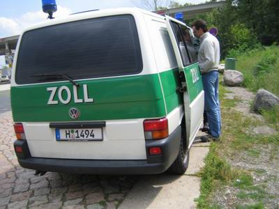  
Het Zollbusje bleek een rijdend laboratorium en de pillen werden aan een reeks chemische proeven onderworpen. Er kleurde iets rood wat duidde op amphetamine, Daniël snapte er niks van maar stemde snel in met de 50 euro boete en de inbeslagname van de gevonden spullen. De agenten adviseerden hem in het vervolg zijn medicijnen in de gebruikelijke verpakking te laten zitten en niet verpakt in een drugszakje in zijn shag te bewaren.  
Ik heb Daniël een beetje bijgestaan. Hij baalde natuurlijk behoorlijk over zoveel onrecht. Samen nog een kop koffie gedronken en toen afscheid genomen.

Na korte tijd weer via vragen een lift tot Berlijn gekregen van twee Ossi's die terugreden van het Hurricane festival (Rammstein, Queens of the Stone Age) naar huis. Het waren echte rockers met een vieze auto vol lege bierflessen en snoeiharde rock uit de speaker. Mijn kaartje met internetadres afgegeven zodat ze mijn reis kunnen volgen.  
Ik liet me afzetten op Rastätte Michendorf waar ik vroeger, in DDR-tijden, met mijn ouders wel eens was geweest om de laatste Ostmarken de besteden aan glazige aardappelen en harige soep. Ik heb er deze keer niks gegeten.

De volgende lift betrof twee russen in een busje. Ze reageerden vol ongeloof toen ik mijn reisplannen uit de doeken deed. Zelf woonden ze al 13 jaar in Duitsland en waren volgens mij de voeling met het vaderland een beetje kwijt.  
Ze brachten me naar een pompstation c.q. vrachtwagen terminal zo'n 3 km achter de grens in Polen alleen niet in mijn richting maar richt Zeleny Gorod.

Daar heb ik zo'n twee uur lang alle vrachtwagens op de reusachtige terminal afgelopen maar niemand ging mijn kant op. Ze gingen of naar zuidelijk Polen, of naar Duitsland of bleven daar om te overnachten. Dit schoot niet zo op dus. Na twee uur wachten een strategische lift geregeld terug naar de grens geregeld met een vrolijke poolse vrachtwagenchauffeur zonder oplegger. Zijn vrachtwagen rammelde aan alle kanten en had grote problemen met het vinden van de juiste versnelling. De chauffeur vloekte er vrolijk op los (Kurwa) maar wist wel zijn truck met veel horten en stoten richting grens te bewegen.

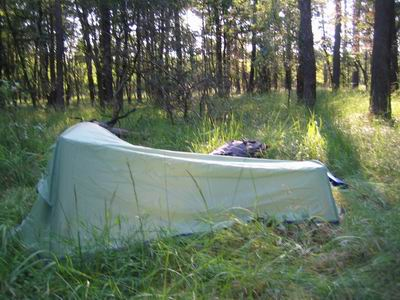  
Vlak voor de grens stonden twee poolse agentjes van een jaar of 18 die mij verboden om direkt aan de grens te liften. Dat was vrij klote omdat ik nu aan de weg moest liften, een paar honderd meter van de grens af, op een plek waar iedereen net lekker aan het optrekken was. Het schemerde reeds en ik had nog steeds geen bordje. Ik besloot de tent op te gaan zetten met het beetje daglicht dat mij nog restte. Dat lukte.

Het einde van de eerste dag, alles volgens planning verlopen en zo'n 900km afgelegd.

## Dag 2: Poolse grens tot 50km voor Wit-Rusland

De volgende ochtend vroeg wakker en de tent weer ingepakt. Toen ik weer bij de weg was stonden daar nog steeds diezelfde agentjes en ik mocht nog steeds niet dichter richting grens mijn liftwerk verrichten. De plek was beroerd dus na 10 minuten besloot ik maar weer richting de terminal te lopen waar ik vorige avond al had staan vegeteren.

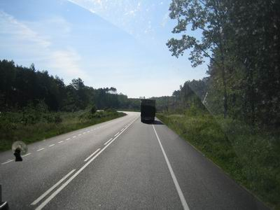
Toen stope plots een Litouwse vrachtwagen die de goede kant opging en ik was weer onderweg !  

Het rijden schoot niet op vanwege gebrek aan 4-baansweg, veel verkeer, en veel getreuzel van Alexandr. Hij moest vaak koffie drinken en was op zoek naar een speciaal kantoortje dat zich volgens hem ergens langs de weg moest bevinden alwaar speciale bonnetjes gemaakt worden ergens voor die hij weer kan declareren. Na zelfs een paar keer een stuk te zijn teruggereden werd het kantoortje eindelijk gevonden, ergens achter een sloperij aan de kant van de weg.  

Het was al halverwege de middag toen ik Alexandr had voorgerekend dat het hem 50km zou schelen als hij door Warschauw zou rijden i.p.v. een noordelijker route te nemen. Hij ging akkoord en we reden nog een stuk door. Op zo'n 50km afstand van Warschauw bleek echter dat deze weg voor vrachtwagens verboden was. Wist ik ook niet natuurlijk. Ik werd afgezet bij een pompstation aan de verkeerde kant van de weg en liet de lustig in het pools, russisch en waarschijnlijk ook litouws vloekende Alexandr achter.

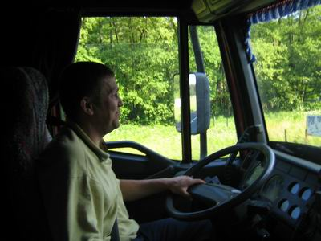
Er waren op deze plek drie opties:

1. liften aan de (snel)weg op een ongunstig plekje
2. liften bij het pompstation aan de verkeerde kant van de weg
3. liften bij het truckersrestaurant.

Er volgde een heftige onweersbui dus ik koos voor optie 3. De chauffeurs in het restaurantje gingen mijn kant niet op en eentje ried mij aan terug naar Nederland te gaan.

Het buitje uitgezeten en een hapje en een drankje op. Toen het weer droog was, maar al wel een beetje schemerig, nog even gaan liften op het ongunstige plekje. Na 30 minuten stopte er een streepjescodescannerverkoper in een gewone auto die goed engels bleek te spreken. Hij vertelde dat hij die dag al twee lifters had laten staan en toen van achteren aangereden is, zijn bumper was met ducktape weer vastgeplakt. Het leek hem beter voor zijn geluk mij wel mee te nemen. Hij bracht me tot aan de rand van Warschauw en onderweg bedachten we dat het het handigst voor mij zou zijn om bus 125 te nemen die de hele stad doorkruist van west naar oost. Zo gezegd, zo gedaan. Het was niet mogelijk om in de bus een kaartje te kopen dus was het gratis.

Aan de oostkant van Warschauw nog een bus (502) genomen die nog een paar km oostelijker tot een pompstation ging. Dat ging vrij soepel. De plek was gunstig alleen was het inmiddels 22:30.  
Na een half uurtje vragen bleek een pools jongen in een busje zeer verheugd mij mee te kunnen nemen. Hij was samen met een vriend onderweg van Frankfurt Main naar oostelijk Polen. De chauffeur was erg moe en had veel koffie nodig onderweg.

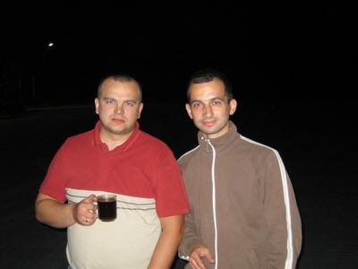

Hij vertelde dat hij 6000km in 7 dagen had gereden in zijn busje. Tsja. Anyway, we hadden veel lol onderweg en ze maakten via de korte golf grappen met andere nachtelijke chauffeurs. Om 1:30 werd ik zo'n 50 km van Terespol (grens) afgezet. Daar met toestemming van de pomphouder mijn tentje opgezet op een mooi plekje. Tevreden in slaap gevallen.

## Dag 3: 50km voor Wit-Russische grens tot Minsk

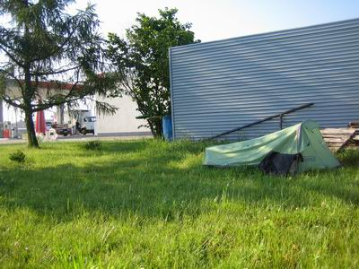
's Ochtends weer vroeg op (7:30) en snel een korte lift gescooord nog iets verder richting Terespol. Daar heb ik een tijdje bij een verkeerde weg staand liften omdat ik een verkeersbord misinterpreteerde. Zie foto. Toen ik erachter kwam dat ik gewoon rechtdoor moest had ik snel een lift van een pools stelletje dat naar Brest, Wit-Rusland, ging.

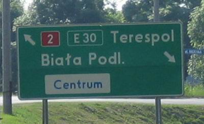
Met hen de hele grensprocedure afgelegd, die in totaal 3 uur duurde. Daar stond ook nog een convooi van 30 belgische en nederlandse kampers en caravans die op vakantie richting St. Petersburg en Moskou waren.

Aan de andere kant van de grens kreeg ik een korte lift van twee dikke kortharige russische jongens naar een goede liftersplek aan de andere kant van Brest. Onderweg nog even Brest bekeken vanuit de auto.  
De liftersplek was goed bevolkt met sjaggerijnig kijkende russen, die waarschijnlijk niet voor de lol aan het liften waren. Ik nam mijn plaats in achteraan, zoals het hoort. Na zo'n 30 minuten in de hete zon werd ik meegenomen door een oude man in een stokoude Ford, terwijl de lifters voor mij nog lang niet allemaal weg waren. Zo gaat dat soms. De oude man reed richting Minsk en had een afspraak met iemand halverwege die uit Minsk kwam. Die zou mij volgens hem verder mee kunnen nemen en zo geschiedde. De twee hadden een korte schimmige bespreking waarna ik over kon stappen in de splinternieuwe Toyotabus van de ander, een jong dikbuikig figuur die veel interesse had voor Nederland. Hij bracht mij tot het hotel in Minsk alwaar ik om 18:00 aankwam.

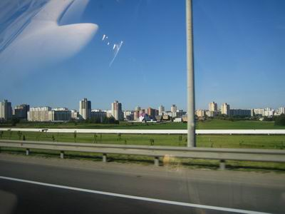

## Minsk

Zoals mij al door meerdere mensen van de tevoren verteld was is Minsk inderdaad een hele schone stad ! Weinig rommel en stof.  
In de oorlog is de stad grondig vernietigd hetgeen de soviets de kans gaf om hier een na de oorlog een model communistische stad uit de grond te stampen: brede straten en nog bredere trottoirs, stadion in het centrum van de stad, grote pleinen, parken en plantsoentjes met alle bankjes bezet, geen kerken en verder gewoon heel weinig te beleven vanuit toeristisch oogpunt. De museums zijn vrij oninteressant op het oorlogsmuseum na.  
Opvallend is ook dat er relatief weinig reclame op straat te zien is, veel minder dan in Moskou bijvoorbeeld. De meeste abri's zijn gevuld met posters die gaan over de herdenking van de overwinning van 60 jaar geleden op nazi-duitsland. Dat blijft een thema.

Verder is er een tweelijnige metro en rijden er trammetjes en trolleybussen rond. Er is relatief weinig verkeer op straat. Maar, zoals gezegd, alles is schoon en goed onderhouden. Helemaal geen tekenen van verval of vieze grouwigheid zoals in andere post-soviet steden wel het geval is.

Ik heb snel een werkende pinautomaat gevonden en een SIM-kartochky gekocht. Eerste nachtje in het hotel doorgebracht. Mijn boeking kon een nacht naar voren worden geschoven (ik lig 1 dag voor op mijn conservatieve schatting). 's Avonds moest wel de telefoon weer van de haak.

Tijdens de eerste douche in drie dagen vond ik een teek op mijn borst, waarschijnlijk uit het Poolse bos. De Xenos tekentang kreeg zo zijn vuurdoop en bleek goed te werken. Nu maar afwachten of ik Encephalitis krijg. Zo'n 15% van alle teken draagt deze ziekte met zich mee. Het risico op besmetting is echter veel lager. Encephalitis schijnt zich aan te kondigen met een grote verkleuring rond de beet en die heb ik nog niet kunnen waarnemen, sterker nog, ik kan de plek nauwelijks meer terugvinden.

Na 17 juni de hele dag de stad verkend te hebben was het 's avonds tijd mijn via [Hospitality Club](http://www.hospitalityclub.org) geregelde adresje op te zoeken. Ik had hem al gebeld maar merkte weinig enthusiasme aan de lijn. Toen ik hem, Alexey, echter gevonden had, was hij uiterst hartelijk. Het bleek dat mijn nederlandse accent aan de telefoon nogal als arabisch-russisch klinkt en hij was bang met een arabier van doen te hebben...

Alexey is een informatica student, volgende week studeert hij af. Hij woont met twee andere informatica studenten in het centrum van de stad. Hij werkt bij IBA, een bedrijf dat zich met name bezig houdt met offshore programmeren voor westerse klanten. Hun grootste klant is IBM. IBA was vroeger onderdeel van IBM.  
Ze hebben ook een content management systeem gemaakt voor een Engelse klant. Hij heeft het 
gedemonstreerd en het zag er heel aardig uit: je kon zelf objecttypes definieren en de relaties daartussen !  
Verder houdt hij zich bezig met een oude Russische rituele zelfverdedigingssport en hij drumt. 
Hij heeft een jaar in Miami gewerkt om geld voor de studie te verdienen. Zijn huisgenoten werken ook om de studie te kunnen bekostigen. Eentje had er zelfs enige maanden in Napels in de bouw gewerkt.  
Wat wel opvallend is is dat ze geen van allen een bed hebben. Ze slapen op een dekentje op de grond, zo hebben ze overdag meer ruimte op de kamers, hoewel die helemaal niet klein zijn. Ook is er in het hele huis geen TV te bekennen. Wel hebben ze alledrie een moderne PC met alles erop en eraan.

## Dag 4: Minsk - Moskou

's ochtends om 7:30 opgestaan en na een snelle koude douche afscheid genomen van Alexey. Toen met de metro naar station Bostok en daar bus 99 genomen tot het eindpunt. Toen we naar de laatste halte reden zag ik aan de weg reeds een lifter staan, vlak achter een politiepost. Ik besloot daar ook heen te lopen en even een praatje te maken met de medelifter.  
Net toen ik hem wilde aanspreken stopte er een auto voor hem, de lifter vroeg de chauffeur gelijk of ik ook meekon en dat kon. De bestuurder, Dima, bleek een jaar in Antwerpen gewoond te hebben en was een paar keer in Rotterdam geweest waar hij hele heldere en goede herinneringen aan had.

Het bleek dat hij direkt richting Moskou reed ! Dat was geregeld dus. De andere lifter bleek Vjaza te heten en was 19 jaar oud. Hij herinnerde zich mijn [post](http://www.bpclub.ru/index.php?showtopic=2363) op het Russian Backpacker forum en was erg blij mij te ontmoeten ! Hij nodigde mij onmiddelijk uit om naar Jaroslavl te komen. De uitnodiging werd gedurende de reis nog een paar keer herhaald en kracht bijgezet met allerlei beschrijvingen van deze 1000 jaar oude stad en haar bezienswaardigheden. Het klonk best aanlokkelijk hoewel het wel 250 km de verkeerde kant op ligt.

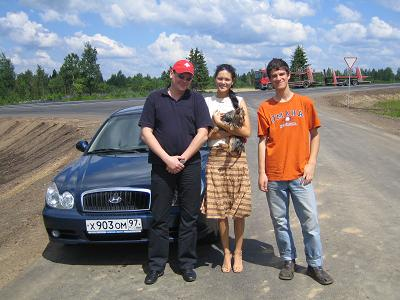
In wit-rusland reed Dima redelijk rustig omdat hij geen wit-russisch geld meer had voor benzine en niet veel spritze meer had. Met mijn laatste geld nog even getankt en toen reden we al wat harder.

Ik maakte me al weer op voor een zware grensovergang maar hiervan bleek helemaal geen sprake. Al stond er wel een kilometerslange vrachtwagenfile, personenauto's konden doorrijden zonder paspoortcontrole. Wit-Rusland en Rusland vormen een soort van unie of zoiets. Er zijn helaas wel twee visa nodig maar het declaratieformuliertje dat ik bij de Pools - Witrussische grens had ingevuld is weer geldig voor beide landen.

Eenmaal Rusland bereikt ging de snelheid goed omhoog en af en toe bereikten we de 180 op de uitstekende snelweg. De andere lifter had verteld dat zijn max totnutoe 160 was, dus dat was weer een extra aanleiding voor Dima om dit highwatermark te verhogen. Verder niet onveilig.

Na een heel gezellige rit van zo'n 8 uur bereikten we zo Moskou. Iedereen was blij. De andere lifter werd afgezet bij een metro station en Dima begon mij te vragen wat mijn direkte plannen waren. Deze waren vrij vaag, dat moet ik toegeven, ik had een lijst met telefoonnummers en een hotelboeking maar nog niks concreets bedacht. Daarop nodigde hij mij uit naar zijn huis.

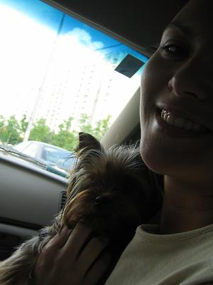

Dat bleek een heel mooi ruim appartement in Moskou-Zuid. Snel even gedouched en nadat ik op aandringen van Dima mijn broek had gestreken, gingen we naar een Oekraiens restaurant. Beetje wodka op en Borsch en Salo (wit dierlijk vet dat in de Oekraine als een lekkernij wordt beschouwd). Onderweg naar huis nog even wat DVD's gekocht en ontbijt voor de volgende dag. 's Avonds dus nog whiskey gedronken en de portfolio van Anja bekeken, die modellenwerk deed. (Rijdend door Moskou kon ze haar collega's op de billboards aanwijzen). Verder de film Madagaskar gekeken, een aanrader. Ik kreeg een DVD van de film Fandorin, naar de roman van Boris Akunin (Fandorin, een verbastering van de nederlandse naam Van Dooren, is de Sherlock Holmes van Rusland) en een grote fles sterk belgisch bier, die later duits bleek te zijn en door Oleg bij het ontbijt weggewerkt is.

In een superbed tevreden in slaap gevallen.

## Moskou in vogelvlucht 

De vierde dag in Moskou alweer. Vanwege de hoge dichtheid aan gebeurtenissen heb ik geen tijd om alles uitvoerig te beschrijven.

De eerste avond overnacht bij mijn laatste lift, de rijke rus met zijn 19-jarige vriendin die als model werkt. In een oekraiens restaurant gegeten, dure single malt whiskeys gedronken en Madagaskar op DVD gekeken. Goed geslapen en bij het ontbijt, de volgende dag, nog wat geinternet op de reusachtige laptop op de keukentafel.

Op maandag naar het hotel gegaan alwaar Arnold, de medecursist russisch, ook net aangekomen was na zijn twee maanden verblijf in de Oeral, in Perm.  
Veel ervaringen uitgewisseld en toen de stad in gegaan. 's Avonds daar met Oleg, mijn vriend uit Kiev afgesproken op het rode plein. Er volgde een gebruikelijk avondje en dagje met Oleg, wel erg gezellig zolang het niet te lang duurt. Oleg was al zo'n 20 jaar niet in het centrum van Moskou geweest.

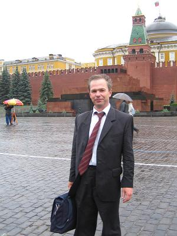

's Avonds (dinsdag) vertrok Oleg weer richting Kiev.

Op woensdag met Arnold en zijn tataarse vrienden Veronica en Marat naar de dierentuin geweest, het weer was een stuk beter en de dierentuin best aangenaam. 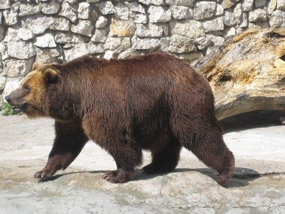 's Avonds met een nederlandse bekende van Arnold, Arjen, afgesproken. Arjen is een toffe gozer uit Spike-City die specialistische kabels verkoopt voor een bedrijf uit Capelle. Hij was in Moermansk geweest en ook Moskou beviel hem uitstekend. Hij bleek een echte gangmaker en al snel waren in allerlei gezellige pubs aan het dansen waarbij we ons onderweg aansloten bij een groep CMG-ers. De CMG-ers waren naar een telecommunicatie beurs geweest en zaten nu in de relaxmodus. Het was al vrij laat toen ik afscheid nam van Arnold en Arjen, die nog een tent verder gingen. Ik met de taxi naar huis en goed gepraat met de chauffeur.  
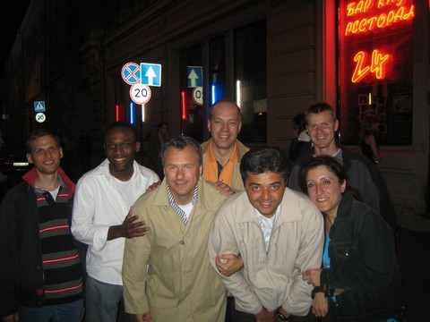

Op donderdagochtend even een bummer toen bleek dat ik het hotel niet kon verlengen voor nog een nachtje. Nu ga ik dus maar een ander slaapplekje zoeken, waarschijnlijk bij Lena, de vriendin van Lena uit Rotterdam. Alleen betekent dat dat ik weer met de rugtas heel Moskou door moet. Het feit dat ik hier tegenop zie doet al vermoeden dat ik tijdelijk de liftmodus verlaten heb en me het comfortlevel van een toerist heb aangemeten. Hoog tijd om dit weer eens te verlaten, mijn hotelkamer voor een plaatsje ergens op een vloer in te ruilen, mijn frisse deolucht ondervandaan mijn oksles te vervangen door een pittige zweetdamp en snel wat andere lifters te vinden voor nuttige info voor de rest van de route.

## Ontmoeting met Russische lifters

Gisteren heb ik een nieuw logeeradres gevonden bij Lena die in een ruim appartement helemaal aan de rand van Moskou woont. Na een gezellige maaltijd bij haar thuis zijn we gisteravond samen wat russische lifters gaan opzoeken wat haar ook wel interessant leek.

Als eerste ontmoetten we Sergei Karitich, webmaster van [hike.ru](http://www.hike.ru), de russische hitchhikers site. Hij praatte uitstekend engels want werkt als tolk-vertaler. Hij was nog nooit naar het verre oosten van Rusland gelift maar wel veel naar West-Europa, waarbij hij altijd over Finland reist vanuit St. Petersburg.  
Met Sergei afgesproken dat ik hem af en toe wat voortgang rapporteer hetgeen hij dan weer op Hike.ru zal zetten.

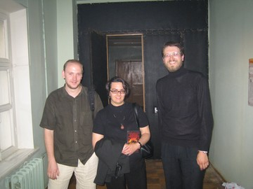
Met hem zochten we vervolgens ene Oleg op. Oleg is de langste rus die ik totnutoe ken (>2m) maar zag er verder uit als een kabouter. Hij was nog aan werk bij een archief vlak bij het rode plein. Oleg is vorig jaar van Moskou naar Kaapstad gelift, petje af dus.  
Hij is een 'bekend' lid van de [AVP](http://www.avp.travel.ru/), de akademie van het vrije reizen, in Moskou. Lidmaatschap daarvan is alleen op basis van uitnodiging en komt pas ter sprake bij >100.000 km liftervaring.  
Van hem heb ik een aantal erg nuttige boekjes gehad. De informatie daarvan is ook op de AVP site te vinden alleen zijn deze boekjes handiger, voor als je onderweg bent. Alle boekjes zijn van de hand van [Anton Krotov](https://www.boekreporter.nl/index.php?itemid=63) (1976) die inmiddels liftend veel uithoeken van Rusland heeft bezocht, maar ook Arfika, Afghanistan, Iran, Syrie en China doorlift heeft.

1) **De praktijk van het vrije reizen**. Het eerste boek van Krotov en een hele goede introductie voor elke rus die zin heeft om te gaan reizen zonder daar kapitalen voor uit te geven. Het behandelt onderwerpen als de keuze van beste route, de techniek van het stoppen van auto's in allerlei omstandigheden, formules om je dagsnelheid te bepalen, hoe je slaapplaatsen kunt vinden in onbekende steden, hoe je goedkoop aan eten kunt komen, hoe je een gratis douche kunt regelen, wat de beste uitrusting is, hoe je te gedragen als je bij vreemden logeert etc.  
   De slogan van de AVP is 'наука победит', hetgeen zoiets betekent als 'de wetenschap overwint'. Het allerbelangrijkste en enig absoluut noodzakelijke onderdeel van je uitrusting zijn je eigen 1500 gram hersenen, zo luidt het betoog.  
   Dit boek kende ik al maar erg leuk om het nu in vaste vorm en handzaam formaat te hebben. Krotov is een goed auteur die boeiend weet te schrijven. Door zijn boekjes ben ik vandaag al twee keer tever doorgereden in de metro.

2) **134 vragen en antwoorden**. Zijn eerste boek heeft Krotov zelf uitgegeven en massaal verkocht op festivals, concerten en in treinen. Het sloeg erg aan bij een bepaalde groep jongeren en de armere (gewone) rus in het algemeen (een relatief grote groep). Het succes was overstelpend en Krotov werd een voorbeeld voor velen. Zijn 'volgelingen' noemt men ook wel de 'Krotovniki' en eigenlijk ben ik er ook een.  
   Krotov publiceert zijn woonadres en email en telefoonnummers in al zijn boekjes en hij moest al snel allerlei maatregelen nemen om zelf nog een beetje rust te hebben. Een daarvan was het schrijven van het tweede boekje, waarin hij 134 vragen beantwoordt, die hem vaak gesteld worden. Een greep uit de vragen:

- Ben je vaak in vervelende situaties beland ?
- Gebeuren er vaak ongelukken met lifters ?
- Lieg je wel eens ?
- Overlijden lifters wel eens ?
- Wat doe je als bestuurders om geld vragen ?
- Ik wil met jou op reis !
- Is het warm in Afrika ?
- Zijn er nog armere landen dan Rusland ?
- Drink je wel eens wodka ?
- Hoe lift ik in de winter ?

etc. etc. Erg leuk om te lezen en om te hebben ook.

3) **De encyclopedie van het 'vrije' reizen**.  
   Dit boek is het nuttigst voor mij. Het bestaat uit 277 pagina's in A5 formaat compeet volgedrukt in een klein nauwelijks leesbaar lettertype. Het beschrijft alle grote wegen, steden, liftplekken bij elke stad en hoe deze te bereiken. Het bevat tips voor goedkope eetplekken, bezienswaardigheden en het vertelt van elke stad waar de permanente hangplekken zijn waar geestverwanten ontmoet kunnen worden. Het bevat minstens zoveel informatie als de LP van Rusland, die ik deze keer thuis heb gelaten. Echt een superboek.

4) **Alle elektrichkas van Rusland**  
   Vanuit elke stad van betekenis in Rusland rijden er elektrische treinen die de stad met het direkte achterland stad verbinden. Vaak gaan ze tot 100km of verder van de steden vandaan. Deze zogenaamde elektrichkas vormen een groot netwerk en het is in het europese deel van Rusland vaak mogelijk om via het elektrichka netwerk van stad naar stad te reizen, als je geduld hebt. Elektrichkas worden matig beconducteurd dus het kan ook gratis.  
   Dit boek is ook in A5 formaat maar gebruikt een nog kleiner typeface. Nog net leesbaar somt het alle vertrektijden van alle elektrichkas op en geloof me, dat zijn er veel.

Ik heb een klein bedrag betaald, later, toen ik zag wat ik allemaal gekregen had bedacht ik me dat iets meer wel op zijn plaats zou zijn maar de gelegenheid om meer te betalen komt nog wel op het festival. Gewapend met deze boeken voel ik me een stuk zekerder.

De AVP heeft zicht tot doel gesteld iedereen die geinteresseerd is informatie te verschaffen over het vrije reizen. Ik heb dus met Oleg rest van mijn reis doorgesproken en de moeilijkheden en eventuele gevaren die mij te wachten staan geinventariseerd:

1) **Alcoholisten**. Komen voor in heel Rusland maar lopen in Siberie nog al eens langs de wegg. Dronken bestuurders komen heel weinig voor volgens Oleg (Alcoholisten hebben hun auto meestal al verkocht en de politie is erg streng op drink&drive). Advies: rustig blijven, niet tegen ze gaan schreeuwen, niet met ze praten en rustig weglopen.

2) **Teken**. Advies: je huid bedekken als je in een bos loopt en goed controleren als je er weer uit komt. Als je je na een tijdje slap gaat voelen kun je die ziekte hebben. Dan moet er een arts bezocht worden.

3) **Het stuk Chita-Chabarovsk**. Daar is geen asfalt en ueberhaupt heel weinig verkeer, enkele auto's per uur of nog minder. Advies: geduld hebben.

4) **Politie**. Officieel bestaat nog steeds de wet dat je je in elke stad waar je niet woont moet registreren. Dit geldt ook voor Russen zelf. In de praktijk is dat voor een reiziger/lifter natuurlijk niet haalbaar.  
   In europees Rusland wordt het allemaal wel een beetje gedoogd maar in de afgelegen gebieden kan deze wet nogals eens irritant stipt door de politie nagevolgd worden. Advies: geduld hebben, of pech, naar huis gestuurd worden met het vliegtuig op eigen kosten.

## Dag 5: Moskou - Penza

De tocht van Moskou naar Penza (600km) is goed verlopen. 's Ochtends vroeg opgestaan en gedouched, nadat ik de kattekeutels uit het bad had verwijderd. Na een uurtje metro en een stukje minibus stond ik aan het begin van de M5, die trouwens in mijn atlas ook nog met E30 wordt aangeduid. Deze weg loopt van Moskou via Penza en Samara naar de Oeral naar Cheljabinsk en is zoon 1800 km lang.

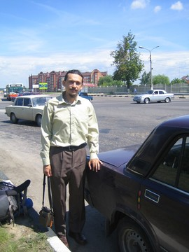
Na zoon 10 minuten stopte Anatoli die mij meenam tot het dorpje Lychovitsi, een kleine 120 km verder. Anatoli bleek fanatiek orthodox christen. Zijn auto was volbehangen met kleine icoontjes en toen ik mijn reis vertelde sloeg hij zijn eerste kruisje, er zouden er nog ettelijke tientallen volgen gedurende de rit. Zo sloeg hij kruisjes in de auto bij elke kerk die we passeerden, maar soms ook zomaar (of ik zag de kerk niet). Hij was onderweg naar een starets in wording. Diegene die Dostojevski gelezen hebben weten wat een starets is. Dit is een mystieke ziener/heilige met bijzonder gaven en een breedband verbinding met de spirituele wereld. Je zou het een orthodoxe versie van een medicijnman kunnen noemen. Blijkbaar komen ze nog steeds voor.

Onderweg wilde Anatoli nog even het graf bezoeken van een andere starets, Nila, die onlangs overleden was en nu hard op weg richting heiligverklaring. Naarmate we de kerk naderde sloeg Anatoli steeds meer kruisjes. Bij de kerk zelf aangekomen ging hij goed door. Een aldaar lopende priester werd door hem op de hand gezoend, waar de beste man niet echt van gediend leek te zijn trouwens. In de kerk werden de iconen gezoend.

Achter het kerkje was een speciaal gebouwtje gemetseld met daarin het graf van Nila, die nog maar kort geleden overleden was. Het was bedekt met een laagje zand en omringd door vazen met bloemen.  
Anatoli stelde voor dat ik haar zou vragen mijn reis te zegenen maar hier had ik geen zin in. Hij ging het gebouwtje wel in, ging langdurig op zijn knieen en drukte zijn voorhoofd in het zand dat het graf bedekte. Hij plaatste een mooie roos in een van de vazen en ging nog eens op de knieen. Daarna ging hij naar het kerkwinkeltje en kocht een foto van Nila, een oude vrouw met dikke hangwangen. Deze foto drukte hij een paar keer tegen zijn gezicht en werd toen ook in de auto gehangen. I.p.v. de bedelaars bij het kerkje geld te geven kregen ze allemaal een banaan van hem.  
Ik moet eerlijk zeggen dat ik een beetje onwel werd van zoveel devotie en vromigheid.

Toen we verder reden begon hij te vertellen over het christendom in Rusland, dat sinds 2000 jaar niks veranderd was en daarom het enige ware christendom was. Verder had hij het over de dyxovoi mir, de geestelijke wereld om ons heen, die gevuld is met kleine groene duiveltjes. Duiveltjes van de prostitutie en van het alcoholisme etc.

Hij vertelde over de russische vrouwen die een man in het westen zoeken via contactbureaus. Hij maakte een vergelijking met een pan met versgemolken melk. Na een tijdje drijft daar bovenin het beste mooie lichte schuim, dan komt de melk, en de vieze klontjes vet zakken uiteindelijk naar de bodem. De vrouwen die een man in het westen zoeken, dat zijn die vieze klontjes vet.

We kwamen onderweg nog langs de afslag bij het dorpje Gzelj. Tijdens mij vorige lifttripje werd mij verteld dat de delfts blauw klompjes die ik als kadootjes weggeef helemaal niet typisch nederlands zijn maar eigenlijk typisch russische soeveniertjes, met de naam Gzelj.  
Anatoli vertelde dat Peter de Grote, na zijn reis naar Nederland, hier een fabriek had laten bouwen om aardewerk naar nederlands voorbeeld te produceren. Dit feit is blijkbaar in de vergetelheid geraakt en de meeste russen menen nu dat delfts blauw van russische origine is :)

Ik stapte uit in het gehucht Lychovitsi en werd gezegend door Anatoli. Wat wel tof was is dat hij mij nog het telefoonnummer gaf van bekenden van hem uit Chita. Dat kan later nog wel eens van pas komen.

In Lychovitsi hing een grappig spandoek: "Rusland heeft drie hoofdsteden: St. Petersburg, Moskou en Lychovitsi."  
Ik had er al snel weer een lift te pakken in een klein vrachtwagentje met een nuchtere chauffeur en een niet nuchtere passagier die zin had in wat gezelschap. Deze Alexander bleek een toffe peer en had een heel genuanceerde mening over buitenlanders, moslims en integratieproblematiek etc. I.p.v. de rondweg te nemen reden we speciaal voor mij door de stad Rjazan heen, zodat ik foto's kon nemen. Hij bood me een aantal keren wodka (medicijn zoals hij het noemde) aan maar dat heb ik afgeslagen, hetgeen hij wel snapte en verstandig vond. Een stuk achter Rjazan afgezet.

De volgende lift volgde al snel. Het was een vrij zwijgzame soldaat (met verlof) in een Zjiguli personenauto. Met hem door de schitterende natuur gereden tot Zubova Poljana, gelegen in de autonome republiek Mordovie, hoofdstad Saransk. Daar heb ik wel een uurtje gestaan bij een rotonde. Er liepen daar wat zwerfhonden waar ik niet echt fan van ben. Bedacht me dat het misschien wel handig is om een stuk worst of zo mee te nemen voor het vervolg om ze af te kunnen leiden. Hard schreeuwen is misschien beter trouwens. Analoog hieraan zou ik voor lastige dronkaards een fles wodka in de rugzak kunnen meenemen.

Het wilde niet echt vlotten en ik liep een paar honderd meter verder waar er wegwerkzaamheden waren bij een brug over de rivier de Vod. Daar moesten alle auto's stoppen bij een stoplicht en ik kon al snel instappen bij een lege vrachtwagen die normaal auto's vervoerde. Toen ik instapte bleek dat zich in de slaapruimte van de kabine een dronken manspersoon bevond. Het was de broer van de chauffeur die een paar dagen meereed en in Moskou een fles wodka had gedronken.  
Weer viel me op dat russen die zelf niet kunnen drinken, omdat ze moeten rijden bijvoorbeeld, wel lol hebben in gezelschap van lieden die wel dronken zijn. De kabine was een redelijk zooitje maar de beide heren waren erg goed gezelschap en vroegen honderuit over mijn reis en over nederland. Heb weer een beetje gelogen over mijn salaris en mijn leeftijd.  
De chauffeur leek trouwens sprekend op Kevin Kostner. Zijn dronken broer was slager en vertelde me herhaaldelijk wat een superbroer hij toch had en hoeveel hij van hem hield. "Wat heb ik op deze wereld nog meer nodig met zoon broer !". Dit veroorzaakte telkens minzame glimlachjes bij Kevin Kostner.  
De vrachtwagen was onbeladen en reed op sommige stukken 120 km/uur. Ik vroeg of er geen begrenzer was en Kostner vertelde me dat hij een speciaal knopje in de vrachtwagen had later inbouwen waarmee de begrenzer uitgezet kon worden. Gewoon via het dashboard.  
De natuur was nog steeds geweldig en we passeerden allerlei boerendorpjes met kerkjes waarvan de condities varieerden van compleet inelkaar gezakt tot funkelnagelneu opgeknapt met glimmende koepels die vanaf grote afstand zichtbaar in de zon aan het glinsteren waren.

Bij Penza de vrachtwagen en de M5 verlaten. Met een taxi naar het centrum en een redelijk hotel gevonden.

Het einde van een superdag.

## Dag 6: Penza - Tjoletti

De vorige avond, na een dagje Penza, vertrokken met de elektrichka richting de M5. De elektrichka reed behoorlijk langzaam en het was reeds 21:00 toen ik in het dorp Chaadaevka aankwam. Vanaf het station is het 500 meter lopen richting de weg. Het bleek een redelijke liftplek maar het leek me toch beter de tent maar op te gaan zetten want daar had ik zin in.

Een aardig plekje gevonden maar bij het opzetten van de tent werd ik gehinderd door een legioen muggen. Het interieur van tent heb ik gelukkig mugvrij kunnen houden. Nog een tijd nagedacht over mijn reis en me afgevraagd waarom ik een nachtje in een klein tentje langs een drukke weg, belaagd door muggen, leuker vindt dan een riante hotelkamer...  
In de tent kreeg ik SMS'sjes van Lena&Jan en Jan de Bas. Er kropen nog wat piepende beestjes langs de tent maar gelukkig geen homo sapiens. Met oordopjes in in slaap gevallen.

Vandaag om 8:00 uur wakker en de tent ingepakt. Het bleek vrij bewolkt en er dreeg regen. Vlak bij mijn slaapplaats aan de weg, op mijn goede liftplek bovenop een heuveltje waar ik goed zichtbaar zou zijn, stond een politieauto. Dat nodigt automobilisten bepaald niet uit tot stoppen dus ik ben een stuk verder gaan lopen. De inmiddels begonnen motregen veranderde in een plensbui en ik ben gaan schuilen onder een afdakje. Toen het stopte met regenen zag ik de politieauto wegrijden, waarop ik teruggesneld ben naar de goede plek.

Daar kreeg ik al snel een lift van Evgeni, een soldaat die onderweg was naar Kyznets, een plaatsje 30km verderop. Hij vond mij een superheld en zou eigenlijk ook wel eens zo willen reizen. Hij was zelf wel heel Rusland doorgeweest tijdens zijn militaire carriere, het verre oosten, Chabarovsk, Afganistan en Tsjetsjenie. Tsjetsjenie was geen pretje geweest.  
Zijn salaris was aardig volgens eigen zeggen alleen was het hem verboden naar het buitenland te reizen, dit tot groot verdriet van zijn vrouw die lerares Duits was en dolgraag eens daarheen zou gaan. Na 5 jaar pensioen wordt het hem toegestaan de grens over te gaan.

Vanaf Kyznets duurde het weer eventjes voordat ik een lift had. Tijdens een bui zwarte koffie zonder suiker en een gebakje gegeten bij een eethuisje aan de weg.  
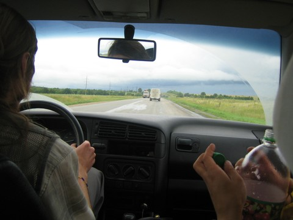
Toen stopte er een witrussische Volkswagen Golf met twee relaxte alternatievelingen uit Gomel, Wit-Rusland. Zij waren op weg naar het Grushinski festival en met hen ben ik tot Tjoletti meegereden. Tijdens de rit babbelden de twee honderduit, vooral met elkaar. Ze waren ook fysiek aan het dollen wat mij niet altijd even veilig leek. Ook waren ze op zoek naar nog een lifter. Interessant om eens te zien hoe ze hun keuze maakten. Iedereen die er oud en als een local uitzag, zonder bagage etc, lieten ze staan. Toen er weer een jong iemand langs de weg opdook, met rugtas en gitaar, werd er prompt gestopt. Geen verassing eigenlijk. Om deze reden heb ik ook een grote rugtas meegenomen.

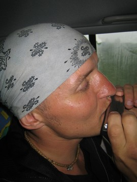
De tweede lifter heette Dennis en kwam uit Saratov. Hij had twee gouden voortanden en was ook onderweg naar het festival. Hij had een gitaar bij zich en twee mondharmonica's en een groot mes. Hij klaagde een beetje over dat het liften zo slecht ging. Hij babbelde verder heel rap en was moeilijk te volgen. Wel gaf hij een aardig mondharmonicaconcertje weg in de auto.  
Ook kreeg ik japanse eetstokjes van hem. Ik heb hem Krotov's boekje 'de praktijk van het vrije reizen kado gedaan'.

Onderweg kregen we twee keer een boete oftewel, moesten we twee keer de politiebetalen. Ik heb wat meegelapt.

Bij Tjoletti ben ik uitgestapt evenals Denis. Ik begreep het niet helemaal maar volgens mij vonden de witrussen hem irritant worden en vroegen ze hem om 50 roebel. Hij besloot toen maar vanaf hier de elektrichka naar het festival te nemen. Ik twijfelde nog of ik niet direkt naar het festival zou gaan. Dat begint vrijdag officieel en eindigt op zondag. Ik ben al niet zoon festivalmens, het weer is niet super en een hele week kamperen tussen 150.000 mensen zie ik niet zitten. Ik besloot dus weer een hotelletje te gaan zoeken aangezien mijn hospitalityclub adresjes in Tjoletti niet thuis gaven.

Samen met Denis richting station gelopen omdat ik vermoedde dat vandaaruit ook wel bussen zouden gaan naar het centrale gedeelte van de stad, dat een paar kilometer verderop ligt. Dat bleek niet het geval, ik nam afscheid van Denis alsof we oude vrienden waren en ben teruggelopen naar de weg, alwaar ik een minibusje vond die naar het centrale rayon ging. Uitgestapt bij hotel Wolga. Prima kamer voor 15 euro per nacht, warm water, aardige personeel en internetcafe om de hoek.  
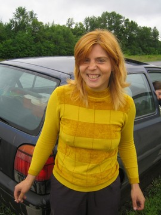

Overigens totnutoe geen spoor van [die irritante clown en die dekselse acrobaat](http://www.adriaan-homepage.nl/foto_nieuw/121_ba_bloembollen2_gr.jpg)...ik blijf zoeken !

## Grushinski Festival

Dit jaar voor de 32ste maal, het Grushinski Festival. Er is hier in 1965 een jongen in de Wolga verdronken (Valeri Grushinski) toen hij kinderen wilde redden die in de Wolga waren gevallen. De kinderen zijn gered maar Valeri zelf is verdronken. Grushinski was een student lucht en ruimtevaart die goed kon zingen en gitaar spelen.  
Ter ere van hem hebben zijn vrienden hier toen elk jaar een bijeenkomst georganiseerd met gitaarmuziek en zang. Dit is uitgegroeid tot het festival waar nu op de drukste dag, de zaterdag, 300.000 mensen schijnen te komen. Moeilijk in te schatten of het klopt maar druk is het wel.  
In de 80-er jaren is het festival 8 jaar niet gehouden want verboden door de commies.  
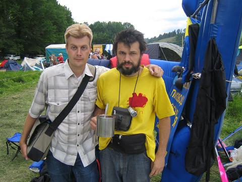  
Iedereen overnacht in tenten en het hele terrein van zo'n 2 bij 5 km is een grote camping. Het is onderverdeel in 'lagers' met groepjes. Het nederlandse kampje (1 tent) bevindt zich tussen het lager uit Oktjabrsk en Ekaterinaburg in. Verder zijn er kampjes met punkers, scouts, tolkienisten, hippies, lifters, soldaten, families, zwervers etc. Overal zijn kleine podia waar muziek gemaakt wordt, voornamelijk van het type singer-songwriter, man of vrouw met gitaar.  
's Avonds worden overal vuurtjes gemaakt,eten gekookt en vooral gedronken, veel gedronken. De hygienische omstandigheden zijn vrij spartaans. Wassen gebeurt in de Wolga en voor de toiletgang zijn een soort van latrines ingericht.

Inmiddels twee dagen verder mag ik wel zeggen dat dit festival voor mij een echt socioavontuur aan het worden is. Het is ondoenlijk om alle groepjes te beschrijven waarin ik ben beland en die mij uitgenodig hebben in hun lager. Er is wel een algemeen patroon te ontwaren:  
Ik kom iemand tegen of wordt via via geintroduceerd, het blijkt dat ik een nederlander ben en er volgt een spervuur aan vragen. Soms door 3, 4 mensen tegelijk. "Peter, nog een vraag, nee nu ik !, Peter nog een vraag". De vragen zijn meestal niet zo origineel en eerder gesteld zodat ik in vlot russisch het antwoord kan geven, waarop weer veel lof volgt over mijn russisch. Dan stel ik mijn vragen, wie zijn jullie, waar komen jullie vandaan etc.  
Dan krijg ik thee, pap, gedroogde vis, bier, een hele maaltijd of wodka, dat laatste niet zo heel vaak trouwens en volgt de adressenuitwisseling en het nemen der foto's

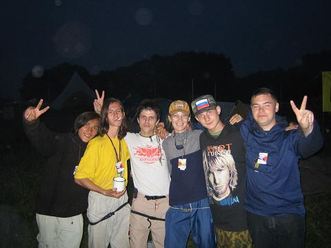
Als ik even rustig bij mijn tent ga zitten zijn daar de omringende kampen (Oktjabrsk en Ekaterinaburg) die zich haasten om mij gezelschap te houden. Gisteren met hen een hele grote gedroogde en gezouten snoek op !

Als ik wat langer bij een groepje blijf hangen wordt het soms wat lastiger. De conversatie onderling tussen de russen gaat heel rap en is doorspekt met uitdrukkingen en zegwijzes die mij onbekend zijn. Sommige mensen praten ook gewoon heel onduidelijk, het russisch leent zich vrij goed voor binnensmonds gemompel. Verder ben ik niet zo'n held in smalltalk en de paar moppen die ik inmiddels in het russisch kan zijn snel verteld. Het lukte me gister ook niet om maar 1 nederlands liedje compleet uit te zingen.

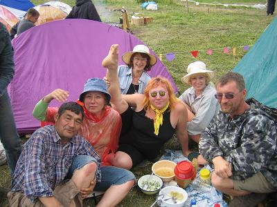
Met de lifterscommunity had ik het snel gehad. Hele discussies over de juiste lifthouding en hoe je je hand moet houden. Schrijven gedichten en zingen liedjes over liften. Ze gaan echt helemaal op in hun lifterszijn en hebben weinig aandacht voor andere zaken. Een groot aantal van hen is hier ook eigenlijk alleen maar om te werken, het verkopen van boekjes met liftverhalen.

Gisteren kreeg ik een krant met daarin een artikel over nederland dat mij ter verificatie werd aangeboden. Het ging over de beweging 'Maxifal' die in Nederland en West-Europa erg veel aanhangers zou hebben. De auteur was zogenaamd in Amsterdam toen hij op straat een hele groep mensen tegenkwam die allen 'Maxifal' scandeerden. Hij was op hen afgestapt en vroeg wat dit te betekenen had. Hem werd verteld dat er in Nederland allerlei problemen waren: omdat de regering homoseksualiteit en transseksualiteit door de vingers ziet, evenals het roken van weed, is het normale gezinsleven en gezonde liefde tussen man en vrouw eigenlijk verdwenen. Hierdoor daalt de bevolking in rap tempo terwijl de immigranten in 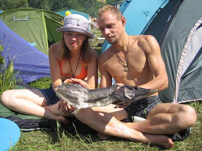 grote getalen het land binnenstromen. De Maxifal beweging wil hier een einde aan maken en promoot daarom het penisvergrotende device Maxifal met begeleidende zalf, gebaseerd op natuurlijke ingredienten. Daarna volgde het adres waar de Maxifal te bestellen is...

Inmiddels ook kennis gemaakt met Gulsum, waarbij ik in Ufa zal logeren. In haar kamp aangekomen was er ene overenthusiaste Karina die gelijk vroeg of ze met mij mee mocht naar Vladivostok. Ik hoefde hier nog geen nanoseconde over na te denken. Mijn weigering werd met veel onbegrip bejegend. Blijkbaar ging ze door voor een knappe meid en sla je dit soort aanboden niet af...  
In dat kamp was ook een arts uit Ufa, van mijn leeftijd die zich erover verbaasde waarom ik geen grote buik had. Hij bleek een heel populair figuur omdat hij toegang had tot medicinale alcohol waarmee hij allerlei drankjes brouwde, niet vies trouwens.

Gisteravond was het hoofdconcert waarbij iedereen zich verzameld op een behoorlijk stijle 
helling. Onderaan de helling ligt een podium in de vorm van een gitaar in het water. Er volgde een groot variete aan artiesten en ensembles. Echt erg gezellig en gelukkig bleef het droog. Vorige jaren had het geregend en dan schijnt er na een tijdje een modderstroom op gang te komen, minder natuurlijk.

Het weer is verder super hoewel er wel regen voorspeld wordt. Blijft tot morgen.  
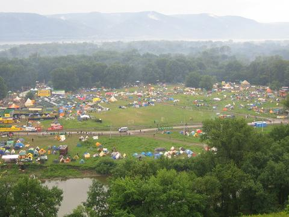

Oh ja, het internet is gratis voor mji op voorwaarde dat ik elke keer in het engels een stoere customer quote over het bedrijf SAMTelekom schrijf, die dit alles mogelijk maakt.

"I would like to thank [SAMTelecom](http://www.samtelecom.ru/) once more for the excellent service they provided me on the Grushinski Festival for free ! Thanks to them I was able to continue the day to day report of my trip. The speed of the connection is very impressive and the [SAMTelecom](http://www.samtelecom.ru/) employees were very helpful !"

## Dag 7: Grushinski - Samara - Ufa

## Dag 8: Ufa - Chelyabinsk

## Dag 9-10: Chelyabinsk - Novosibirsk

## Dag 11: Novosibirsk - Krasnoyarsk

## Krasnoyarsk

## Dag 12: Krasnoyarsk - Taishet

## Dag 13: Taishet - Severobaikalsk

## Dag 14: Severobaikalsk - Tunda

## Dag 15: Tunda - Belogorsk

## Dag 16: Belogorsk - Chabarovsk

## Dag 17 - Chabarovsk - Vladivostok

## Vladivostok

