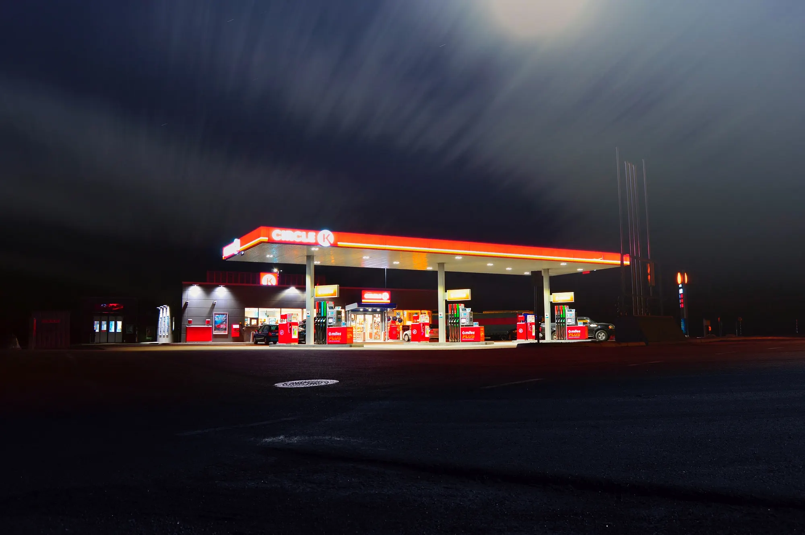

Erik schrok wakker van de autodeur die dichtgeslagen werd. Het duurde enkele seconden voor hij bij
volle bewustzijn was. Het was donker buiten en het dashboardklokje gaf 4:35AM aan. Hij keek door de
voorruit en zag zijn vrouw de felverlichte shop van het pompstation binnenstappen. Voor de shop
stond een rijtje emmers met bossen bloemen. Daarnaast een stapel openhaardhout, in plastic netjes
gebundeld. € 6,95 voor drie stammetjes. Verderop liep een lifter met een hanenkam en een kartonnen
bordje. Hij kon niet lezen wat erop stond. “Kansloos type”, dacht hij bij zichzelf.
Hij maakte een kommetje met zijn handen, blies erin en rook zijn adem. Geen alcohol meer, leek het.
De roes was weg en hij voelde de kater opkomen. Dat soort momenten maakte hij liever niet bewust
mee, hij had allang in bed willen liggen. Hopelijk kon hij zo weer verder slapen.  
Even in het dashboardkastje kijken. Geen paracetamol helaas, wel een geopend zakje muntdrop met nog
twee dropjes erin. Hij stopte ze in zijn mond. Niet de beste snack na zo’n nacht maar na de twee
dropjes weggekauwd te hebben wilde hij meer. Misschien koopt Amber wel een zakje in de shop. Hijzelf
kocht altijd een zakje snoep bij het tanken. Fruitdrop. Misschien is dat voor haar aanleiding om dat
deze keer ook eens te doen. Waar blijft ze eigenlijk?

Hij dacht terug aan het feest. Zijn oren suisden nog. Het was als vanouds geweest. Hij sloot zijn
ogen en wiegde zijn hoofd op de bassline die daar nadreunde en probeerde zijn herinneringen op een
rijtje te krijgen. Restaurant Schneeweiss met Dietrich en Martina, champagne en een paar whiskeys,
een lijntje. Toen door naar club Berghain. Eerst de onderste zaal. Meer champagne daar. Wodka, veel
oude bekenden uit zijn Berlijn tijd… Volkmar, Sergey, Hendrik, Sandra en wodka. Toen naar de
Panoramabar. Flarden Panoramabar slechts in zijn geheugen. De beat, stoom, lasers, licht en de
menigte dansende mensen. Winnie, Utah, Marit … shit, Marit. Zij was er ook geweest… Hij kneep zijn
ogen verder dicht. In zijn hoofd begon een schrille fluittoon. Waar bleef Amber nou? Hij overwoog
uit te stappen maar merkte bij de eerste aanstalten dat zijn souplesse van eerder die nacht plaats
had gemaakt voor een pijnlijke stijfheid. Beter stil blijven zitten in het koele leer van zijn
Porsche 911.

Daar kwam ze eindelijk aangelopen. Ze had haar haar los. In haar kielzog liep de punker die hij
eerder had gezien. Ze opende het portier en klapte de chauffeursstoel naar voren.
“Deze jongen rijdt met ons mee. Hij moet naar Amsterdam”, zei ze kortaf. Voordat Erik er iets
tegenin kon brengen stak de boomlange gozer zijn rechterbeen naar binnen, wurmde de rest van zijn
lichaam op het krappe achterbankje, en trok met twee handen zijn linkerbeen erachteraan. Erik hoorde
een schrapend geluid. Veiligheidsspelden over zijn Porsche Exclusive Leather. De hanenkam, die
kennelijk keihard was, schuurde tegen de hardtop van de 911 aan. De punk moest zijn hoofd scheef
houden en zijn bovenlichaam voorover tussen de twee stoelen. Erik wendde zijn hoofd naar links en
keek recht in het gezicht van de punker, een bleek landschap van puisten, piercings en tatoeages. In
de rugleuning voelde hij een knie. Een scherpe zweetlucht vulde de auto. Verder slapen was geen
optie meer. Amber stapte ook in en startte met haar linkerhand de wagen. Haar gezicht was uit beeld. Er zat een
ladder in haar netkous. Ze trok flink op.  

“Ik ben Leen, meneer”, brulde de punker in zijn oor toen ze de snelweg opreden. Erik kromp in
elkaar. Was die jongen doof of zo? De punker draaide zijn hoofd naar Amber. Erik week uit voor de
hanenkam die zijn kant opkwam.  
“Autorijden doe je ook lekker”, brulde hij haar toe en liet er een koude lach op volgen.
Erik kreeg een droge mond en voelde zich misselijk worden. Hij zette de airco lager. Ergens achter
zijn slapen startte een schelle beat. “Je hebt nogal een schuld hè”, zei Leen, nu weer tegen hem.
Hij moest iets zeggen nu.  
“Wat bedoel je?”  
“Vraag maar aan je vrouwtje”, zei Leen. “Haha”, weer die droge neplach. Erik wachtte even of Amber
zou reageren maar het bleef stil aan de andere kant.  
“Wat bedoelt hij, Amber?”, vroeg Erik
tenslotte. Tevergeefs probeerde hij zijn stem zo luchtig mogelijk te laten klinken.  
“Dat zeg je toch zelf altijd?”, zei ze uiteindelijk, “dat je vroeger als lifter zo vaak bent
meegenomen dat je nooit meer iemand mag laten staan?”   
“Oh ja”, mompelde hij. Hij kon weer iets
vrijer ademen. Wat had ze die klojo allemaal verteld? “Waarom praat ze überhaupt met zo’n vogel?”
schoot er door zijn hoofd. Viel ze op dit soort types? Onwillekeurig dacht hij aan Amber’s ex. Die
had ook een oorbel, eentje dan, maar ook drie platenzaken en een BMW 7-serie. Niet echt een punker.

Wat was er nu gebeurd gisteravond? Zijn gedachten gingen terug naar de benevelde Panoramabar.
Plotseling klaarde deze op. Marit. Ze stond dicht tegen hem aan te dansen. Hij voelde haar billen.
Hij voelde haar handen op zijn heupen, haar handen overal. Waar was Amber geweest? Zij was de bob,
ze had niets gedronken. Wat had ze allemaal gezien?  
“Wel tof dat je vroeger ook gelift hebt, gast”, loeide Leen nu. “Zeker ook veel geneukt on the
road?” zei hij vanaf twee centimeter afstand in zijn oorschelp. “Ouwe Sex Pistol, hahaha”.  
“Erik, vertel het verhaal van die lift die je ooit kreeg van die pas getrouwde vrouw, dat vindt Leen
vast mooi.” zei Amber op ironische toon. Hij zweeg. Dat was het laatste verhaal dat hij nu wilde
vertellen. Amber liet de wagen flink voortjakkeren. Erik staarde naar de snelweg die onder hen door
schoot. Weer een flard. Het toilet van de Panoramabar. Hij en Marit …  
Erik voelde niks meer. De muziek in zijn hoofd was gestopt. Alleen nog het gieren van de motor en
het ruisen van de wind over de hardtop.

Een uur later reden ze op de A12 bij Utrecht. Amber stopte bij een pompstation vanwaaruit Leen
richting Amsterdam door kon liften. Toen deze zich uit de auto gevouwen had en er getankt was, reden
ze het pompstation af langs de parkeerplaats. Amber zweeg en keek strak voor zich uit. Bij de oprit
naar de snelweg zagen ze Leen nog een keer, die onder een lantarenpaal stond te liften met zijn
kartonnen bordje ‘Amsterdam’. Toen hij hen aan zag komen rijden begon hij met iets te zwaaien. Amber
zwaaide terug en toen ze hem voorbij reden zag Erik dat Leen een rood slipje in zijn hand hield.
Godverdomme, dus toch. Hij graaide tussen Amber’s benen en ging met zijn hand omhoog. Zij liet hem
begaan. Toen hij de stof van haar slipje bereikt had pakte ze zijn hand en rukte deze weg. “Wat
dacht je nou? Vieze klootzak!”, siste ze hem toe.
