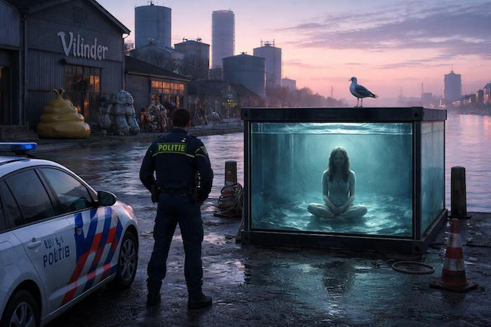
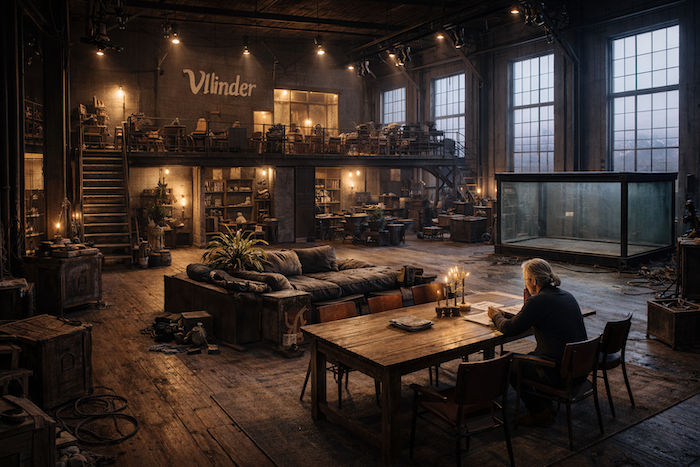

## Inhoud

## I – Keilekade

Het is zondagmorgen 9 april 2017 en een paar minuten na half negen als agent André Bultman van
politiedistrict Delfshaven een melding krijgt dat er iets vreemds is aangetroffen aan de Keilekade.
Hij rijdt op dat moment op de Vierhavenstraat, keert om en slaat linksaf de Keileweg op, het
industriegebied Nieuw-Mathenesse in. De pakhuizen, de olieopslagtank en de
vuilverbrandingsinstallatie voor hem, steken donker af tegen de heldere
blauwroze ochtendschemer.  

Nog niet zo lang geleden was dit gebied berucht vanwege de tippelzone en het openbare drugsgebruik,
maar anno 2018 is het een van de hotspots van de stad, succesvol getransformeerd tot creatieve
broedplaats voor ontwerpers, kunstenaars en aanverwante ondernemers. Bultman rijdt langs de
bouwmarkt en passeert de reusachtige werkplaats van Atelier van Lieshout, met voor de ingang kris
kras geplaatste levensgrote polyester beelden: een manshoge gele drol, twee blokkige robots zonder
armen in een copulerende pose, en een golvend tunnelstuk waarvan de organische vorm doet denken aan
een opengewerkte aorta uit een anatomische prent. Hij parkeert de dienstwagen naast het Atelier en
stapt uit. Hij staat voor een hoge loods met op de gevel de naam ‘Vilinder’
in grote sprookjesachtige sierletters.   

De brede dubbelzijdige parkeerstrook 
voor de loods is leeg. Van de jogger die de
melding heeft gedaan is geen spoor te bekennen. Aan de overkant van de straat loopt de kade.
Daarachter stroomt de Maas met het wijdse uitzicht over Rotterdam-Zuid. Op de kade staat een losse
container waarvan de contouren een sterk contrast vormen met het ochtendlicht dat Bultman van over
de rivier tegemoet komt. Op het dak zit een grote meeuw onverstoord voor zich uit te kijken. De
wanden van de container zijn spiegelend glad. Als Bultman de container nadert, neemt de spiegeling
af. De wanden zijn van glas en binnenin neemt hij een zachtblauw lichtschijnsel waar.
De container blijkt een reusachtig aquarium, tot de nok gevuld met water en afgesloten met een
deksel van zwart geribbeld staal. Op de bodem ziet Bultman het silhouet van een vrouw in de
kleermakerszit, met de rug naar hem toe. Hij loopt om de container heen. Haar voeten zijn bloot en
haar gekruiste enkels zijn met donkere metalen beugels aan twee ringen bevestigd op de bodem van de
container. Haar handen liggen in elkaar gevouwen in haar schoot. Een wijde harembroek en een hemd
met lange mouwen golven gewichtloos om haar ledematen. Een krans van haren, drijvend in het roerloze
water, straalt om haar gezicht. Haar ogen zijn gesloten. Om haar licht geopende mond lijkt een
glimlach te spelen.

In eerste instantie weerhoudt iets Bultman ervan zijn politie-reflexen te volgen en de centrale op
te roepen. Een paar minuten staat hij daar op de kade, zijn aandacht volledig geabsorbeerd door het
onwerkelijke tafereel in de container. Als een zorgvuldig voorbedacht decor schijnt het hem toe, een
verstilde scène waarin hij de rol van toeschouwer speelt. Dan roept hij zichzelf tot de orde en
grijpt zijn portofoon.

Na een paar uur politiewerk is duidelijk dat het om het lichaam van Dawinde Zwaneveld gaat, een
vierendertigjarige milieuactiviste. Later die dag verschijnt op haar weblog een lange post: haar
manifest. Het is een lang en vurig pleidooi voor een radicale koerswijziging inclusief een lijst met
concrete acties om klimaatverandering tegen te gaan. Het eindigt met de woorden:

> Als je om mij wilt rouwen, rouw dan om de planeet. Als je over mij wilt
> spreken, spreek dan over de wereld, spreek over de zaak waarvoor ik sterf.
>
> Als je aan mij denkt,
> denk dan aan de natuur, denk aan de toekomst. Laat mijn dood de kiem zijn…

Een dag later is de Keilekade gevuld met satellietwagens. De media bestormt
de zaak als een zwerm
gieren rond een vers kadaver. Voor een paar dagen beheerst Zwanevelds dood en alles eromheen
journaals, kranten en talkshows. En dan wordt het weer stil. De botten vol vlees achterlatend,
vliegt de zwerm weer verder, zonder antwoord te geven op de grote vragen.

Wie was Dawinde Zwaneveld? Wat bezielde haar? Was haar motief waarachtig? En gegeven haar oprechte
intenties, hoe komt een vrouw in de kracht van haar leven, vrij van materiële of fysieke ellende,
zover om in de afwezigheid van enige urgentie, met de door de klimaatverandering verwachte grote
catastrofes nog minstens tien, twintig jaar verwijderd, ertoe zichzelf op een vroege voorjaarsmorgen
in een tank met water af te laten zinken en niet meer boven te komen? Hoe verliepen haar laatste
uren, minuten, haar laatste seconden?

## II – Loods

Op zoek naar antwoorden spreek ik af met Bastiaan Vilinder. Het is begin oktober als ik de
werkplaats annex woning, de hoge loods aan de Keileweg in Rotterdam, bezoek. De zon staat laag. Een
frisse najaarswind waait me in het gezicht. Van de zeecontainer die hier een half jaar geleden
buiten stond is geen spoor meer te bekennen. De brede parkeerstrook voor de loods is leeg, op een
rode Tesla Model X na. Een hoge, donkerzeegroene schuifdeur biedt toegang tot de loods. Een deurbel
is er niet. Ik ping Vilinder op zijn mobiel. Even later opent een zijdeurtje en verschijnt zijn
gezicht. Vilinder, in 2012 nationaal bekend geworden als illusionist en escapist bij Holland’s Got
Talent, is gekleed in een spijkerbroek en coltrui. Zijn grijze haar in een staart. Hij komt me
magerder en kleiner voor dan in zijn shows. Hij gaat me voor in de sfeervol verlichte hal, de
ijzeren trap op die leidt naar een verhoogd plateau, een in zacht licht badend eiland op stellingen
dat als woongedeelte dienst doet en aan de zijkanten zicht biedt op de begane grond van de loods. We
nemen plaats aan een grote sloophouten tafel.

Vilinder vertelt. “Voor zichzelf zag ze de toekomst niet somber in. Ze had
het goed hier. Samen
hadden we het goed. Het was de planeet waar ze zich zorgen om maakte, nergens anders om. Moeilijk te
geloven hè? En dat snapte zij weer niet, dat ik daar zo nuchter onder bleef. Ze voelde dat radicaal
anders.”

Hij beschrijft hun eerste ontmoeting. “Het was 2015, twee jaar geleden, toen ze ineens op de stoep
stond. Bruingebrand, tanig, gemillimeterd haar. Sinead O’Connor, dacht ik steeds. Die grote grijze
ogen, die serene glimlach. Kort daarvoor was ze teruggekomen uit Vietnam. Haar hele hebben en houden
had ze in een klein rugzakje. Ze had alleen nog een paar dagen bij haar ouders gelogeerd, in de
polder, en toen kwam ze hier. We kenden elkaar vluchtig van een dating website. Ik had een paar keer
met haar gechat, heel kort steeds, maar toen niet begrepen dat ze in het buitenland was.
Als een blok viel ik voor haar en ze is niet meer weggegaan. Vanaf de eerste dag liep ze rond alsof
ze hier al jaren woonde. Alsof deze plek haar in een hoger bestemmingsplan toebedeeld was. Ik voelde
me de nieuwkomer die bij haar introk. Niet op een onaangename manier hoor,
integendeel.”   
Vilinder leunt achterover en kijkt om zich heen. “Het was of ze de ruimte hier nog groter maakte.
Sinds ze er
niet meer is, lijkt de loods gekrompen. Het is ielig zonder haar.”  
Het woonplateau waarop we ons bevinden is ingericht als grote loft met smaakvolle designmeubels.
Diverse kamerschotten, kledingrekken en een lang keukenblok breken de ruimte en ik voel me als in
een voorstelling, een gevoel dat nog verder versterkt wordt door de richtspots die vanaf het plafond
van de loods kriskras naar beneden schijnen. Vilinder wijst naar een klein bureau aan de rand van
het plateau. “Dat was haar hoekje. Daar zat ze te werken op haar laptopje. Eindeloos zat ze te
lezen: kranten, weblogs, forums. Ze werkte aan haar manifest of zat te e-mailen, te chatten met God
mag weten wie.”  

“Dawinde is het mooiste en tegelijkertijd het meest curieuze dat me ooit is overkomen. We hadden
niet echt een relatie, weet je. Althans, niet in de traditionele zin waarbij je er honderd procent
bent voor elkaar, elkaars verlangens bevredigt, elkaar aanvult. Echte gesprekken hadden we eigenlijk
nooit. Het is meer dat we elkaar duldden, tenminste, zij duldde mij en dat was genoeg.” Vilinder
zwijgt even, “Ze had het goed hier.”  
In de bladen en op Twitter is veel gespeculeerd over de aard van hun relatie. Dat Vilinder zich op
naïeve wijze zou hebben laten gebruiken. Dat hij onderdak zou hebben geboden aan een radicale cel
klimaatextremisten. Dat er over zijn rug, roem en requisieten heen een
grandioze stunt uitgevoerd is. Het raakt hem nog steeds.  

“Ik probeer het te negeren. Natuurlijk heeft ze hier vrienden uitgenodigd, wat zou dat? Ze woonde
hier! Vorig jaar had ik bijna dagelijks een show, soms twee op een dag en was hele dagen van huis.
Als ik ‘s ochtends wakker werd en mijn ochtenddingetjes deed, zat ze steevast te mediteren. Daar op
dat kussen. Volledig roerloos, als een standbeeld. De jongens die beneden mijn requisiten inpakten
zag ik altijd met een schuin oog naar boven gluren. Alsof ze een van mijn illusies was.
Na mijn optreden probeerde ik ‘s avonds altijd weer terug te komen naar Rotterdam. De momenten dat
ik dan na een zware show ergens in het land en een lange autorit terug, thuiskwam, en haar hier dan
aantrof, die koester ik.” Vilinder kijkt vertwijfeld.    
“In de ochtenden was ze afstandelijk,
onbereikbaar, maar ‘s avonds niet. Dan was ze kwetsbaar, hulpbehoevend als een pasgeboren kitten.
Dan was ze er voor mij, helemaal. Haar liefde, dat was geen rekensom, zoiets
voel je.”  
Wanneer ik later die middag vertrek valt mijn oog op de zeecontainer die in een verre hoek van de
loods staat. Voor mijn bezoek heb ik een geheimhoudingsverklaring getekend waarin ik onder een
dwangsom vastleg niets te onthullen over de talloze requisieten waarmee de loods gevuld is. “Er
staat hier voor miljoenen aan illusies”, zegt Vilinder verontschuldigend. “Ja, dat is ModPool. De
politie heeft hem meegenomen voor sporenonderzoek. Het NFI heeft hem hier pas geleden weer
terugbezorgd.”  

Vilinder vertelt hoe hij de zeecontainer alias zwembad gekocht heeft in Australië bij ModPool. Het
bedrijf transformeert containers in speciale zwembaden die als module bij een terras geplaatst
kunnen worden. De website van het bedrijf toont diverse visuals van op hellingen gelegen terrassen
waar de ModPool integraal onderdeel van uitmaakt, met zonnebadende mensen aan de bovenrand en
zwemmende kinderen achter het dikke glas.  
“Ik heb dit exemplaar op maat laten maken voor een ontsnappingsact die ik ontwikkelde. Ze moesten
voor mij de bovenkant erop laten zitten. Voor de zwembadtoepassing halen ze die er normaal
natuurlijk vanaf. Niet dat hij daar goedkoper van werd overigens. Het plaatsen van de glaswanden
werd er weer ingewikkelder van, lang verhaal. De speciale binnenverlichting en de sloten hebben we
hier gemonteerd. Mijn buurman heeft een goede lasser in dienst, waarmee ik dat soort klusjes doe.
Alleen het transport was goedkoop, 800 euro, meer kost het niet om zo’n gevaarte helemaal vanuit
Melbourne hier op de kade te laten zetten. Leve de globalisering. Makkelijk maatje he, zo’n
container”, Vilinder glimlacht flauwtjes, “hij hoeft niet ingepakt te worden.”  
Wat hij nu met de ModPool gaat doen, weet hij nog niet. Alsnog inzetten bij een act is uitgesloten.
Hij vertelt dat er van diverse kanten belangstelling getoond is om de container ergens als monument
te plaatsen.  
“Ik kijk het nog even aan. Voorlopig staat hij hier. Eigenlijk wil ik hem op de Coolsingel, voor het
Stadhuis, maar de gemeente heeft zich nog niet gemeld. Misschien moet ik ze zelf eens bellen.”
De Regionale Inlichtingen Dienst schreef in haar onderzoeksconclusies dat op basis van de notities
op haar laptop bleek dat Zwaneveld de container, met water gevuld, voor het Stadhuis had willen
laten plaatsen.  
“Had ze dat plan maar uitgevoerd”, zegt Vilinder. “Dan was ze wellicht gearresteerd nog voordat ze
erin had kunnen springen. Als ze er eenmaal in had gezeten was er niet veel meer geweest wat de
politie had kunnen doen. Het glas is te dik om kapot te schieten en het deksel is alleen van binnen
uit te openen. Zo hebben we hem gemaakt, dat was nodig voor de illusie die we ermee wilden
uitvoeren.

In haar email is correspondentie gevonden met een aantal expediteurs waar Zwaneveld onder de naam
Street Aquariums BV informatie bij opvroeg over de transportmogelijkheden. Vanwege het buitengewone
gewicht van een met water gevulde container bleken hier speciale dieplader trucks voor nodig te zijn
en een reusachtige kraan voor het op- en aftakelen. Op basis van die informatie zou Zwaneveld dat
plan hebben laten varen.  
Vilinder heeft zo zijn twijfels over die lezing. Hij denkt dat Zwanevelds keuze voor een eenzame
dood uiteindelijk voortkwam uit haar menslievendheid. “Voor het maximale effect was het natuurlijk
een stuk beter geweest als ze zichzelf daar midden in het centrum van de stad verdronken had, met de
neuzen van het winkelend publiek tegen de ramen aan, voor de alom aanwezige camera’s van Instagram
en Twitter. Probeer je zo’n fimpje eens voor te stellen! Als je al ziet wat mijn ontsnappingsacts
bij het publiek oproepen, terwijl mensen daarvan weten dat het een illusie is. Ik denk dat het
traumatiserend effect dat zo’n publieke zelfexecutie op de aanwezigen zou hebben haar heeft
teruggehouden, meer nog dan die logistieke problemen. Uiteindelijk is ze geen Thích Quảng Đức”, zegt
hij, refererend naar de Boeddhistiche monnik die zichzelf op 11 juni 1963 op een drukke weg in
Saigon in brand stak om zo te protesteren tegen de discriminatie van boeddhistische monniken door
het door de Verenigde Staten gesteunde Zuid-Vietnamese regime.

## III – Wageningen

Dawinde Zwaneveld werd in 1984 geboren in Strijensas in de Hoeksche Waard als Daphne Zwaneveld.
Nadat ze in 2003 haar VWO diploma haalde, nam ze een tussenjaar. Ze werkte
een tijdje als cassière in de lokale supermarkt waar ze geld spaarde om daarna met een vriendin naar
Borneo te vliegen voor
een half jaar vrijwilligerswerk in het Samboja Lestari Orangutan Sanctuary in Balikpapan waar ze
apen verzorgde en Engelse les gaf. Terug in Nederland begon ze aan een bachelor Environmental
Sciences aan de Universiteit van Wageningen. Ze ging op kamers wonen in een complex aan de Herstraat
en werd lid van studentenvereniging SSR-W. Daar kwam ze in contact met Roelant Graten (Razende
Roelant), inmiddels uitgegroeid tot ‘s lands bekendste klimaatactivist. Beiden staan ze op een
groepsfoto van dispuut Wilt in het SSR-W jaarboek van 2005: Zwaneveld, tenger met lang donker haar,
enigszins schuchter in de camera kijkend. Graten daarnaast, blozend blond, in een rood-zwart geblokt
houthakkershemd, een brede glimlach op zijn gezicht. Verder herkennen we Tuur
Koenebroek, tegenwoordig wethouder van milieuzaken in Nijmegen en Saartje Vreeman, sinds 2013 tweede
kamerlid
voor GroenLinks.   
Met Graten bouwt Zwaneveld in Wageningen een hechte vriendschap op. Via hem komt ze in contact met
de groep linkse activisten die wekelijks samenkomen in café Groenwijk, niet ver van Wageningen
Campus. Het bestaat uit een bonte mengelmoes van veteranen uit de kraakbeweging, antifa’s,
nieuw-communisten, maar ook New Age types zoals professor doctor Leo Huiten en zijn vriendin, de
filosofe Lisanne de Ruiter. Zwaneveld en Graten proberen de groep te organiseren rondom praktisch
haalbare doelen en aan te zetten tot concrete acties. Ik zoek Graten op in zijn huidige woonplaats
Groningen, waar hij vanuit zijn kleine arbeiderswoning bezaaid met boeken, tijdschriften en andere
paperassen, de strijd tegen de fossiele-brandstoffenindustrie handen en voeten geeft.

Graten steekt van wal, “De harde kern van onze groep bestond uit zo’n 30-35 mannen en vrouwen. Ik ga
hier geen namen noemen, ga dat maar navragen bij de AIVD, die houdt het keurig bij, maar inderdaad,
Daphne hoorde daar ook bij.” Graten praat vooral graag over zijn idealisme en activisme: “Het is
natuurlijk volkomen ridicuul hoe wij door sommige media, maar ook door mensen in de lokale en
landelijke politiek als extreem worden weggezet. Het probleem waar we met deze planeet voor staan is
groot, urgent en bedreigt het voortbestaan van duizenden dieren en plantensoorten en miljoenen
mensen. Life as we know it, dat staat op het spel en dat wordt onderschreven door zo’n beetje elk
wetenschappelijk onderzoek dat zich hierop richt. En toch lijkt het grootste gedeelte van de
bevolking het niet te willen zien, of er omheen te draaien. Dat komt omdat de oplossing raakt aan de
kernwaarde van onze westerse maatschappij, het kapitalisme, waarin geen plaats is voor een rem op
welke groei dan ook.” De acties van het klimaatfront, zoals Graten zijn groep noemt, zijn bedoeld om
de boel op ruwe wijze wakker te schudden.

Hij wijdt uit over het spectrum van ideeën, hoe deze door het grote publiek gepercipieerd worden en
hoe je dat kunt zien als een venster dat voortdurend verschuift. Ideeën gaan van ondenkbaar naar
radicaal, van acceptabel naar verstandig en tenslotte van populair tot
beleid.  
“Je ziet die beweging nu terug in het klimaatbewustzijn. Fossielvrij beleggen, stoppen met vlees,
veganisme.
Zaken die tien jaar geleden als extreem bestempeld werden, beginnen nu acceptabel te worden onder
bredere geledingen van de bevolking.”     
“Helaas zijn er meer krachten aan het werk en wordt het spectrum in alle richtingen opgerekt,”
verzucht hij. “Die types die beweren dat het klimaatprobleem er niet toe doet maar immigratie en
aantasting van onze westerse cultuur het centrale probleem van onze tijd is. Zo iets kleins, zo’n
feitelijk non-issue. Geweldig eigenlijk als dat werkelijk het vraagstuk van onze tijd zou zijn. Een
verkoudheidje dat vanzelf overgaat, een gescheurde teennagel die weer aangroeit. Oneindig veel
prettiger dan de dodelijke tumor van global warming door ons eigen toedoen veroorzaakt. De
misleidende kracht van die ideeën snap ik heel goed.”

Het gedachtegoed van Roelant Graten resoneert op veel punten met dat van Zwaneveld. In haar manifest
vinden we dezelfde toon terug, dezelfde verontwaardiging, dezelfde wanhoop. Als we uiteindelijk op
Dawinde’s privéleven uitkomen laat hij zijn scherpe toon varen. Hij vertelt over haar mislukte
dienstverbanden, de niet verlengde jaarcontracten, haar carrière die niet op gang kwam en haar
depressieve klachten.  
“Weltschmerz, zo noemde ze het zelf, maar het was meer,” zegt hij. “Als je je
op onze manier voor een goede zaak inzet en daar je levensdoel van maakt, dan moet je heel stevig
in je schoenen staan en voldoende rücksichtlos zijn. Als je dat niet in je hebt kom je niet verder.
Het klinkt afschuwelijk maar op een bepaalde manier was ze te goed om deze wereld te redden.
Haar laatste jaren bij het front ging ze het meer zoeken in het symbolische. Performance art à la
Christo of Abramovic. Dat vond ze geweldig. De grootste plannen maakte ze toen weer, maar als puntje
bij paaltje kwam,” hij maakt zijn zin niet af, zijn stem stokt.

Ondanks de verschillen in inzicht wilde Graten Zwaneveld kost wat kost bij
het klimaatfront houden.
Ze vormde een inspiratiebron voor de rest, een spiritueel baken voor de groep. Haar plotselinge
vertrek naar Vietnam in 2013 kwam dan ook aan als een mokerslag. Graten heeft weinig zin erover te
praten. “We hebben wel contact gehouden, sporadisch een SMS-je, maar het was uit het oog, uit het
hart. Toen ze terug was en bij die SBS6-tovenaar is ingetrokken, heb ik haar een paar keer
opgezocht. We hebben wat bijgepraat over de acties die we tijdens haar afwezigheid hebben uitgevoerd
en de aanstaande protesten, zoals de bezetting van het NAM hoofdkantoor. Ze was veranderd. Die naam.
Dawinde.” Als een vies snoepje rolt het uit zijn mond.

## IV – Vietnam

Ik herken Thích Ca Mâu Ni (John) aan zijn kale hoofd en het rode habijt dat schuin om zijn lichaam
is gewikkeld en de rechterschouder bloot laat. Hij wacht me op, op het vliegveld van Da Nang waar
ik aankom na anderhalf uur vliegen vanuit Ho Chi Minh stad, de hoofdstad van Vietnam. Het is een
goedlachse veertiger, een makkelijke prater, die met zijn accent zijn Australische afkomst verraadt.
Hij vertelt me dat hij al dertien jaar in Vietnam woont, de laatste vijf jaar als volleerde bikkhu,
Boeddhistisch monnik. Hij treedt op als tolk en contactpersoon van de Nồi Nấu Nước, een lokale
Boeddhistische orde bestaande uit zo’n vijftig bikkhus en bhikkuni’s. De naam Nồi Nấu Nước
betekent zoveel als ‘Stille Wateren in Mij’. Zwaneveld verbleef bijna twee jaar in hun midden.
John bestelt een taxi, geeft in vlot Vietnamees een bestemming op en door de hete straten van Da
Nang rijden we naar de retraite die de orde beheert, in de Ba Na heuvels, even buiten de stad. De
retraite is omringd door bos en bestaat uit meerdere gebouwen. Het meest opvallend is de kleine
tempel, een in steen opgetrokken traditionele pagode, met een rijkelijk versierd houten dak. Schuin
daarachter staat een laag modern gebouw dat ruimte biedt aan het gastenverblijf en het meditatie
centrum. John leidt me rond. Als we voorbij de meditatieruimte komen zie ik de gasten zitten, naar
schatting zo’n dertig personen, doodstil op kussens in de meditatiehouding. Boven hen een
plafondventilator die rustig zijn rondjes draait. Niet iedereen doet mee. Buiten de slaapzaal zit
een meisje met een afritsbroek en een buiktasje een sigaret te roken, aandachtig starend naar haar
mobiel.

We eindigen de rondleiding in een hagelwit kantoor, waarvan de airconditioning en het moderne
meubilair een vreemd maar aangenaam contrast vormen met de hitte en sobere inrichting van de overige
ruimtes. John vertelt me dat vrijwel alle gasten hier westerlingen zijn, veelal twintigers,
backpacker types, maar ook ouderen: vijftigers en pensionados. Ze volgen hier een meditatieprogramma
van elf dagen. De eerste dag wordt besteed aan acclimatisering en instructie, daarna gaat een strak
programma in met tien uur meditatie per dag, opgebroken in een ochtend en een middagsessie. De
leerlingen dienen volledige stilte te betrachten die alleen verbroken wordt aan het einde van de
middag, tijdens een tien minuten durend één-op-één met de instructeur.

Wanneer ik over Dawinde begin, verdwijnt de glimlach van John’s gezicht, voor het eerst die middag.
Uiteraard heeft hij gehoord van haar zelfmoord en zegt door verschillende Nederlandse kranten
telefonisch benaderd te zijn voor een interview, iets dat hij tot nu toe steeds geweigerd heeft.
“Zij was een bijzonder geval. Ze vertrok niet na haar eerste tiendaagse, zoals de meesten doen, maar
sloot zich direct aan de bij de volgende, en toen die afgelopen was, de volgende. Uiteindelijk
volbracht ze zes tiendaagse retraites op rij. Haar voortgang en toewijding waren indrukwekkend. Niks
ten nadele van onze leerlingen, maar de meesten onderschatten waar ze aan beginnen, om het lichtjes
uit te drukken. Het vereist veel van een leek om de blik inwaarts te richten en helemaal zuiver te
krijgen. Als het al lukt dan bevalt het vaak niet wat ze daar zien of hoe weinig ze daar zien. Bij
Dawinde was het anders, het ging haar relatief makkelijk af, ze leek op te
bloeien.”    
Na haar zesde retraite hebben de monniken haar apart genomen en haar aangeboden haar verblijf voort
te zetten in de Vihara, het hoofdklooster van de orde, verder landinwaarts, om daar kennis te maken
met de Vinaya, de door 227 regels beteugelde levenswijze voor Boeddhistische nonnen en monniken. Een
soort stage. Ze zei toe.

“Ze is de tweede leerling die vanuit deze retraite naar de Vihara is verhuisd, de tweede westerling
ooit die er een voet heeft binnengezet. Ik was de eerste,” laat John er enigszins ongemakkelijk op
volgen. Als ik hem vraag te vertellen hoe het haar in de Vihara vergaan is, reageert hij
terughoudend. Hij noemt het manifest, dat ook hij gelezen heeft, waarin ze een aantal keer, vrij
summier, verwijst naar haar verblijf in het klooster.

> [...] De monniken hebben mij geleerd dat je slechts dat kunt verliezen wat
> je hebt, niet wat je bent. Stop dus met het nastreven van bezit, het vergroot je afhankelijkheid
> en beperkt je echte
> vrijheid [...]

en iets verderop

> [...] in de Vihara werd me duidelijk dat de zin van het leven, de zin van
> mijn leven, iets heel
> persoonlijks is, en voor mij niet per se ligt in het leven zelf [...]

“Het is voor een leek moeilijk te begrijpen wat een mens onderweg naar Nibbana (Verlichting red.)
ondergaat. Hij is als een reiziger in een vreemd land, zonder reisgids, zonder woordenboek, zonder
mobiele telefoon.” Bij die woorden glimlacht John weer. Hij knikt naar zijn eigen mobiel die reeds
een paar keer getrild heeft en geeft me te kennen dat er nog werk op hem wacht.

Als ik twee dagen later opnieuw arriveer op het complex, tref ik John in een toeschietelijker bui.
Hij vertelt me dat een bezoek aan de Vihara onmogelijk is maar dat hij na overleg met zijn chief
bikkhu, de hoogste monnik van de orde, toestemming heeft om vrijelijk over
Zwaneveld te praten.  
“We hadden een speciale band. We waren de enige niet-Vietnamezen en voor haar communicatie met de
anderen was ze op mij als tolk aangewezen. Later leerde ze zelf wat Vietnamees. Het enthousiasme dat
ze in de retraite voor onze levenswijze kreeg, bleef aanvankelijk in stand. Ze voelde zich bevrijd.
Ze vertelde me dat ze voor het eerst in haar leven geluk vond in het pure bestaan, het existeren an
Sich. Ze verzon zelf haar nieuwe naam, Dawinde.”
John probeert me de ontwikkeling uit te leggen die een leerling monnik in zijn orde ondergaat. Hij
zoekt naar woorden, de juiste uitdrukkingen voor wat hij over wil brengen lijken niet altijd te
bestaan.   
“Door alles los te laten, lost je ego op, stukje bij beetje. Je wordt in zekere zin
essentie-loos. Hierdoor ontwikkel je een helderder blik naar buiten toe, minder vervormd door je
behoeftes en je eigenbelang. Maar ook naar binnen toe ga je meer zien, je krijgt oog voor de natuur
in jezelf. De geoefende meditator ziet de gevoelens door zijn brein stromen, ziet zijn eigen
gedachten meanderen als een rivier en aanschouwt het kolken van zijn diepste zijn. Letterlijk soms!
De ervaring is sterker dan welke drug dan ook. En geloof me, ik weet waarover ik praat.” John
knipoogt. Even zie ik de Australische hippie terug die hier dertien jaar
geleden arriveerde.  
“Bij de intermediates in de Vihara zien we dagelijks de tranen over de wangen rollen. Tranen van
geluk welteverstaan. Dat is de paradox. Je laat hier alles los. Je hele leven laat je achter je en
je ontvangt er het grootste geluk voor terug, al ervaar je dat anders dan je voorheen deed. En ook
dat moet je weer loslaten.”  
Als ik vraag naar zijn gedachten omtrent Dawinde’s zelfverkozen einde vertelt John over de laatste
maanden van haar verblijf. “Soms vergezelde ik haar op de wandelingen die ze ‘s ochtends vroeg
maakte in het bos. Ze kende alle bomen, alle vogels, alsof ze al jaren in deze contreien woonde. Het
was bijzonder. Tijdens die wandelingen opende ze zich, haar zwijgzaamheid verdween. We hadden lange
gesprekken over haar leven, over haar geboorteplaats. Onze geesten raakten elkaar op veel punten,
maar niet overal. De centrale gedachte uit onze filosofie, dat de werkelijkheid per definitie
onbevredigend is, en we hiermee in het reine kunnen komen door onze geest te plooien in plaats van
de werkelijkheid, kon zij niet accepteren. Met onze onttrekking, zoals zij dat noemde, zouden we
hooguit onszelf verlossen, maar niet de aarde met alles wat erop leeft. Niet zolang het grootste
gedeelte van de mensheid een andere weg volgt.” John zucht.
“Ze worstelde daarmee. Samen zochten we naar een oplossing, zodat ze verder kon op Het Pad. Maar
toen was ze plotseling verdwenen, zonder een woord. Terug naar Nederland dus, zoals ik later pas
begrepen heb. ”  
John zucht, staart voor zich uit en lijkt dan plotseling wakker te schrikken. De
glimlach krult weer om zijn lippen.

## V – Strijensas

“Weet je dat Mozart hier nog is geweest? In 1765, hij was toen negen jaar en als wonderkind op
tournee door Europa met zijn ouders en zijn zusje Nannerl. Vanaf het posthuis hier op het dorp
hebben ze de koets genomen naar Den Haag. Kun je je het voorstellen?”  
Ik zit aan de eikenhouten
eettafel bij de heer en mevrouw Zwaneveld in Strijensas. Het grote raam van de woonkamer geeft
uitzicht op de dijk waarover af en toe een auto rijdt. Levendig vertelt Zwaneveld (“zeg maar Dick”)
over zijn woonplaats, gelegen in de Hoeksche Waard, zo’n 30 km ten zuidwesten van Rotterdam. Dick,
een blakende babyboomer en gepensioneerd geschiedenisleraar lijkt blij met
mijn bezoek. Zijn vrouw
Trudy zit er stil bij. De aandacht die ze vlak na het overlijden van hun dochter hebben gekregen,
heeft haar terughoudend naar de media gemaakt.  
Daphne, zoals haar ouders haar genoemd hebben, heeft een gewone jeugd gehad. Broertjes en zusjes had
ze niet, wel vriendjes en vriendinnetjes. “Wij kunnen niet echt zeggen waarin ze bijzonder was. Ze
was ons enig kind, zie,” zegt Dick. “Alles aan haar vonden we bijzonder. Ze was intelligent, ze kon
goed leren en was altijd aan het lezen. Ze las alles wat los en vast zat. En ze was een
Einzelgänger. Ik kan niet anders zeggen. Toen ze naar het VWO ging fietste ze elke dag naar
Oud-Beijerland, 20km verderop. De kinderen uit het dorp fietsten altijd samen maar vanaf de derde
of zo ging Daphne liever alleen. Dan ging ze expres wat later van huis zodat de groep al weg was. ‘s
Middags kwam ze steeds laat thuis. Bleek dat ze dagelijks op de terugweg langs het vogelgebied reed,
ging ze daar wandelen in de wetlands, bij de Schenkeldijk. Weer of geen weer. Ze kende alle
vogelsoorten, en dat zijn er niet weinig hier.”  
Nadat Daphne op kamers is gegaan in Wageningen, bezoekt ze haar ouders minder vaak. Op een gegeven
moment zien ze haar nog maar sporadisch. “We wisten niet waar ze zich mee bezighield. Ze leefde in
een andere wereld dan de onze, zoveel was ons duidelijk. Toen ze vorig jaar terugkwam uit Vietnam
stond ze hier plotseling voor de deur. Hele korte haren, maar verder zag ze er gezond uit. Ze kwam
heel ontspannen over. We hebben veel gepraat over ons dagelijks leven. Zij vertelde ons over
Vietnam. Over haar toekomstplannen hebben we met geen woord gerept, daar waren we jaren geleden al
mee gestopt.  
Ze bleef een paar dagen. Dat was fijn. Elke ochtend ging ze de polder in, nog voor de haan kon
kraaien. Dan ging ze de dijk op en het vogelgebied in. En toen was ze plotseling weer verdwenen. Nog
geen briefje of niks. Zo was ze. We hebben ons suf gepiekerd of wat we fout hebben gedaan, maar dat
leidt nergens toe.”  
Dan verbreekt Trudy haar stilte.   
“Waarom blijft iedereen toch zo geïnteresseerd in Daphne en niet in
dat waarvoor ze gestorven is? Wat maakt het uit of ze gestorven is uit frustratie, haar dood als
ontsnapping, machteloos als ze zich voelde in deze wereld, of juist als instrument, een uniek offer
om iets te veranderen, iets in gang te zetten. Wat is het verschil?
Het was een ultieme daad van liefde. Nu is het aan ons, aan mij en Dick, aan de media, aan ons
allemaal om iets te doen. Waarom schrijft u daar geen artikel over? Verkoopt dat niet? Alstublieft,
laat haar dood niet voor niks zijn geweest. Het was de ultieme daad van
liefde…”   
Trudy verlaat de kamer. Dick en ik blijven achter, in stilte.

## VI – Zondagmorgen 9 april 2017

Wat er in het fatale weekend precies is omgegaan in Dawinde zal voor altijd onbekend blijven. Het is
aannemelijk dat het plan, en daarmee haar doodswens, reeds klaarlag, ergens 
in een laatje van haar
geest. Naar waarom ze juist die dag het plan van een voornemen in een concrete daad heeft omgezet
kunnen we alleen maar gissen. Feit is dat ze die zaterdag, april de achtste, de eerste
voorbereidingen begon te treffen. Wat volgt is een reconstructie op basis van het politierapport en
de gesprekken die ik voerde.

Bastiaan Vilinder staat die morgen vroeg op voor zijn doen, om een uur of 
negen.   
“Dawinde zat in
meditatie, zoals gewoonlijk rond die tijd. Ik heb niet gewacht tot ze eruit kwam en ben gewoon
weggegaan. Om half elf moest ik het vliegtuig hebben naar Gran Canaria. Ik zou twee shows geven in
Playa Des Ingles, zaterdagavond en zondagmiddag. Zo ging dat met ons, we spraken niet veel en ‘s
ochtends wisselden we nooit een woord. De nachten, die waren van ons, die vorige nacht was daarop
geen uitzondering geweest.”

Rond het middaguur komt Roelant Graten langs, met zijn Lada Niva uit Groningen. Ze hadden eerder die
week afgesproken. Ze lunchen samen waarna hij verder rijdt naar Den Haag, voor een andere afspraak.
Graten wil de details van het gesprek niet kwijt.   
“Dat blijft privé, het waren onze vertrouwde
thema’s. We hadden het over de voorgenomen acties van het front. Ze nam ze ter kennisname aan maar
het landde niet meer. Daar heb ik mijn frustratie over uitgesproken maar ook die woorden raakten
haar niet meer, zo leek het. Die wezenloze glimlach die ze in Vietnam had opgelopen verdween geen
moment van haar gezicht. Gekmakend. Onze laatste conversatie was niet onze beste, laten we het daar
op houden. Daar zal ik mee moeten leven.”

Een uur of drie die middag loopt Zwaneveld de aanpalende loods van Atelier van Lieshout binnen. Ze
vraagt de heftruckchauffeur die daar werkt of hij voor haar iets wil verplaatsen. Als deze een
kwartiertje later door de geopende deuren Vilinders loods binnenrijdt, 
blijkt het om de ModPool te
gaan. Op Zwanevelds verzoek rijdt hij hem uit en plaatst hem op de kade.

Volgens het politierapport dat zich baseert op beelden van de beveiligingscamera’s op Van Lieshouts
atelier, rolt Zwaneveld die avond om 17:28 de brandslang uit. Te zien is hoe ze de slang aan het
einde bij het koppelstuk beetpakt en over de parkeerplaats heen trekt. Ze gooit het uiteinde op het
zwarte dak van de ModPool waarna ze zelf via de zijkant naar boven klimt. Op het dak opent ze het
luikje en voert het koppelstuk naar binnen. Dan opent ze de kraan. Volgens een schatting van de
brandweer heeft het gebruikte type blusinstallatie de container in een uurtje of twee tot de rand
gevuld. Om 20:05 is te zien dat Zwaneveld de slang eruit haalt en hem weer oprolt. “Haar handelingen
geven een voorbedachte indruk”, aldus het politierapport.

Om 22:15 gaat de telefoon bij Trudy en Dick Zwaneveld in Strijensas. Trudy ligt al op bed en Dick
neemt op.   
“‘Dag pap,’ hoor ik. Het was Daphne. Haar telefoontje bevreemde me. Ze had al in geen
jaren naar ons huisnummer gebeld en eigenlijk had ze niks te melden, zwijgend hing ze aan de lijn.
Uiteindelijk ben ik maar wat gaan vertellen. Over de pioenroos in de tuin die op het punt van
bloeien stond en de krokussen die al weer verwelkten. Over de brandganzen in de wetlands achter de
dijk, die binnenkort wel weer naar het noorden zouden vertrekken. En toen hing ze weer op. Tot
ziens, pap, zei ze nog.” Dick slikt. “Volgens mij huilde ze. Ik kreeg in ieder geval een sterke
herinnering aan vroeger. Daphne lag als tiener bij tijd en wijlen onbedaarlijk te snikken in haar
bed. Ontroostbaar was ze dan. Trudy en ik kregen er geen hoogte van. Maar de volgende ochtend zat ze
altijd weer monter aan het ontbijt, alsof er niets voorgevallen was. We lieten het maar zo.”

Op haar laptop ziet de politie dat er die avond tot 22:52 aan het manifest gewerkt is. Daarna is de
inhoud van het document op haar weblog geplaatst, met als publicatiedatum de volgende morgen om
twaalf uur.  
De camerabeelden van de volgende morgen tonen vanaf 5:30 een donkere gestalte, roerloos zittend op
het dak van de ModPool. Als het ochtendschemer de hemel lichter kleurt, 
verbetert het contrast.  
Zwaneveld heeft een kleed om zich heen en zit in de meditatiehouding, met rechte rug naar de camera
gericht. Haar hoofd licht gebogen, haar gezicht naar de rivier.  
In Vietnam heb ik het met John over zelfmoord onder Boeddhisten. Volgens hem is het uiterst
zeldzaam. “Boeddhisme is erop gericht vrede te vinden met de onvolkomenheden van het bestaan. Jezelf
verlossen van aardse hunkeringen en impulsen. Dat gezegd hebbende, de geestelijke capaciteiten die
je opdoet op de Weg zijn heel krachtig en kun je op diverse manieren aanwenden. Het is een
tweezijdig zwaard. Twijfel, stress, pijn, doodsangst, juiste meditatie is hét instrument om ze te
neutraliseren.”  
Als voorbeeld noemt ook hij Thích Quảng Đức. De zelfverbranding die deze monnik onderging zou een
normaal mens ondraaglijke pijn hebben bezorgd. Wie echter de beelden van de Đức’s verbranding goed
bekijkt, ziet door de vlammen heen dat hij onbeweeglijk blijft, nog geen gezichtsspiertje vertrekt.
John maakt zich een voorstelling van Zwanevelds laatste uur, op het dak van de container, en neemt
me mee.
“Je begint de meditatie met concentratie op de adem,” zegt John. “Dat lukt beter boven water
uiteraard. Zo breng je je geest tot kalmte en beteugel je je emoties. Dan, na een bepaalde periode
van aandacht op je adem, keert de concentratie naar binnen toe en treedt de Jhana in, de toestand
van complete onderdompeling en absorptie, de hoogste staat van concentratie. 
Je ademhaling is nog
nauwelijks waarneembaar. Vanaf dat punt overheerst gelukzaligheid en raak je onthecht van je
zintuiglijke gevoelens. Een zingende vogel, kramp in je benen, een doodswens, je neemt het nog waar,
je aanschouwt het, maar het roept geen emoties meer op.”

De zon, die om 7:06 verschijnt tussen de pakhuizen aan de oostkant van de kade, zet de container en
de vrouw daarbovenop in het volle licht. Nog even blijft Zwaneveld in de zon zitten. Dan is er
beweging. Ze opent het luikje en laat zich soepel naar binnen glijden met kleding en al, haar benen
eerst. De schittering in de ruiten van de ModPool ontnemen de camera het zicht in de container.

“Anderhalf uur Jhana is de beste voorbereiding voor een plons in het koude water”, zegt John, “de
eerste één twee minuten heeft ze niet geleden, daar ben ik vrij zeker van. De kou heeft haar niet
gedeerd, het gebrek aan zuurstof evenmin. Hoe het haar daarna is vergaan is giswerk. Uiteindelijk
hou je de natuur niet tegen en de wil om te leven is sterk, in iedereen. Maar ze had zich
vastgeketend aan de bodem toch, las ik, waren er tekenen van doodstrijd?”  
Het is Bastiaan Vilinder die hier de cruciale informatie verschaft. “Die ontsnappingsact is toch
naar de klote, ik kan het net zo goed vertellen: die enkelsloten op de bodem zijn niet echt. Ze
houden je lichaam aan de grond maar bij de minst geringste schokbeweging schieten ze open. Zo hebben
we ze gemaakt. Op TV zie je mij onder water altijd als een krankzinnige in de weer met paperclips,
maar dat is pure show. Dawinde wist dat, ik had het haar verteld. Ze had elk moment nog kunnen
ontsnappen.”   

Maar Dawinde hield controle, tot het laatste moment. Als er al sprake was van een doodstrijd dan
had ze die in de weken, maanden en jaren daarvoor al gevoerd. 

