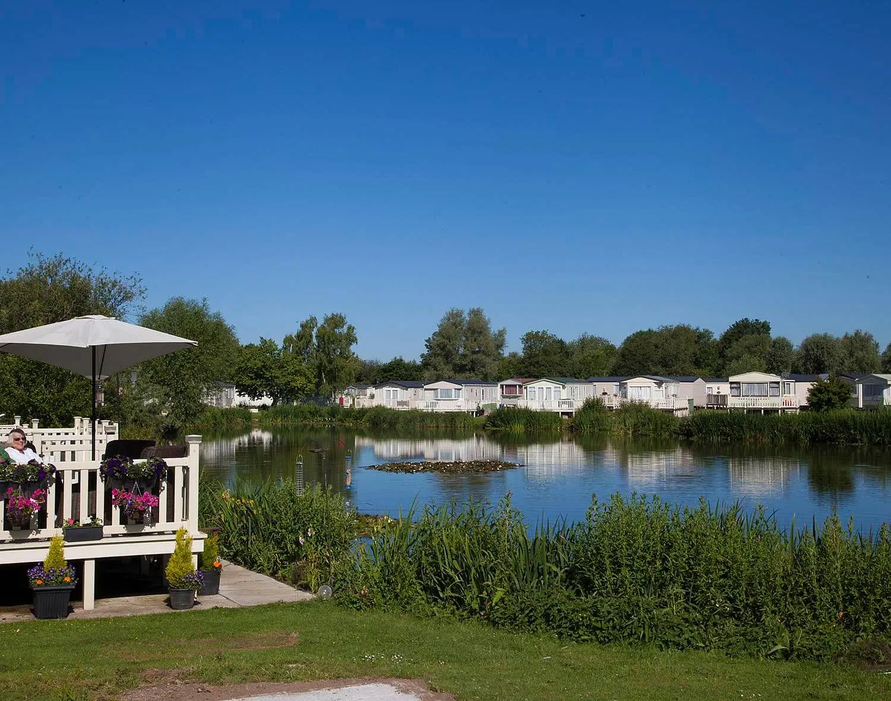

Met gemengde gevoelens liep ik die avond van de schrijfles terug naar huis. Enerzijds voelde ik me
ik bevredigd, anderzijds vertwijfeld en lichtelijk bezoedeld. Keenan had weer een nieuw publiek
gevonden. Bij de bespreking van mijn verhaal en de oorsprong van de hoofdpersoon was hij daar weer.
In geuren en kleuren had ik alles verteld, voor de zoveelste keer.  
Hoe was het zo ver gekomen? De herinneringen aan mijn zomervakantie in Engeland hadden al lang
aangeschoven moeten zijn op de vliering van mijn geheugen, opgegaan in de nevel van
kampeertafereeltjes, zwembadgeplons en zonmomentjes die me normaal gesproken van zo’n vakantie
nablijven. Voor een groot deel zijn ze dat ook, op die paar dagen na. Die paar ogenschijnlijk gewone
dagen doorgebracht op vakantiepark Loburne Cotswold in Engeland, die me wel scherp zijn bijgebleven.
En de reden daarvan is Keenan, de leisure manager van het park.  

Gedurende ons verblijf liep hij dagelijks rond in het centrale gebouw van het park dat onderdak bood
aan het restaurant, het zwembad, het café, het kidspark en de receptie. Hij was een jonge man, nog
geen dertig, met een ongezond uiterlijk. Korte o-beentjes onder een dikke buik. Zijn gezicht
pafferig en grauw. Op zijn hoofd vet stekelig haar en in zijn nek een matje. Via het staff board met
portretfoto’s van het managementteam, dat naast de ingang van de receptie hing, kwam ik achter zijn
naam en functie. Het board vermeldde ook zijn hobby’s: sport, lezen en hardlopen.  
Op enkele momenten na, waarop hij drukdoenerig en in een lichte paniek door het complex liep, hing
hij meestal bij het zwembad rond, verveeld voor zich uit kijkend, een sigaret in zijn mond. Of hij
stond bij de bar van het café een grote cola te drinken of een hamburger te eten. Hij maakte op mij
een ongelukkige indruk, alsof hij niet op zijn plaats was. Eén keer slechts zag ik hem duidelijk aan
het werk, zij het niet direct leisure-gerelateerd. We zaten op het terras bij het zwembad. Er kwam
een regenbui aan en Keenan gaf de poolboys luidkeels instructie het zwembad met zeil af te dekken.
De boys gingen aan de slag maar deden volgens hem iets fout. Hij hielp ze niet maar bleef op een
afstandje staan roken en riep hen toe hoe het wel moest.  

Een ander voorval vond plaats op de dag dat we weggingen. De auto was ingepakt en we hadden in het
café ontbeten. Ik had de kinderen naar het toilet gestuurd voor de verplichte plas voor de lange
autorit en stond ze in de receptie op te wachten toen Keenan zijn kantoor uit kwam stuiven. Daar
liep ook net de manager van het park, Andrew –wist ik eveneens van het staff board– en deze beet hem
toe, “Keenan, wear your badge!” Keenan draaide zich om en liep in een drafje terug zijn kantoor in.
Even later zag ik hem daar weer uit komen, nog steeds zonder badge.  

Dat was het, meer is er feitelijk niet gebeurd. Nooit heb ik een woord met hem gewisseld, geen
moment hebben we elkaar aangekeken. Hij was een passant in mijn leven, een van de duizenden mensen
die op je pad komen, die je een paar keer ziet, waar je je vluchtig en onbewust een indruk van vormt
en die daarna voorgoed uit je aandacht verdwijnen. Maar juist daar verliep het met Keenan anders.
Steeds weer dook hij op in mijn bewustzijn. Alsof zijn dossier nog niet klaar was voor het archief.
Goed en wel thuisgekomen in Rotterdam, op een nazomerige zondagmorgen, was hij daar weer. Ik opende
mijn laptop en LinkedIn en zocht op zijn voornaam zoals ik het op het staff board gespeld had
gezien, ‘Keynan’. Dit leverde geen resultaten op. Toen ik echter zocht op Leisure Manager en Loburne
vond ik hem direct, zijn naam gespeld als ‘Keenan Montgomery’. Een kort CV verscheen. Zijn vorige
baan was lifeguard bij CenterParcs en sinds oktober 2015 werkte hij als Leisure Manager bij Loburne.
Op Facebook vond ik hem ook. Ook daar geen uitgebreid profiel maar alleen een paar vakantiefoto’s
van enkele jaren oud. Typische Facebook-kiekjes waarin het altijd feest is, iedereen dikke lol
heeft, drinkt, en lekker gek doet. Keenan met vrienden, Keenan met een grote bier in zijn handen,
Keenan op een tropisch strand met een surfplank, Keenan verkleed en geschminkt voor een
Halloweenfeest, Keenan als stralend middelpunt omringd door een groep meiden. Naarmate ik terug de
geschiedenis in scrolde zag ik Keenan slanker worden. Op een foto uit 2012 zit hij in een innige
omhelzing met een klein kind dat een speen in zijn mond heeft. Zou dat zijn zoontje zijn?  

Na een Google search op zijn naam stuitte ik op een krantenartikeltje uit juni 2006 uit de South
Wales Echo. ‘Police Dog Alerted Me’, luidt de kop. Het artikel vertelt hoe politieman Ian Montgomery
‘s nachts melding krijgt van een inbraak bij een leisure centre (!). Daar aangekomen vindt hij in
eerste instantie niets verdachts. Hij wil weer vertrekken als Charlie, zijn tweeënhalf jaar oude
witte Duitse herder en nog maar twee maanden actief als politiehond, plotseling begint te blaffen en
naar een grasveld verderop rent. Daar vindt Ian tot zijn schrik een levenloze man, verhangen aan een
boomtak, met zijn handen achter zijn rug vastgebonden. Het artikel vermeldde verder dat officer
Montgomery 39 jaar oud is, getrouwd is met Lian, 33, en vader is van Keenan, 12 en Ryan, 10, en nog
twee honden heeft.  

Ik herinner me de opwinding weer bij het vinden van dit artikel. Alsof het door een hogere macht
online was gezet, speciaal voor mij. Het artikel bevatte meer informatie over Keenan dan zijn
LinkedIn- en Facebook-profielen bij elkaar. Ten eerste het beroep van zijn vader, politieman, al
zestien jaar, en nog steeds op patrouille. Ten tweede Keenans leeftijd. Twaalf jaar in juni 2006,
wat betekende dat hij nu tweeëntwintig is. Zou hij echt op zijn achttiende al vader zijn geworden?
Ik kijk nog eens naar de Facebook-foto. Het kleine kind op zijn schoot heeft lange blonde lokken en
is daar al minstens één jaar oud. Zou Keenan een tienervader zijn geweest? Het zou ook nog een klein
broertje kunnen zijn dat na 2006 geboren is, een nakomertje. In 2012 was zijn moeder pas 39.  
Terug op Facebook vond ik ook zijn broer Ryan, vrijgezel, en zijn vader en moeder. Zijn familie is
woonachtig in Bridgend, Wales, net als Keenan zelf, op anderhalf uur rijden van Loburne.  
Opgetogen vertelde ik mijn nieuwe wetenswaardigheden over Keenan aan Petra, mijn vrouw, en aan Diana
en Egbert-Jan, onze vrienden die die zomer met ons in Loburne Cotswold waren geweest. Ik stuurde hen
WhatsApp-berichten met linkjes naar het artikel en Keenans LinkedIn-profiel. Ze feliciteerden me met
mijn speurwerk. Ik vertelde mijn broer over Keenan, mijn kantoorgenoten en iedereen die het horen
wilde en aan wie ik het uitgelegd krijg.

Als in het voorjaar de schrijfles weer van start gaat, schrijf ik een verhaal dat zich afspeelt op
het vakantiepark met hem in de hoofdrol, als anti-held. Ik ben er maar matig tevreden over. Keenan
komt in het verhaal niet echt tot leven. Tijdens de bespreking in het schrijfklasje doe ik zijn
herkomst uit de doeken en mijn vreemde fascinatie. De vraagt komt op of hij wel de juiste
hoofdpersoon is. Ben ik het niet zelf? Het was niet Keenans idee om door mij geobserveerd en
opgezocht te worden, of te figureren in mijn verhalen, nee; dat was allemaal míjn idee, mijn
kronkel. Hoe is het toch zover gekomen?  

Ik pijnig mijn hersenen en ga terug, bekijk mezelf van alle kanten, daar op dat vakantiepark met
mijn gezin en het bevriende gezin. Eerst met volle aandacht, in uiterste concentratie ga ik terug in
de tijd en laat die bewuste dagen aan me voorbij trekken. Dan meer terloops, achteloos terugkijkend
in de hoop dat me plotseling iets binnenvalt. Met enige afstand analyseer ik de verschillende
factoren die een rol gespeeld zouden kunnen hebben. Was het wel de persoon van Keenan, zijn
eigenschappen, of mijn perceptie daarvan, die voor zo’n sterke markering in mijn geheugen hebben
gezorgd? Of was er iets anders aan de hand? Iets afwijkends in mij dat ervoor zorgde dat mijn
indrukken gedurende die dagen zo hard mijn geheugen in gebeiteld zijn en waaraan mijn geest
abusievelijk Keenan als oorzaak verbonden heeft? Hoe langer ik er over pieker, hoe moeilijker het
wordt om de zaken op een rijtje te krijgen. Mijn fascinatie voor Keenan bereikt een nieuw niveau,
het is inmiddels een fascinatie voor mijn fascinatie voor Keenan.  

Waarom Keenan in de eerste plaats? Waarom niet Hariette? De receptiedame waar we als eerste kennis
mee maakten toen we op het vakantiepark arriveerden. We hadden twee plekken naast elkaar
gereserveerd maar, zo verontschuldigde zij zich toen we ons na aankomst bij de receptie meldden, die
waren helaas niet beschikbaar, de camping was te vol. Toen we het terrein op reden bleek het echter
zo goed als leeg. Na herhaaldelijk aandringen bij Hariette konden we toch naast elkaar kamperen, het
bleek een misverstand liet zij plotseling weten, waarna zij zich bleef excuseren. Telkens wanneer we
tijdens ons verblijf langs de door haar bemande receptie liepen wierp ze ons weer een
verontschuldigende blik toe. Tot vervelens toe. Waarom heb ik voor Hariette geen blijvende
fascinatie ontwikkeld?
Of de serveerster met die Russische naam van wie haar slankheid mij sterk deed vermoeden dat ze ook
echt Russin was en waar ik in het Russisch mijn ontbijt bij wilde bestellen. Iets wat ik
uiteindelijk toch niet durfde want wellicht was ze toch niet Russisch maar Pools, of, zoals ik vaker
heb meegemaakt, is ze er niet op bedacht in haar moedertaal aangesproken te worden en verstaat ze me
niet, of wil ze überhaupt niet in haar moedertaal praten en geneer ik me vervolgens omdat ik denk
dat mijn Russisch onverstaanbaar is. Waarom kan ik me haar niet meer voor de geest halen, maar
Keenan nog wel?  
Of die andere serveerster, die minder slank was maar van wie het gezicht op allerlei manieren met
metaal doorboord was en die zo sliste vanwege haar tongpiercing, een accessoire waarvan de verborgen
geneugten zo groot moeten zijn dat zo’n meisje er een spraakgebrek voor over heeft. Waarom zie ik
haar niet meer voor me?  
Of de obese badjuf die op de hoge stoel in het binnenbad zat. Toen ik de eerste dag vroeg in de
morgen met de kinderen in het zwembad was, zag ik hoe ze met een hamburgerdoosje in haar hand het
zwembad binnenkwam en naar de lockerroom schuifelde en daar na een minuutje met volle mond weer
uitkwam om moeizaam het trappetje naar de hoge stoel te beklimmen. Eenmaal daar gezeten verbood ze
mij de kinderen op te tillen en ze terug het water in te slingeren. “No splashing sir!” Het bad was
zo ondiep dat je overal kon staan maar toch dwaalden mijn gedachten af naar het onwaarschijnlijke
geval van een verdrinkingsdreiging, en hoe haar reddingsmanoeuvre er dan uit zou zien. Ik stelde me
voor hoe ze als een klein eiland onder de drenkeling naar boven zou komen en deze, comfortabel
zittend op haar buik, in veiligheid zou brengen.  

Geen van deze personen heeft een blijvende indruk gemaakt zoals Keenan. Het verschil is wellicht dat
Keenan, net als ik, een man is. Een volwassen man en die bekijk ik van nature met een andere bril.
Een vergelijkende bril. Op het moment dat ik zijn naam weet, en zijn functie, maar waarschijnlijk
eerder al, legt mijn brein hem langs de meetlat. Beter spreek ik van een veelvoud aan meetlatten,
nee een heus aangeboren keuringsinstituut dat aan de slag gaat. Ten opzichte van een echt
keuringsinstituut gaat het mijne anders te werk, per definitie subjectiever, meer toewerkend naar
een wenselijke uitkomst.  
De vergelijkende analyse doorloopt een aantal stadia. Het begint onbewust, snel en primitief, met de
vorming van een eerste indruk om vervolgens door te gaan naar een bewustere, bedachtzamere en meer
rationele beoordeling.  
De impulsieve scan is snel klaar en valt voordelig uit, in mijn voordeel! Ten eerste rookt Keenan.
Hoe kan hij zo dom zijn en vooral, hoe kan hij zo zwak zijn? Met rokers ben ik snel klaar. Ikzelf
heb ook wat afgepaft maar toen ik er eenmaal genoeg van had heb ik er in één keer een punt achter
gezet, geen centje pijn. Zijn hele fysieke conditie lijkt niet best, hij heeft behoorlijk
overgewicht. Waarom gaat hij niet echt hardlopen zoals op het staff board als zijn hobby vermeld
staat? Neem een voorbeeld aan mij, ik was eerst ook chubby en nu loop ik kilometers per week, gewoon
’s ochtends voor het werk of ’s avonds laat, dat kan iedereen. Als je dat niet op kan brengen, vind
ik je lui.  
Dan — voor de homerun — werk en sociale positie. Keenan is Leisure Manager, in loondienst bij een in
alle opzichten triest en middelmatig vakantiepark in een weinig opwindende regio. En daar kom ik,
eigen zaak, programmeur aan het front van de technologische ontwikkeling, duizendpoot, polyglot,
elke maand dikke facturen, uitdagend werk, alleen maar dingen doen die ik leuk vind… hou maar op…  

Maar het hield niet op. Er was meer tijd dan voor een snelle indruk alleen. Keenan liep daar rond en
ik zat op een stoeltje naast het zwembad. Uiteraard ging het verder. Wat zijn de zaken die ertoe
doen in het leven? Geluk? De waarheid vinden, je eigen waarheid vinden? Een doel voor jezelf bepalen
en dat volgen? Er zijn voor anderen? Scoor ik op die schalen meer punten dan Keenan? En waar is dat
vergelijken überhaupt voor nodig? Wie wordt daar nu echt gelukkig van, behalve de aap in mij?
Langs welke dimensies zou Keenan mij eigenlijk opmeten? De kwaliteit van mijn vakantie? Zou hij mij
benijd hebben zoals ik daar zat op dat stoeltje, naast dat zwembad op dat in alle opzichten triest
en middelmatig vakantiepark, zijn werkplek? Ik denk terug aan zijn Facebook-vakantiekiekjes op het
tropische strand, met al die meiden. Zou hij überhaupt iets over mij gedacht hebben…  
Dit is een doodlopende weg. Ik ben terug bij af, nog steeds tastend in het duister over mijn
fascinatie.  

Was het dan misschien een uit de hand gelopen nieuwsgierigheid? Mijn vrouw verklaart deze en andere
obsessies waarover dit verhaal niet gaat vanuit mijn enigszins roddelzuchtige aard. Zelf noem ik het
liever een gretigheid naar het verwerven van persoonlijke informatie van mensen. Roddelen wordt het
pas zodra ik de verworven informatie weer doorgeef aan anderen die daar al dan niet om gevraagd
hebben, iets waarin ik me doorgaans probeer te matigen. In de tijd dat mijn sociale leven levendiger
was dan nu, mijn tiener- en studententijd, de tijd dat er nog allerlei smeuïge, doorgevenswaardige
dingen gebeurden in de levens om mij heen — zoals mensen die voor het eerst rookten, stiekem, of
dronken, en dan veel te veel, of drugs gebruikten, heel veel of hele rare, of ineens met elkaar
zoenden en met elkaar gingen en dan plots weer niet, of wel met elkaar zoenden maar niet met elkaar
gingen — genoot ik een zekere reputatie als doorgeefluik. Er waren nog geen mobieltjes, geen
WhatsApp-groepen of Facebook, en wie in onze vriendenkring een nieuwtje, echt of nep, over iemand
wilde verspreiden kon dit het beste doen door het aan mij te vertellen. Ik herinner me nog een scène
uit die tijd. Een vriend bekende mij zijn prille, heimelijke verkering. Het heimelijke bleek er snel
vanaf te zijn en als verweer tegen zijn verwijten beriep ik me op mijn sociale functie als
informatie-broker, iets wat hem blijkbaar tot die tijd ontgaan was.  

Op den duur voelde ik wel dat ik, om niet alleen oppervlakkig nieuws toegeworpen te krijgen, me meer
vertrouwelijk moest opstellen. Het op de hoogte zijn van iets, zonder het door te kunnen kletsen,
schenkt an Sich al voldoening. De informatievoorsprong op de ander en het genoeglijke feit dat jij
een weetje vóór ligt op een ander is fijn. Andersom verdraag ik situaties slecht waarin anderen meer
weten dan ik, een informatieongelijkheid waarbij ik aan het kortste eind trek. Toen ik, in de tijd
en kring waarover ik net schreef, tot mijn chagrijn merkte dat er dingen speelden waar ik buiten
gehouden werd, hanteerde ik de volgende tactiek om weer voorop te komen: ik vertelde mensen dat
wanneer ze mij persoonlijk een vertrouwelijk verhaal meldden, en mij vroegen om het voor me houden,
ik dat verzoek zou honoreren, maar dat wanneer ze dat niet deden en de informatie mij via andere
wegen zou bereiken, ik me niet geroepen voelde tot enige discretie of erger nog, ik mij zo vrij zou
voelen om zelf de ontbrekende puzzelstukjes in te vullen en zo een potentieel onzinverhaal de wereld
in te helpen. Dergelijke tegen afpersing aanliggende handelswijzen leverden mij een reputatie als
paparazzo op. Het feit dat ik dagelijks Goede Tijden Slechte Tijden volgde en The Bold And The
Beautiful en uren door kon praten over Arnie, Brooke en Ridge, en gespot werd in het
tijdschriftenpad van de supermarkt met een Privé of Weekend in mijn handen, droeg daar verder aan
bij. Het was niet iets waar ik echt tegenin ging, hooguit als gebaar, nee achteraf geloof ik dat ik
het koesterde. Een reputatie hebben is al heel wat, of hij nu bedenkelijk is of niet, alles is beter
dan kleurloos zijn in de ogen van anderen.

In de verschillende werkomgevingen waarin ik na mijn studententijd verkeerde, heb ik mijn persona
van roddelnicht verder zijn gang laten gaan: overal waar ik binnenkwam, als helpdeskjongen,
systeembeheerder, programmeur, consultant of trainer, hield ik mijn oren en ogen open voor sociaal
relevante nieuwtjes, saillante verhalen of veelzeggende stiltes en probeerde snel op de hoogte te
raken van wat er speelde op de verschillende sociale niveaus binnen de groep. Ik meen er een talent
voor te hebben.  
Langzaamaan is mijn sociale kring echter kleiner geworden. In mijn huidige leven speelt er minder op
dat vlak. Het gezinsleven is niet vrij van intriges maar de schaal en dynamiek is anders. De laatste
jaren werk ik ook voornamelijk in mijn eentje, vanuit een ZZP-verzamelkantoortje tegenover mijn huis
met twee alleszins bedaarde kantoorgenoten. Ik kan niet anders dan stellen dat mijn leven in een
rustig kabbelend vaarwater terecht is gekomen en dat er in de groepen waarin ik verkeer nagenoeg
niks opmerkelijks lijkt te gebeuren anders dan een hypotheek die wordt overgesloten, iemands wagen
die de APK doorkomt, of een kind dat uiteindelijk toch dyslectisch verklaard wordt. Dat, of mijn
radars zijn compleet verstoft en er gebeurt van alles maar ik zie het niet meer. In elk geval zit ik
nu dus met deze eigenschap, dit sociale vermogen, vooruit… deze roddelzucht die gevoed moet worden,
zowel aan vraag- als aan de aanbodkant, maar nagenoeg niks binnenkrijgt… Vervolgens beland ik
tijdens mijn zomervakantie in het trieste en middelmatige vakantiepark, een park waar niks kan, mijn
eigen leven in ultimo, waar alles schoon en aangeharkt is, waar alles in het werk is gesteld om
spontane verrassingen en onverwachte gebeurtenissen uit te bannen, waar de leisure gemanaged wordt
en genieten alleen via strak afgebakende paden dient te verlopen. Mijn opmerkzaamheid en fantasie
raken verstikt, verstoken van impulsen, alsof er een plastic zak overheen gaat, van alle lucht
afgesloten. Dan wordt alles wat er overblijft groter, dat kleine wereldje komt onder een
vergrootglas te liggen, elk detail wordt reusachtig, alle scheurtjes worden zichtbaar, kleine
oneffenheden worden tot groteske proporties opgeblazen. In die situatie is daar plotseling Keenan.
Keenan met zijn norse kop, Keenan die in niks op een manager lijkt, Keenan als vanuit een ander
leven naar dit park overgeplant, Keenan als voedsel voor mijn ziel. Hoe is deze jongen hier
terechtgekomen, waarom rookt hij zoveel? Hoe kan hardlopen zijn hobby zijn, met zo’n lichaam? Kijkt
hij er graag naar? Lezen is zijn hobby, maar wat in hemelsnaam leest hij dan?  
Keenan maakt mijn verblijf op het park makkelijker, ik ben minder reddeloos. Dankzij hem is mijn
sociale groep weer enigszins uitgebreid. Want dat is wat ik feitelijk mis, een grotere sociale kring
om mij heen. Evolutionair gezien schijnt roddelen de basis te zijn van menselijke interactie, het
bindmiddel dat het samenleven in grotere groepen mogelijk maakt. Zo bezien is Keenan zowel een
aandachtspunt voor mijn roddelzucht als een uitbreiding van het beperkte sociale kringetje in mijn
dagelijkse leven en daar op dat vakantiepark in het bijzonder. Dankzij het staff board kom ik zijn
naam en zijn hobby’s te weten waarmee hij voor mij een persoon wordt. Zo werd Keenan onderdeel van
de groep mensen waar ik méér van wist. Elke keer als ik met de kinderen naar het zwembad ging keek
ik er naar uit hem te zien en fantaseerde ik verder over wie hij is en wat hem drijft. Op de dag van
het vertrek doet zich het incident voor met de badge waarmee Keenan definitief, met een extra
punaise, op het prikbord van mijn geheugen vastgezet wordt.  

Maar het ging verder dan dat, besef ik nu. Toen bleek dat mijn fascinatie voor Keenan goed viel bij
anderen, vreemd gevonden werd op een leuke manier, ben ik het gaan uitdragen. Jan en alleman heb ik
over Keenan verteld, op een achteloze manier, waar ik hem gezien heb, hoe ik hem op internet
teruggevonden heb, het artikel over zijn vader… Ik heb mijn fascinatie gecultiveerd, het gebruikt
als een gimmick, een aandachttrekkend eigenaardigheidje om mezelf interessanter te maken. Een hekel
als ik heb aan uiterlijke aandachttrekkerij wend ik blijkbaar dit soort zaken aan om interessant
gevonden te worden. De fascinatie voor Keenan was tot op een bepaald moment echt, daarna werd het
kunstmatig. Ik vond Keenan interessant, maar vond het vooral interessant om Keenan interessant te
vinden. Als een felgekleurde veer droeg ik hem mee op mijn hoed.  

Dan dringt zich de vraag op, op welk niveau zoiets werkt, ofwel, hoe schuldig ben ik? Hoe erg is
dit? Vanuit welke karaktertrek of tekortkoming komt dit voort? Doe ik het vaker? Heb ik bewust dit
hele Keenan verhaal opgeblazen om mezelf interessant te maken? Wellicht. Waar de één zijn haar groen
verft, de ander een onnodig dure auto koopt en weer een ander een death metal concert bijwoont en
serieus beweert van die muziek te genieten, doe ik het blijkbaar op deze manier. Uiteindelijk komt
het voort uit mijn angst voor kleurloosheid, onopvallendheid. Een angst die, nu ik dit zo bekend
heb, in volle mate bij me terugkomt. Met deze bekentenis schaar ik me immers bij de grote groep
mensen die iets eigens willen hebben, bijzonder gevonden willen worden, en het daarmee dus niet
zijn.
