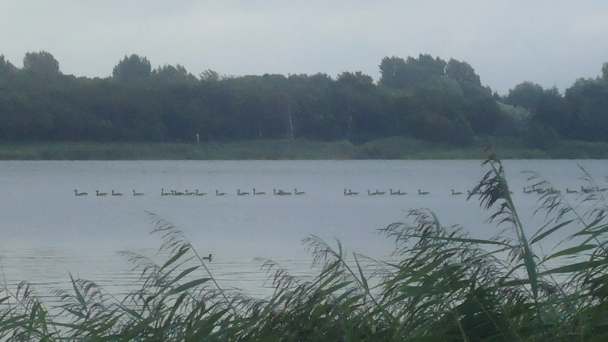

De beginnende schrijver zit aan zijn bureau te peinzen. Jonas Schetterkop, want zo heette hij, was
een aardige jongeman. Zijn ouders waren vroeg overleden en hij was door zijn grootmoeder opgevoed
met wie hij van jongsaf aan in één huis woonde. Ze hadden het reuzegezellig saampjes, Jonas en zijn
Grootje. Jonas werkte overdag op kantoor en Grootje genoot van haar welverdiende rust. Elke avond
voor het slapen gaan zaten Johan en zijn Grootje knus bij elkaar. Zij las eerst altijd een paar
bijbelverzen waarna hij haar een van zijn verhalen voorlas.

De verhalen van Jonas waren uiterst
genoeglijk. Platvloerse taal of beuzelarijen bezigde hij nooit en uit zijn pen vloeiden louter
stichtelijke verhalen waarin de zon altijd scheen, letterlijk en figuurlijk, en dikwijls kwam het
voor dat Grootje al ver voor de laatste zin zat te knikkebollen. Na het voorlezen zongen ze altijd
een Psalm en dan gingen ze slapen. Het waren goede christenmensen.
Maar ja, op een dag wilde Jonas meer. Zijn verbeelding speelde op, hij wenste zich wat literaire
perikelen in zijn leven en schreef zich in bij een schrijfcursus. Zijn Grootje weende bittere
tranen.  
“Ach jongen, je verhalen zijn als engelengezang voor mijn ziel. Schrijfles, wat zou dat?
Wat kun jij daar nu nog leren?”, schreide ze. Maar Jonas had A gezegd en zette door.

Aanvankelijk had hij het goed naar de zin op de cursus. De juf bleek een olijke dame die hem al snel
een aantal reuzehandige kneepjes aanleerde en zijn verhalen waren met sprongen vooruit gegaan, dat
moest zelf zijn Grootje toegeven aan wie hij nog steeds trouw alles voorlas. Maar toen, op de
laatste les van de cursus, was de juf met die duivelse opdracht gekomen. “Een verhaal zullen jullie
schrijven, een verhaal in de stijl van jullie lievelingsschrijver!”, had ze alle leerlingen geboden.
Wat een verfoeilijke opdracht! Daar zit hij maar mooi mee nu, alleen op kantoor, met zijn handen op
het toetsenbord. Voor hem, op zijn bureau, een leeg beeldscherm. Met angst in zijn hart denkt hij
aan de waarschuwende woorden die zijn Grootje had voorgelezen uit Exodus.   
“En gij zult uw zinnen
niet zetten op de zinnen van een ander, verkondigde de Heer in al zijn liefderijke goedheid aan het
volk Israël vanaf de berg Sinaï. Ik, de Heere uw God, ben een ijverig God, die de misdaad der
vaderen vergeldt op diens vaderen, de kinderen, aan het derde, en aan het vierde lid dergenen”. Nu
zul je zien, denkt hij bij zichzelf, nu zul je zien wat er van komt. Je zult spijt krijgen als een
wollen trui in de woestijn, als een aangespoelde kwal op het strand waar niemand op stapt. Een
stommeling ben je, doeratsjok! Nu zul je B moeten zeggen, je ontkomt er niet aan.

Kent u dat zelf niet, zo’n vlaag van zwaarmoedige zelfkastijding? Muisstil zit je, vier uren lang en
buiten hoor je alleen maar kinderen, twee aan twee marcheren ze in lange rijen aan je kantoor
voorbij. Je denkt aan machetes en kindsoldaten. Je hoort ze gillen maar je durft niet naar het raam
te lopen en naar buiten te kijken. Zijn kinderen echt onze toekomst? En op welke leeftijd verliest
een kinderziel haar onschuld? Zo pieker je door. Bier in een theekan, schuimt dat wel? Een kapot ei
in een vreemd nest, de kuikentjes piepen schattig maar hoort men toch de kip niet liever tokken?  

Nog
eens vier uur gaan voorbij, Jonas belt zijn Grootje dat hij moet overwerken vanavond. Je denkt aan
oorlog en hongersnood, AIDS, zwermen sprinkhanen die God’s akkers leeg eten. De MediaMarkt op
zondagmiddag. Het wordt donker, het wordt licht, en het wordt weer donker en duizenden bezwarende
gedachten kolken je door het hoofd, met volle kracht striemen ze tegen de binnenkant van je
hersenpan. Je krijgt rode branderige plekjes op je voorhoofd en in je nek, duizenden plekjes over je
hele lichaam maar je durft niet te krabben. Kopje thee erbij? Ja maar zonder schuimkraag, dat smaakt
ook prima. De plekjes op je voorhoofd veranderen in schilferige rode bulten. Een bult springt open
en een kleffe druppel druipt langs je wang naar beneden. De druppel verandert in een donkere oceaan,
zwart als modder, en je bureau drijft weg. Zou je niet eens een afspraak met de dermatoloog moeten
maken?   
Hallo dokter, hoeveel kinderen zijn er wel niet in de oceaan verdronken? En waarom 
blijft al
dat plastic wél drijven? Krankzinnig wordt je ervan maar het scherm voor je blijft leeg. Je denkt
aan je medeleerlingen, hoe ze straks als trotse koekkoeken het klaslokaal binnen zullen paraderen
met hun verhalen. Zotte belevenissen in archaïsch proza, surrealistische vertellingen in licht
cynische bewoordingen of post-moderne manifesten in een romantische schrijftrant.   
“Jajajaja”, hoor
je ze trots bulderen “Jaha, ik dacht van, ik dacht bij mezelf van potverdikkeme, dat viel nog niet
mee!, wat jij Schetterkop?” Je krimpt in elkaar, een wolk schilfers stijgt uit je haren op en weer
springt er een bult open maar je scherm blijft leeg. 

De arme Jonas schuift zijn toetsenbord opzij,
legt zijn armen op zijn bureau en zijn hoofd precies daartussen. Hij valt in slaap en krijgt een
merkwaardige droom.
Het is een maanheldere nacht en hij rijdt met zijn brommer over de Klinkerbergerplas in de buurt van
Leiden. Zorgvuldig sturend navigeert hij de brommer over de golven. Bij grotere golven neemt hij wat
gas terug zodat de zijkant van zijn wielen droog blijven, als die nat worden is het einde zoek. Hij
rijdt zo een tijdje over de plas rond als hij in de verte aan de oever in de rietkraag het silhouet
van een roeibootje gewaar wordt. Hij vaart erop af. Als hij het bootje nadert ziet hij dat er een
man in zit die een pijpje rookt. Nog dichterbij gekomen herkent hij in de man de schrijver B die hem
verwonderd aankijkt. Jonas rijdt zo langzaam als hij kan een rondje om het roeibootje en vraagt B of
hij niet even bij hem in het bootje mag.   
“Hoe is het mogelijk dat je nog steeds rondrijdt na 
al die
jaren?”, vraagt B die Jonas klaarblijkelijk niet voor het eerst ziet.  
“Ik heb eindelijk mijn 
record
van veertigduizend kilometer over zee gevestigd”, antwoordt Jonas, “maar af en toe doe ik nog een
rondje over een binnenwater, voor de lol zou je kunnen zeggen. Mag ik nu in je bootje?"  
“Nee, donder
op!”, buldert B op homerische toon. “Ik zit hier van mijn rust te genieten. Er is helemaal geen plek
in mijn schuitje. Jij hebt nota bene een brommer waarmee je over water kunt rijden. Kras toch op!”

Jonas wordt wakker, zijn armen en wang nog op het bureau. Een melkwegstelsel van schilfers en roos
cirkelt langzaam om zijn hoofd. Hij richt zich op en kijkt op de klok. Hij staat op van zijn stoel,
klopt zijn trui af en trekt zijn jasje aan. Goed geluimd fietst Jonas de stad door naar het gebouw
van de schrijfcursus. Er staat een zwoel windje. Bij het gebouw aangekomen loopt hij naar het
leslokaal. “Goedenavond beste mensen,” opgeruimd stapt hij binnen, “ik heb geen verhaal vanavond,
maar wat een weertje anders hè?”
