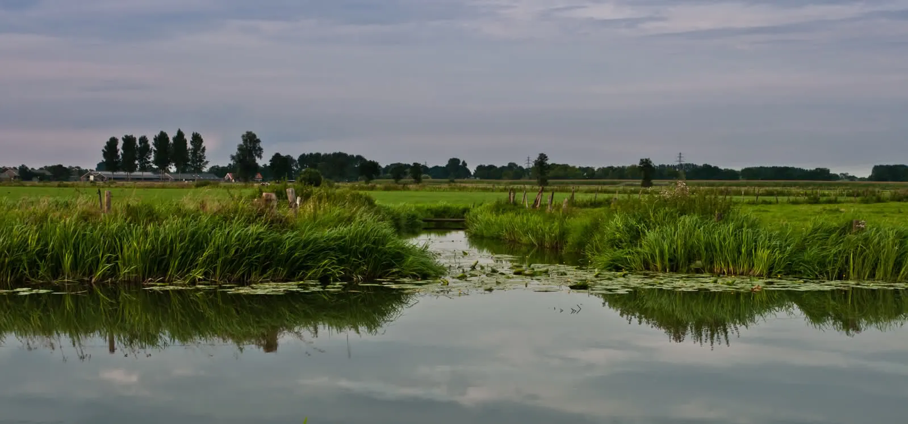

“Hoe vaak is ze nu al niet klaargekomen?”, dacht Manuel toen het gekreun van de Slovaakse opnieuw
aanzwol en haar natte vagina nogmaals stevig tegen zijn open mond en tong aan schokte. Er
ontwikkelde zich een serieuze kramp in zijn kaken en zijn tong voelde slap. Voorzichtig duwde hij
haar van zich af. Als een snorrend katje krulde ze zich tegen hem aan, klam en nahijgend.  
“You ok?”, zuchtte ze. Was dit een vraag of een constatering?  
“Yes, sure”, hoorde hij zichzelf zeggen.  
“Ok, I am going to take shower and then we need to go to airport”, en ze slipte het bed uit richting
badkamer.  
“Godverdomme”, dacht hij bij zichzelf en voelde zijn pijnlijk harde erectie. Wat moest hij hier nou
mee?  

Hij had haar ontmoet op de Couchsurfing meetup in Bratislava, tijdens één van de solo stedetripjes
die hij dit jaar maakte. Hij had haar aangesproken en ze had direkt aan zijn lippen gehangen. Een
paar biertjes en barretjes verder had hij haar gezoend. Diezelfde avond nog had ze hem bij haar
thuis uitgenodigd. In haar krappe maar stijlvol ingerichte flatje aan de rand van de stad hadden ze
voor het eerst seks met elkaar gehad. Eerst in haar keukentje en later in haar bed.

Nu, een maandje later, was ze op zijn uitnodiging een klein weekje naar Rotterdam gekomen. Zijn huis
was opgeruimd, alles goed doorgelucht en netjes. De wiet was weggewerkt en de asbak op het balkon
gezet. Op internet had hij tweedehands romans van Milan Kundera en Sándor Márai gekocht en verspreid
in zijn boekenkast gezet. Hij had haar opgehaald van Schiphol, voor haar gekookt, haar mee uit eten
genomen, de stad laten zien, vier keer de Lijnbaan op en af gelopen en geduldig staan wachten elke
keer als zij een pashokje in dook. Hij voelde zich op een vreemde manier prettig bij haar. Het
gevoel ging dieper dan de oxytocine-high die de dagelijkse seks teweeg had gebracht. Dit bleef
hangen, ook nu merkte hij, nu hij niet eens was klaargekomen.

Afgelopen nacht waren ze met zijn vrienden op stap geweest. Het was supergezellig alleen zij was
stilletjes en teruggetrokken. In BIRD, net toen ze met de hele groep op de dansvloer stonden, had ze
hem naar de kant getrokken. Ze wilde naar huis. Hadden ze thuis nog seks gehad? Hij kon het zich
even niet herinneren.

Een uur later zaten ze in de auto naar Schiphol. Net als vijf dagen eerder had hij ‘Jo’ van
Goldfrapp voor haar opgezet. Hij was een lang verhaal begonnen over hoe één van zijn vrienden in
BIRD ooit een Ierse aan de haak had geslagen. De Slovaakse keek uit het raam naar het
voorbijvliegende Hollandse landschap rechts van haar.   
“You say nothing”, onderbrak ze hem plotseling op vlakke toon, zonder hem aan te kijken.  
“What do you mean, I am talking all the time”, zei Manuel.  
“Yes you talk all the time but you say nothing.”  
“What should I say, please explain?”, zei Manuel.  
“You should talk about us. I like you very much but you seem not serious. Not about work, not about
future, not about relation, not even about sex…
You only interested in talking, travelling, experiences…”   
Ze keek naar hem nu. Hij hield zijn blik
op de weg gericht, kneep zijn ogen samen en plukte met één hand aan het vel op zijn kin.  
“It is not so interesting to me, please understand”, liet ze er op volgen.

De rest van de rit bleef het stil in de auto. Alleen Goldfrapp fluisterzong haar liedjes.
Bij Schiphol aangekomen reed Manuel direkt naar de short-stop parking. Hij stapte als eerste uit,
opende het portier voor haar en gaf haar haar rolkoffer.   
“Three kisses, that’s how we do it in Holland.” Hij voegde de daad bij het woord, stapte weer in en reed rustig weg. 
Aan het einde van de taxi standplaats stopte hij even. Hij reikte naar zijn dashboardkastje. Ja hoor, die dikke file
joint lag er nog. Hij stak op en reed verder.   
“Fock it”, dacht hij bij zichzelf.
